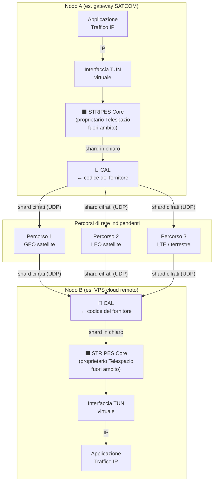
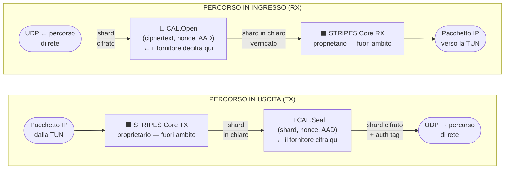
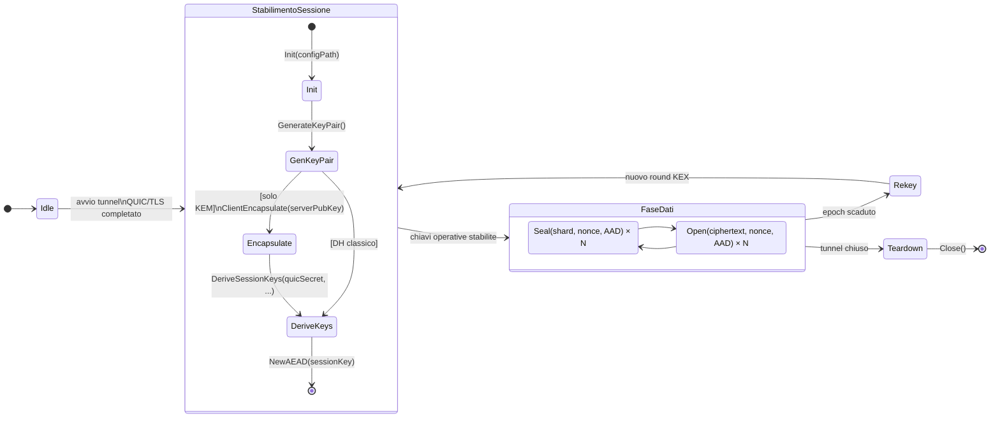
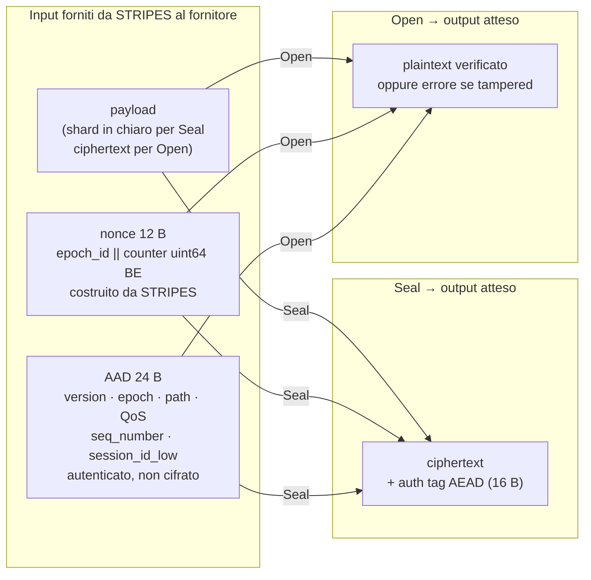
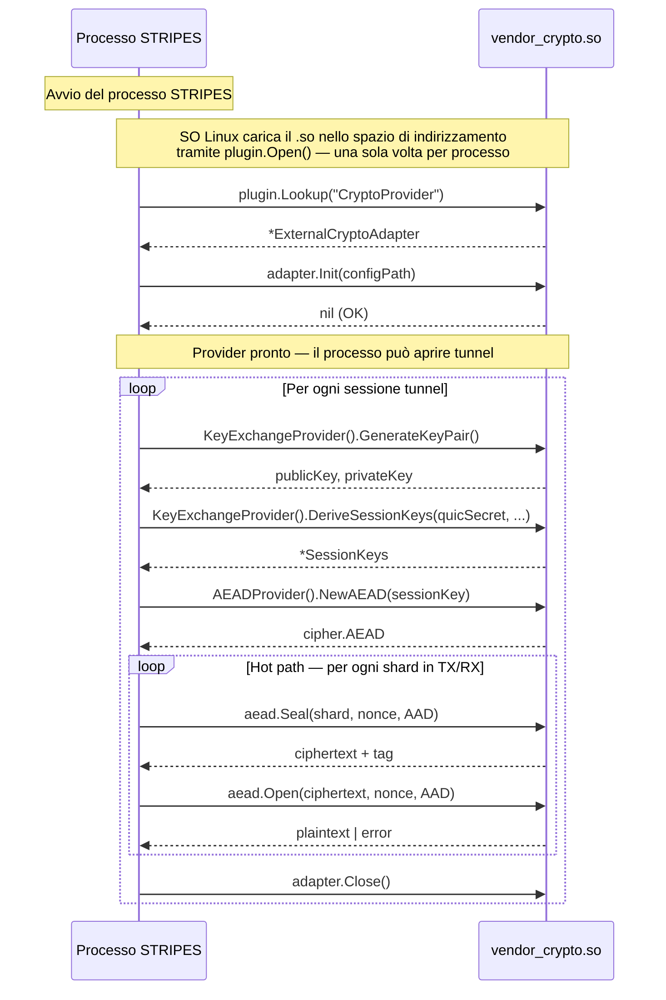
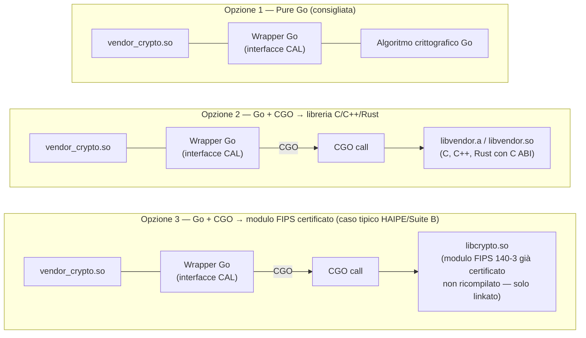
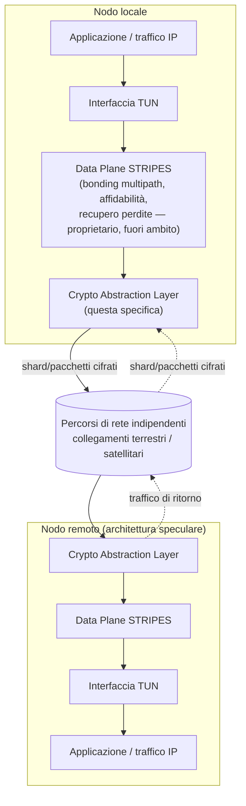
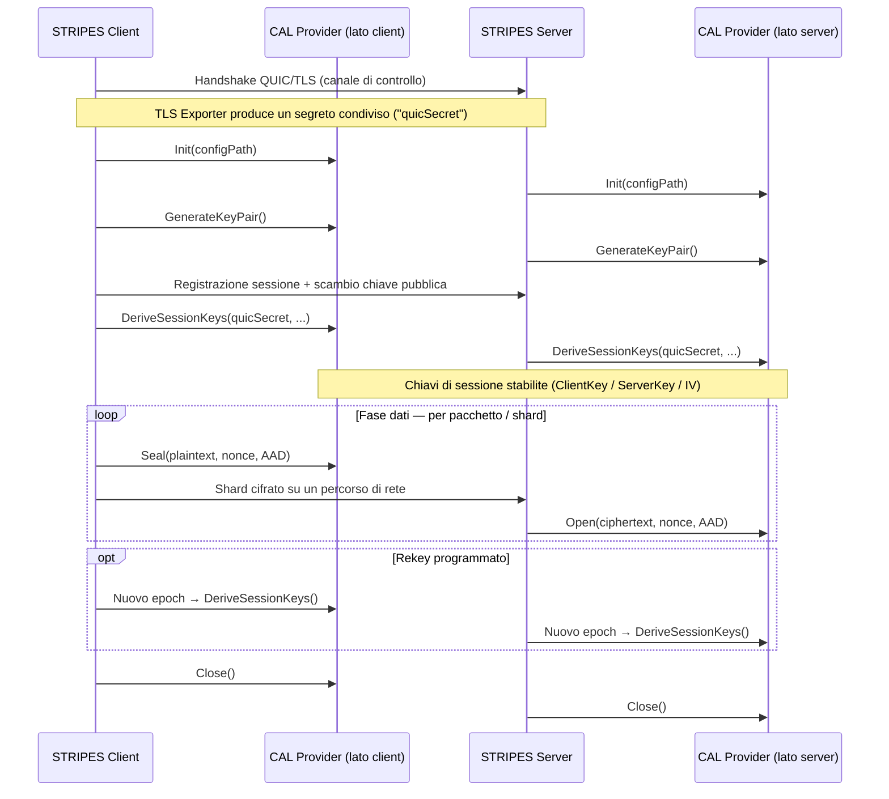
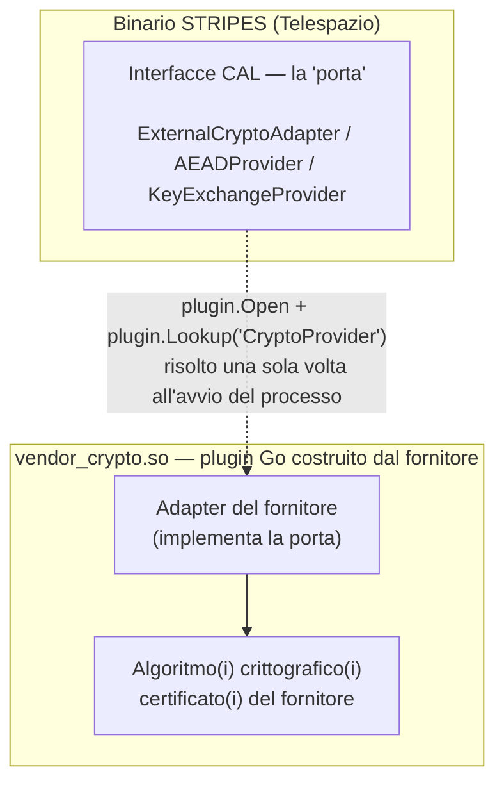

# CIFRANTE STRIPES — Specifica di Integrazione per Fornitore Esterno

**Progetto:** MPQUIC/STRIPES — Telespazio  
**Documento:** Partner Integration Specification  
**Versione:** 1.2 — 2026-06-18  
**Stato:** Released

---

## Prefazione — Come funziona STRIPES: guida per il partner tecnico

> **Scopo.** Questa sezione fornisce al team tecnico del fornitore il contesto funzionale necessario a capire dove, quando e come il proprio software verrà richiamato. Non descrive nessuna logica interna proprietaria di Telespazio: il core di STRIPES (scheduling multipath, recupero delle perdite, gestione dei percorsi) è e deve restare una scatola nera per il fornitore.

### P.1 Il problema che STRIPES risolve

Le comunicazioni SATCOM operative sono esposte a un problema fondamentale di continuità: ogni collegamento fisico — un terminale GEO, un modem LEO, una SIM LTE — può degradarsi o cadere in qualsiasi momento per cause meteo, saturazione, guasto hardware o manutenzione. Affidarsi a un singolo percorso di rete espone il servizio a interruzioni inaccettabili.

**STRIPES** (Secure Transport RIsk Protection Enhancement System) risolve questo problema aggregando più percorsi fisicamente indipendenti in un **unico tunnel logico crittografato**, trasparente alle applicazioni che lo attraversano. Il traffico IP entra da un'interfaccia TUN virtuale su un nodo e viene consegnato all'interfaccia TUN del nodo remoto attraverso la combinazione dei percorsi disponibili in quel momento. La crittografia garantisce che ogni byte di traffico sia protetto end-to-end su tutti i percorsi.



### P.2 L'unità di dati della CAL: lo "shard"

Il traffico IP grezzo non viene mai consegnato direttamente alla CAL. Il core di STRIPES (logica proprietaria, non divulgata) prende i pacchetti IP dalla TUN, li elabora e produce unità di trasmissione atomiche chiamate **shard** — ciascuna destinata a un singolo percorso di rete.

**La CAL opera esclusivamente a livello di shard**: ogni shard in uscita viene sigillato con `Seal()`; ogni shard in ingresso viene aperto e verificato con `Open()`. Il fornitore non ha visibilità su come gli shard vengono costruiti, dimensionati, ordinati o riassemblati: questa è interamente logica proprietaria di Telespazio.



> ⚡ **Hot path.** Su un tunnel ad alta velocità, `Seal` e `Open` vengono chiamati centinaia di migliaia di volte al secondo. I requisiti di performance sono non negoziabili: **zero allocazioni heap per shard, zero I/O bloccante, latenza in microsecondi.** Dettaglio completo al §4.2.

### P.3 Due fasi operative: quando viene richiamato il codice del fornitore

Il ciclo di vita di un tunnel STRIPES si articola in due fasi crittografiche distinte. Il fornitore viene richiamato in entrambe, con requisiti di performance radicalmente diversi.



| Fase | Frequenza di chiamata | Latenza tollerata | Metodi CAL |
|------|----------------------|-------------------|------------|
| **Stabilimento sessione** | Una volta per sessione + ogni rekey programmato | 10 – 100 ms | `Init`, `GenerateKeyPair`, `ClientEncapsulate`, `DeriveSessionKeys`, `NewAEAD` |
| **Fase dati — hot path** | Per ogni shard (> 100 000/s su link ad alta velocità) | < 10 µs | `Seal`, `Open` |
| **Teardown** | Una volta alla chiusura del tunnel | Non critica | `Close` |

### P.4 Anatomia di una chiamata `Seal` / `Open`

Ogni invocazione di `Seal` o `Open` riceve tre input da STRIPES. Il fornitore non deve generare nessuno di questi: vengono costruiti interamente da STRIPES e passati come parametri.



**Struttura del nonce** (costruito da STRIPES — il fornitore non lo genera):

```
nonce[12 B]:
  byte[0]    → epoch_id   (uint8, incrementale ad ogni rekey)
  byte[1:12] → counter    (uint64 big-endian, monotono per sessione/epoch)
```

**L'AAD** autentica il contesto di trasmissione (percorso, classe QoS, numero di sequenza, session ID) senza cifrarlo. Il fornitore **DEVE** includere l'intero AAD nell'autenticazione AEAD — layout completo al §8.

### P.5 Il modello del plugin Go: caricamento e sequenza di chiamate

Il plugin del fornitore è un **file `.so` ELF Linux** compilato con `go build -buildmode=plugin`. STRIPES lo carica una sola volta all'avvio del processo tramite il meccanismo nativo dei plugin Go. Non esiste separazione di processo, non esiste IPC, non esiste latenza di rete: ogni chiamata al plugin è una normale chiamata a funzione Go in-process.



> La latenza di una chiamata in-process Go è dell'ordine dei **nanosecondi** per la sola chiamata di funzione. Il costo effettivo è dominato dall'implementazione crittografica del fornitore — che deve quindi essere ottimizzata per il throughput.

### P.6 Linguaggio e toolchain: vincoli non negoziabili

| Requisito | Valore | Motivazione |
|-----------|--------|-------------|
| **Linguaggio del wrapper** | **Go** — versione esatta comunicata da Telespazio | I plugin Go richiedono identico toolchain tra `.so` e binario host |
| **Build mode** | `go build -buildmode=plugin` su Linux | Unico meccanismo di estensione supportato da STRIPES |
| **Architetture target** | `linux/amd64` (primaria) + `linux/arm64` (obbligatoria) | Entrambe le architetture di deployment STRIPES |
| **Simbolo esportato** | `var CryptoProvider ExternalCryptoAdapter` | Nome esatto cercato da `plugin.Lookup("CryptoProvider")` |
| **CGO** | Consentito previo accordo con Telespazio | Richiede allineamento del runtime C e del linker tra le due codebase |
| **Dipendenze esterne** | Vendorate nel modulo Go del plugin | Build riproducibile e indipendente dall'ambiente Telespazio |

#### P.6.1 Può l'algoritmo crittografico essere realizzato in un linguaggio diverso da Go?

**Sì, l'algoritmo può essere scritto in qualsiasi linguaggio** — purché il file `.so` finale venga compilato come plugin Go. Il file `.so` è **sempre** il prodotto di `go build -buildmode=plugin`; al suo interno, il codice Go può richiamare librerie native tramite CGO. Esistono tre opzioni concrete:



| Opzione | Algoritmo scritto in | CGO richiesto | Note |
|---------|---------------------|--------------|------|
| **1 — Pure Go** | Go | No | Il più semplice da build e consegnare |
| **2 — Go + C/C++/Rust** | C, C++, Rust (con C ABI) | Sì | Richiede accordo con Telespazio per allineamento toolchain |
| **3 — Go + lib certificata** | Qualsiasi (già compilata) | Sì | Caso tipico per moduli FIPS 140-3 o certificazioni NATO già possedute dal fornitore |

> **In tutti e tre i casi**, la "porta" verso STRIPES è sempre e solo un'interfaccia Go. Telespazio non supporta meccanismi di integrazione alternativi (gRPC, socket Unix, subprocess). Per le Opzioni 2 e 3, Telespazio fornirà a inizio engagement un'immagine Docker di build per garantire compatibilità di runtime C e linker.

### P.7 Sintesi: cosa il fornitore deve e non deve conoscere

| Aspetto | Fornitore lo conosce | Note |
|---------|---------------------|------|
| Il tunnel aggrega percorsi di rete multipli | ✅ (contesto funzionale) | |
| Come il traffico viene distribuito tra i percorsi | ❌ | Proprietario Telespazio |
| Il meccanismo di recupero delle perdite / ridondanza | ❌ | Proprietario Telespazio |
| La logica di path-liveness e failover | ❌ | Proprietario Telespazio |
| Che la CAL riceve shard individuali (non pacchetti IP) | ✅ | Contratto di interfaccia |
| Il formato del nonce (epoch_id + counter) | ✅ | §5.2 / §6.2 |
| Il formato dell'AAD (24 byte, layout fisso) | ✅ | §8 |
| Come il segreto QUIC (TLS Exporter) viene derivato e passato | ✅ | §6.1 — parametro di `DeriveSessionKeys` |
| La struttura interna di uno shard (header, trailer, dimensione) | ❌ | Proprietario Telespazio |
| Come QUIC è configurato internamente | ❌ | Fuori ambito |

### P.8 Guida rapida: da dove cominciare

1. **Scegliere il livello di integrazione** → §3: Livello A (solo AEAD), B (solo KEX) o C (completo)
2. **Copiare le interfacce Go** → §5/§6/§7: non sono importabili da `internal/`, vanno copiate nel package del plugin
3. **Implementare le interfacce** rispettando i vincoli del §4
4. **Compilare**: `go build -buildmode=plugin -o vendor_crypto.so ./vendor_crypto/`
5. **Consegnare** secondo la checklist §11

**Struttura minima per Livello A** (solo AEAD — la più veloce da implementare):

```
vendor_crypto/
├── main.go        ← var CryptoProvider ExternalCryptoAdapter = &MyProvider{}
├── provider.go    ← Init, Name, Version, Close, AEADProvider() → &myAEAD{}
└── aead.go        ← NewAEAD, Seal, Open, KeySize, NonceSize
```

---

*Fine della prefazione. Il documento procede con la specifica contrattuale delle interfacce.*

---

## Indice

- [Prefazione — Come funziona STRIPES](#prefazione--come-funziona-stripes-guida-per-il-partner-tecnico)
1. [Panoramica architetturale di STRIPES](#1-panoramica-architetturale-di-stripes)
2. [Scopo e applicabilità](#2-scopo-e-applicabilità)
3. [Livelli di integrazione e paradigma](#3-livelli-di-integrazione-e-paradigma)
4. [Requisiti comuni a tutti i livelli](#4-requisiti-comuni-a-tutti-i-livelli)
5. [Interfacce Go — Livello A (AEAD only)](#5-interfacce-go--livello-a-aead-only)
6. [Interfacce Go — Livello B (KEX only)](#6-interfacce-go--livello-b-kex-only)
7. [Interfacce Go — Livello C (Full provider)](#7-interfacce-go--livello-c-full-provider)
8. [Formato AAD esteso (v2)](#8-formato-aad-esteso-v2)
9. [Profilo YAML custom_provider](#9-profilo-yaml-custom_provider)
10. [Compilazione e consegna del plugin](#10-compilazione-e-consegna-del-plugin)
11. [Checklist di consegna](#11-checklist-di-consegna)

---

## 1. Panoramica architetturale di STRIPES

> Questa sezione fornisce al fornitore esterno il contesto funzionale minimo necessario a capire **dove** e **in quale fase** viene richiamata la Crypto Abstraction Layer (CAL). Si ferma deliberatamente al confine della CAL: i meccanismi interni di scheduling dei percorsi, affidabilità e recupero delle perdite del data plane STRIPES sono tecnologia proprietaria di Telespazio e sono **fuori ambito** per questo documento e per questa integrazione.

### 1.1 Cos'è STRIPES

STRIPES (Secure Transport RIsk Protection Enhancement System) è lo strato di trasporto a bonding multipath del sistema MPQUIC. Trasporta il traffico IP proveniente da un'interfaccia TUN locale, lo distribuisce su **percorsi di rete indipendenti** (es. un collegamento satellitare e uno terrestre, oppure più modem SATCOM/cellulari) e lo riassembla all'estremità remota nel flusso di traffico originale — cifrando ogni byte che lascia il nodo locale e decifrando ogni byte che arriva al nodo remoto.

Dal punto di vista di un fornitore esterno di crittografia, STRIPES è una **scatola nera che consegna pacchetti IP in chiaro alla Crypto Abstraction Layer in uscita, e li riceve di nuovo in chiaro da essa in ingresso**. La CAL è l'unico punto di contatto che il fornitore deve comprendere.

### 1.2 Contesto di sistema



### 1.3 Due fasi operative

STRIPES utilizza la crittografia in due fasi distinte della vita di una sessione tunnel. Le interfacce CAL si mappano direttamente su queste fasi — questa corrispondenza è il concetto chiave da interiorizzare prima di leggere i contratti di interfaccia al §5.

| Fase | Cosa accade | Metodi CAL coinvolti |
|------|-------------|----------------------|
| **1 — Stabilimento sessione** (una volta per sessione, ripetuto ad ogni rekey programmato) | I due endpoint STRIPES concordano un'identità di sessione e derivano le chiavi simmetriche operative da un segreto condiviso | `Init`, `GenerateKeyPair`, `ClientEncapsulate` (solo provider KEM), `DeriveSessionKeys` |
| **2 — Fase dati** (continua, per tutta la durata della sessione) | Ogni pacchetto/shard in uscita viene sigillato immediatamente prima di essere immesso su un percorso di rete; ogni pacchetto in ingresso viene aperto immediatamente dopo la lettura dal percorso di rete | `NewAEAD`, `Seal`, `Open` |



### 1.4 Cosa questo documento NON descrive

Per tutelare la proprietà intellettuale di Telespazio, questa specifica volutamente **non** divulga:

- Come il traffico viene instradato o distribuito sui percorsi di rete
- Il meccanismo di recupero delle perdite / affidabilità usato dal data plane
- La logica di path-liveness, failover o classificazione del traffico
- Qualsiasi algoritmo interno non esposto tramite le interfacce CAL definite in questo documento

Un fornitore esterno non ha bisogno di nessuno di questi elementi per realizzare un'implementazione CAL conforme: le interfacce, i formati dati e il ciclo di vita delle chiamate descritti dal §5 in avanti sono completamente autosufficienti e sufficienti per iniziare l'implementazione da subito.

---

## 2. Scopo e applicabilità

Il sistema MPQUIC/STRIPES espone una **Crypto Abstraction Layer** (CAL) che consente a un fornitore esterno di sostituire il cifrante interno (X25519 + ML-KEM-768 + AES-256-GCM) con una propria implementazione certificata, senza modificare il codice del data plane.

Il presente documento descrive le **interfacce Go obbligatorie**, il **formato AAD**, la **configurazione YAML**, le **modalità di compilazione** del plugin e i **requisiti di sicurezza** che il fornitore deve rispettare.

Questo documento **non** descrive:
- L'architettura interna di STRIPES, oltre a quanto mostrato al §1 (solo contesto funzionale)
- I processi di progetto interni a Telespazio
- Il livello di trasporto QUIC (gestito da `quic-go`)

---

## 3. Livelli di integrazione e paradigma

Il fornitore sceglie uno dei tre livelli di integrazione in base a cosa la propria soluzione certificata fornisce:

| Livello | Cosa fornisce il fornitore | STRIPES gestisce |
|---------|--------------------------|-----------------|
| **A — AEAD only** | `AEADProvider`: `Seal` e `Open` | KEX, KDF, nonce, sessione, epoch, AAD |
| **B — KEX only** | `KeyExchangeProvider`: `GenerateKeyPair` e `DeriveSessionKeys` | AEAD, AAD, nonce, sessione, pacchetti |
| **C — Full provider** | `ExternalCryptoAdapter` completo (KEX + AEAD + lifecycle) | Solo orchestrazione |

**Guida alla scelta:**

- Il fornitore ha un **cifrante simmetrico certificato** (es. HAIPE, NSA Suite B) ma non gestisce il KEX → **Livello A**
- Il fornitore ha un **algoritmo di key agreement certificato** (es. modulare post-quantum) ma si appoggia ad AES-GCM interno → **Livello B**
- Il fornitore fornisce una **suite criptografica completa** con lifecycle proprio → **Livello C**

### 3.1 Paradigma di integrazione

L'integrazione tra STRIPES e il software del fornitore è governata da un insieme piccolo e fisso di paradigmi. L'integratore non deve sceglierli — sono obbligatori e vengono elencati qui affinché il team tecnico del partner possa pianificare da subito la propria architettura interna attorno ad essi.

| Aspetto | Requisito |
|---------|-----------|
| **Linguaggio** | Go (stessa versione del toolchain con cui è compilato STRIPES — vedi §10) |
| **Pattern architetturale** | Ports & Adapters (architettura esagonale) / pattern Strategy. STRIPES definisce la "porta" — le tre interfacce del §5/§6/§7. Il fornitore fornisce l'"adapter" — un plugin Go che le implementa. STRIPES non ha alcuna conoscenza né dipendenza dall'algoritmo concreto dietro l'interfaccia |
| **Meccanismo di caricamento** | Meccanismo nativo dei plugin Go (`buildmode=plugin`), risolto **una sola volta** all'avvio del processo tramite `plugin.Open` + `plugin.Lookup("CryptoProvider")`. Non esiste dipendenza a livello di codice sorgente tra le due codebase |
| **Confine di processo/IPC** | **Nessuno.** Il plugin viene eseguito nello stesso processo e spazio di indirizzamento di STRIPES. Una chiamata verso il fornitore è una normale chiamata a funzione Go in-process — non una chiamata di rete, non RPC, non un sottoprocesso |
| **Disciplina di chiamata** | Sincrona, call-and-return. STRIPES chiama il fornitore; il fornitore non richiama mai STRIPES. Vedi §4.2 per i vincoli sul hot path (nessuna allocazione, nessuna I/O bloccante, nessuna goroutine lasciata in esecuzione) |
| **Gestione errori** | Tutti i fallimenti vengono comunicati tramite il valore di ritorno `error` di Go. `panic()` è proibito |



### 3.2 Tabella fasi di chiamata

Questa tabella risponde con precisione alla domanda "dove e quando STRIPES richiama il nostro codice": ogni metodo CAL, la fase a cui appartiene (vedi §1.3), chi lo chiama e con quale frequenza.

| Fase | Metodo CAL | Chiamato da | Frequenza |
|------|-----------|-------------|-----------|
| Stabilimento sessione | `Init` | Avvio del processo STRIPES | Una volta per processo |
| Stabilimento sessione | `GenerateKeyPair` | STRIPES client & server | Una volta per sessione, ripetuto ad ogni epoch di rekey |
| Stabilimento sessione | `ClientEncapsulate` (solo provider KEM) | STRIPES client | Una volta per sessione, ripetuto ad ogni epoch di rekey |
| Stabilimento sessione | `DeriveSessionKeys` | STRIPES client & server | Una volta per sessione, ripetuto ad ogni epoch di rekey |
| Fase dati (hot path) | `NewAEAD` | STRIPES | Una volta per sessione/epoch — **non** per pacchetto |
| Fase dati (hot path) | `Seal` | STRIPES, percorso TX | Una volta per ogni pacchetto/shard in uscita |
| Fase dati (hot path) | `Open` | STRIPES, percorso RX | Una volta per ogni pacchetto/shard in ingresso |
| Teardown | `Close` | STRIPES | Una volta, allo shutdown della sessione/tunnel |

---

## 4. Requisiti comuni a tutti i livelli

### 4.1 Requisiti obbligatori

1. **Thread safety**: tutti i metodi pubblici devono essere goroutine-safe.
2. **No I/O in hot path**: `Seal` / `Open` / `NewAEAD` non devono eseguire I/O durante il processing di un pacchetto.
3. **No key logging**: vietato scrivere chiavi, nonce, shared secret o materiale derivato in log/stdout/stderr/file.
4. **Gestione errori non-panic**: qualsiasi errore deve essere comunicato tramite `error`; `panic()` in produzione è proibito.
5. **Test vectors**: il fornitore deve consegnare test vectors verificabili (vedi §11).
6. **Cross-compilation**: il plugin deve compilare su `linux/amd64` e `linux/arm64`.
7. **Init idempotente**: `Init(configPath)` deve essere chiamabile una sola volta per istanza.

### 4.2 Comportamenti proibiti in hot path

| Comportamento | Motivo |
|--------------|--------|
| Allocazione heap (`make`, `new`, letterali slice/map) | Viola zero-alloc invariant del data plane |
| Lock globale (mutex non bounded) | Contention su percorso multi-goroutine |
| Syscall bloccante (read/write socket, file) | Latenza inaccettabile per pacchetti live |
| Log a qualsiasi livello | Key logging risk + latenza |
| `panic()` | Crash dell'intero processo STRIPES |

---

## 5. Interfacce Go — Livello A (AEAD only)

### 5.1 Interfaccia `AEADProvider`

```go
import "crypto/cipher"

// AEADProvider astrae un cifrante AEAD.
// Usato nel hot path per ogni pacchetto UDP.
// Le implementazioni DEVONO essere thread-safe e allocazione-minima.
type AEADProvider interface {
    // Name restituisce il nome dell'algoritmo, es. "VendorCipher-256-GCM".
    Name() string

    // NewAEAD crea un'istanza del cifrante AEAD per la chiave fornita.
    // key ha lunghezza uguale a KeySize().
    // Chiamato una sola volta per sessione/epoch.
    NewAEAD(key []byte) (cipher.AEAD, error)

    // KeySize restituisce la dimensione della chiave richiesta in byte.
    KeySize() int

    // NonceSize restituisce la dimensione del nonce in byte.
    // STRIPES usa 12 byte (GCM-standard).
    NonceSize() int
}
```

### 5.2 Nota sul nonce

STRIPES gestisce il nonce autonomamente:

```
nonce[12B]:
  byte[0]    = epoch_id (uint8)
  byte[1:12] = contatore monotono uint64 big-endian
```

Il fornitore Livello A non deve modificare la gestione del nonce.

---

## 6. Interfacce Go — Livello B (KEX only)

### 6.1 Interfaccia `KeyExchangeProvider`

```go
// KeyExchangeProvider astrae la logica di key exchange (classico o post-quantum).
// Usato una sola volta per sessione (handshake) e ad ogni rekey.
type KeyExchangeProvider interface {
    // Name restituisce il nome del provider, es. "VendorKEX-PQC-L3".
    Name() string

    // GenerateKeyPair genera una coppia di chiavi pubblica/privata per il KEX.
    GenerateKeyPair() (publicKey, privateKey []byte, err error)

    // DeriveSessionKeys calcola le SessionKeys a partire dal secret QUIC
    // e dalle chiavi pubbliche dei due peer.
    //
    // quicSecret: output di QUIC TLS Exporter (64 byte)
    //             derivato come: QUIC TLS Exporter("mpquic-stripe-v1", sessionID, 64)
    // localPrivKey: chiave privata locale
    // remotePubKey: chiave pubblica del peer
    // sessionID: identificatore univoco di sessione
    //
    // Output: SessionKeys (layout fisso: vedi struct sotto)
    DeriveSessionKeys(quicSecret, localPrivKey, remotePubKey []byte, sessionID []byte) (*SessionKeys, error)
}

// SessionKeys contiene le chiavi operative per una sessione.
// Il layout (88 byte totali) è OBBLIGATORIO indipendentemente dall'algoritmo KEX.
type SessionKeys struct {
    ClientKey []byte // client→server: chiave simmetrica (32 byte)
    ServerKey []byte // server→client: chiave simmetrica (32 byte)
    ClientIV  []byte // client→server: base IV (12 byte)
    ServerIV  []byte // server→client: base IV (12 byte)
    EpochID   uint8  // epoch corrente (propagato, non derivato dal fornitore)
}
```

### 6.2 Sub-interfaccia `KemProvider` (per KEX post-quantum asimmetrico)

```go
// KemProvider estende KeyExchangeProvider per algoritmi KEM (es. ML-KEM, Kyber).
// I provider DH classici implementano solo KeyExchangeProvider.
type KemProvider interface {
    KeyExchangeProvider

    // ClientEncapsulate prepara il materiale per il lato client del KEX KEM.
    //
    // serverPubKey: chiave pubblica del server
    //
    // Returns:
    //   localPrivKey: materiale privato del client (usato in DeriveSessionKeys)
    //   peerKeyShare: materiale da inviare al server (ciphertext + pub client)
    ClientEncapsulate(serverPubKey []byte) (localPrivKey, peerKeyShare []byte, err error)
}
```

**Utilizzo lato STRIPES:**

```go
if kp, ok := provider.(KemProvider); ok {
    localPrivKey, peerKeyShare, err := kp.ClientEncapsulate(serverPubKey)
    // trasmetti peerKeyShare al server via handshake out-of-band
    keys, err := kp.DeriveSessionKeys(quicSecret, localPrivKey, serverX25519Pub, sessionID)
}
```

### 6.3 Layout output `DeriveSessionKeys`

Il layout di `SessionKeys` è **obbligatorio** a prescindere dall'algoritmo KEX:

| Campo | Offset | Dimensione | Note |
|-------|--------|-----------|------|
| `ClientKey` | 0 | 32 B | Chiave AES-256 o equivalente client→server |
| `ServerKey` | 32 | 32 B | Chiave AES-256 o equivalente server→client |
| `ClientIV` | 64 | 12 B | Base IV client→server |
| `ServerIV` | 76 | 12 B | Base IV server→client |
| Totale | — | 88 B | Sliciato fisso da STRIPES |

---

## 7. Interfacce Go — Livello C (Full provider)

### 7.1 Interfaccia `ExternalCryptoAdapter`

Questa interfaccia è il punto di ingresso del plugin. STRIPES carica il `.so` e cerca il simbolo `CryptoProvider` di questo tipo.

```go
// ExternalCryptoAdapter è l'interfaccia che il plugin Go del fornitore deve
// implementare ed esportare come simbolo "CryptoProvider".
//
// Caricamento:
//   p, err := plugin.Open("/path/to/vendor_crypto.so")
//   sym, err := p.Lookup("CryptoProvider")
//   adapter := sym.(ExternalCryptoAdapter)
type ExternalCryptoAdapter interface {
    // Init inizializza il provider con il path al file di configurazione.
    // Chiamato una sola volta prima di qualsiasi altro metodo.
    Init(configPath string) error

    // Name restituisce il nome del provider (stringa libera, max 64 char).
    Name() string

    // Version restituisce la versione del provider (es. "1.2.3").
    Version() string

    // KeyExchangeProvider restituisce l'implementazione KEX.
    // Restituisce nil se il provider gestisce solo AEAD (Livello A).
    KeyExchangeProvider() KeyExchangeProvider

    // AEADProvider restituisce l'implementazione AEAD.
    // Restituisce nil se il provider gestisce solo KEX (Livello B).
    AEADProvider() AEADProvider

    // Close rilascia le risorse e azera (zeroize) le chiavi in memoria.
    Close() error
}
```

### 7.2 Simbolo esportato obbligatorio

```go
// In vendor_crypto/main.go

package main

// CryptoProvider è il simbolo cercato da STRIPES tramite plugin.Lookup.
// Deve essere una variabile esportata del tipo ExternalCryptoAdapter.
var CryptoProvider ExternalCryptoAdapter = &MyVendorProvider{}
```

> **Nota**: il fornitore deve copiare le definizioni delle interfacce nel proprio package (le interfacce STRIPES sono in `internal/`, non importabili). La compatibilità è garantita dalla struttura Go (duck typing: se i metodi coincidono, la type assertion funziona).

---

## 8. Formato AAD esteso (v2)

L'Additional Authenticated Data (AAD) ha una struttura packed di **24 byte** che il fornitore Livello A o C deve includere nell'autenticazione AEAD.

### 8.1 Schema

```
Offset  Size  Field
──────  ────  ─────────────────────────────────────────────────────
 0       1B   version          0x02 (provider esterno riceve sempre v2)
 1       1B   epoch_id         contatore rekey (uint8, 0-255)
 2       2B   path_pipe_id     path_id[7:0] | pipe_id[7:0] (big-endian)
 4       1B   traffic_class    QoS: 0=best-effort, 1=critical, 2=bulk
 5       1B   flags            bit0=FEC, bit1=direction(0=c2s,1=s2c),
                               bit2=rekey_in_progress
 6       2B   fec_group_id     ID gruppo FEC (big-endian uint16; 0 se no FEC)
 8       8B   sequence_number  contatore monotono uint64, big-endian
16       8B   session_id_low   64 bit meno significativi del session ID
──────  ────  ─────────────────────────────────────────────────────
Totale  24B
```

### 8.2 Utilizzo nell'autenticazione

L'intero AAD di 24 byte viene passato come `additionalData` a `cipher.AEAD.Seal` e `cipher.AEAD.Open`. STRIPES verifica il campo `version` prima di chiamare il fornitore; il fornitore non deve filtrare per versione.

---

## 9. Profilo YAML `custom_provider`

Per attivare il plugin del fornitore, la configurazione dell'istanza STRIPES deve contenere:

```yaml
stripe_crypto_enabled: true

crypto:
  enabled: true
  profile: custom_provider

  custom_provider:
    path: /opt/mpquic/plugins/crypto/vendor_crypto.so
    config_file: /etc/mpquic/crypto/vendor_config.yaml

  rekey:
    enabled: false
```

### 9.1 Campi rilevanti

| Campo YAML | Tipo | Descrizione |
|-----------|------|-------------|
| `custom_provider.path` | string | Path assoluto al file `.so` del plugin |
| `custom_provider.config_file` | string | Path passato a `ExternalCryptoAdapter.Init(configPath)` |

Il file `vendor_config.yaml` è opaco per STRIPES — il suo contenuto è definito dal fornitore.

---

## 10. Compilazione e consegna del plugin

### 10.1 Compilazione

```bash
# Stessa versione del toolchain Go del sistema STRIPES (1.26+)

go build \
  -buildmode=plugin \
  -o vendor_crypto.so \
  ./vendor_crypto/

# Per linux/arm64
GOOS=linux GOARCH=arm64 go build \
  -buildmode=plugin \
  -o vendor_crypto_arm64.so \
  ./vendor_crypto/
```

> **Importante**: Il plugin Go e il binario STRIPES devono essere compilati con lo stesso toolchain Go e le stesse dipendenze condivise (stesso build ID). Telespazio fornirà le specifiche esatte del toolchain al momento della consegna.

### 10.2 Struttura minima del package plugin

```
vendor_crypto/
├── main.go          # package main; esporta var CryptoProvider
├── provider.go      # struct MyVendorProvider; implementa ExternalCryptoAdapter
├── aead.go          # implementazione AEADProvider (Livello A o C)
├── kex.go           # implementazione KeyExchangeProvider (Livello B o C)
├── config.go        # lettura vendor_config.yaml
└── go.mod           # modulo Go separato, versione Go >= 1.26
```

### 10.3 Dipendenze consentite

| Tipo | Consentito |
|------|-----------|
| Standard library Go | ✅ Tutti i package |
| Librerie crittografiche certificate (FIPS 140-3) | ✅ |
| Dipendenze proprie del fornitore (in vendor/) | ✅ |
| Package `github.com/telespazio/mpquic/...` o internal STRIPES | ❌ Non importabili |
| Librerie che avviano goroutine background non controllate | ❌ |

---

## 11. Checklist di consegna

| Artefatto | Obbligatorio | Descrizione |
|-----------|-------------|-------------|
| `vendor_crypto.so` (linux/amd64) | ✅ | Plugin compilato per architettura target principale |
| `vendor_crypto_arm64.so` (linux/arm64) | ✅ | Plugin per architettura alternativa |
| Sorgenti Go del plugin | ✅ | Package completo compilabile |
| `go.mod` | ✅ | Versione Go e dipendenze per ricompilazione |
| Test vectors in formato JSON | ✅ | Vettori verificabili per KEX e/o AEAD |
| Schema `vendor_config.yaml` documentato | ✅ | Tutti i campi con tipo e descrizione |
| Certificazione (FIPS 140-3, NATO CC, o equivalente) | Raccomandata | |

### 11.1 Formato test vectors

```json
{
  "provider": "VendorCipher-256-GCM",
  "version": "1.0.0",
  "aead_vectors": [
    {
      "description": "Nominal encrypt/decrypt",
      "key_hex": "...",
      "nonce_hex": "020000000000000000000000",
      "plaintext_hex": "...",
      "aad_hex": "0201000000000000000000000000000000000000000000001",
      "ciphertext_hex": "...",
      "tag_hex": "..."
    }
  ],
  "kex_vectors": [
    {
      "description": "Cross-derivation symmetry",
      "quic_secret_hex": "...",
      "server_pubkey_hex": "...",
      "client_privkey_hex": "...",
      "session_id_hex": "aabbccdd",
      "expected_client_key_hex": "...",
      "expected_server_key_hex": "...",
      "expected_client_iv_hex": "...",
      "expected_server_iv_hex": "..."
    }
  ]
}
```

---

*Fine documento — CIFRANTE STRIPES Partner Integration Specification v1.1 — 2026-06-18*  
*Documento a distribuzione limitata — Riservato ai partner tecnici autorizzati*
