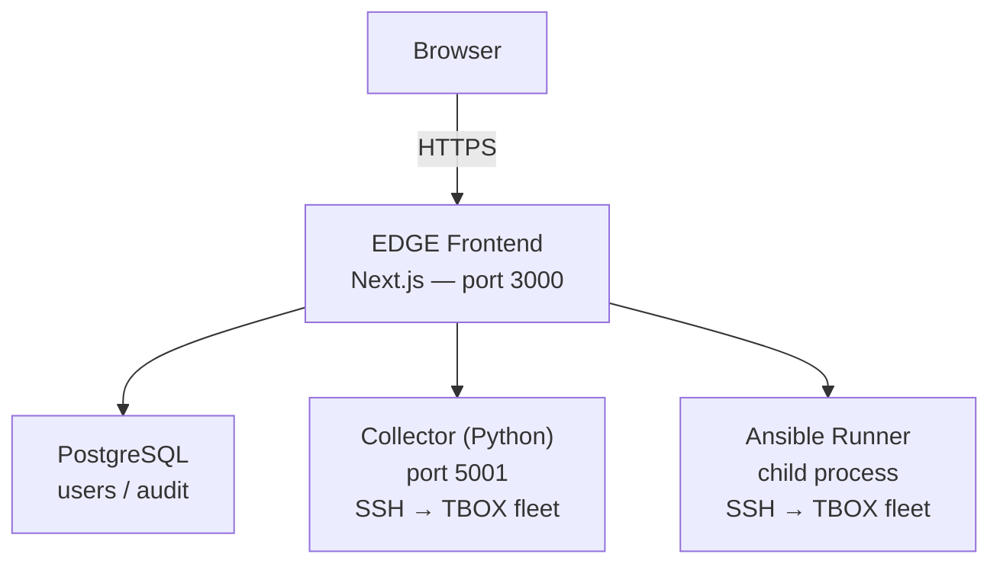
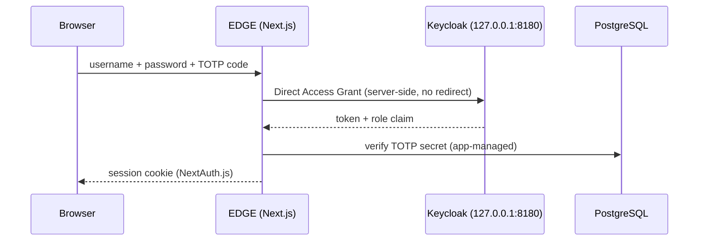
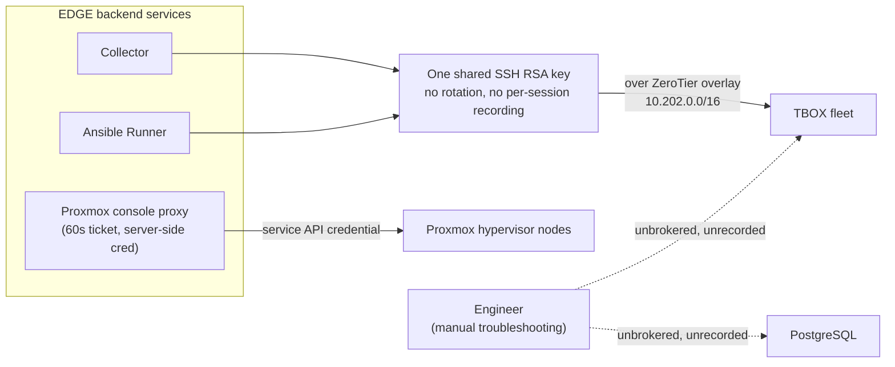

# EDGE Architecture Briefing — Assessing PrivX Integration

| | |
|---|---|
| **Document ID** | TPZ-EDGE-PAM-BRIEF-001 |
| **Title** | EDGE Architecture Briefing for PrivX Integration Assessment |
| **Version** | 1.0 |
| **Date** | 2026-06-27 |
| **Classification** | Restricted — Authorised Technical Partners Only |
| **Issuing Entity** | Telespazio S.p.A. — Engineering Division |

---

## 1. Purpose of this document

The proposal under discussion is to position PrivX behind our EDGE portal, potentially in place of — or alongside — Keycloak, which today handles authentication into EDGE.

We do not yet have a settled view on whether PrivX should replace Keycloak, sit alongside it, or integrate further downstream against the systems EDGE manages — that depends on capabilities of PrivX we are not yet familiar with, and on constraints of our own architecture that your team has not yet seen. This document is written to close both gaps before we meet: it gives you a high-level description of how EDGE is built today (authentication flow, roles, and the systems it manages), answers as much of your RFI as we can at this stage, and lists the open questions we believe need a joint technical session to resolve.

The goal is a concrete, well-informed technical meeting — not a decision taken in advance of it.

---

## 2. What EDGE is, at a high level

EDGE is a fleet-management portal for a distributed network of **remote devices ("TBOX")** deployed on ships, each running monitoring and connectivity-management software. It is a single web application with three backend services:

A logged-in EDGE user does not get a generic shell or remote-desktop session to a target system. They get a **web UI** that, on their behalf and through narrowly-scoped backend services, performs specific operations against the fleet:

- **Fleet status collection** — the Collector service opens an SSH connection (RSA key, no password) to each TBOX node in the fleet to run a fixed status-collection script.
- **Deployment** — the Ansible Runner opens SSH connections to push configuration/software updates via a fixed set of playbooks.
- **Embedded console access** — for nodes virtualised on Proxmox, EDGE proxies a VNC console session over WebSocket, brokered through a short-lived (60s) ticket obtained server-side from the Proxmox API; the Proxmox credentials never reach the browser.

All three of these SSH/console paths reach the TBOX fleet over a **ZeroTier overlay network** (`10.202.0.0/16`), a NAT-traversing peer-to-peer mesh — the TBOX devices are not directly reachable from the public internet or from a flat routed network; the EDGE production server itself is a member of that overlay specifically so its backend services can reach the fleet.

---

## 3. How authentication into EDGE works today

Separately from the backend operations above, a human logs into the EDGE web application itself through the following chain:

- **Keycloak** (realm `edge`), used in **Direct Access Grant** mode: the Next.js backend calls Keycloak server-side with username/password and gets back a token and a role claim. Keycloak listens only on `127.0.0.1:8180` — it is never reached directly by the browser, and there is no OIDC browser-redirect flow.
- **An application-managed TOTP second factor** (RFC 6238): the QR-code setup, secret storage, and code verification are implemented in EDGE's own code and database, not in Keycloak's native OTP support.
- **NextAuth.js (Auth.js v5)**, which issues the actual browser session cookie once both checks above succeed.

Four roles exist today (`admin`, `operator_l2`, `operator`, `viewer`), each mapped to a fixed permission matrix inside the application (e.g. who can trigger a deploy, who can open a Proxmox console, who can edit network configuration).

This design — Keycloak kept internal and used only for password+role validation, with TOTP handled by the application — was the result of real engineering work to get a custom-branded login experience and a reliable 2FA flow working together; it is documented in detail in our internal `AUTH_KEYCLOAK_2FA.md`, which we can share if useful for your assessment of how an integration would need to call into (or replace) this layer.

We do not yet know how PrivX models authentication into a downstream web application — whether as a full OIDC/SAML identity provider expecting a browser redirect, as a backend the application calls directly (closer to how we use Keycloak today), or as a reverse-proxy-level access gate in front of the whole application. That is one of the open questions in §5.

---

## 4. The privileged-access surface behind EDGE

Independently of how a user logs into the portal, the following is the actual privileged-access surface that EDGE's backend services operate against:

- **SSH to the TBOX fleet** — currently **one shared SSH RSA key**, used identically by the Collector service and the Ansible Runner, with no per-operator credential, no rotation, and no per-session recording.
- **Proxmox console access** — currently **one service-level API credential**, held server-side, used to broker VNC sessions per the flow described in §2.
- **Direct database or ad-hoc administrative access** outside the application (e.g. an engineer connecting directly to PostgreSQL or to a TBOX shell for troubleshooting) — today entirely unbrokered and unrecorded.

We flag this because it may be a relevant integration surface for PrivX in its own right — independent of, and potentially in addition to, whatever is decided about the EDGE login flow in §3.

---

## 5. Answering your RFI with what we know today

| Your question | What we can answer now | What's still open |
|---|---|---|
| Target systems by protocol (SSH, RDP, HTTPS/web, DB, VNC) | **SSH**: the TBOX device fleet. **VNC/console**: Proxmox hypervisor nodes hosting the TBOX VMs. **Web**: the EDGE portal itself and the Proxmox API. **No RDP** in this environment. | Exact fleet size and Proxmox node count (to be shared separately, outside this document); whether direct DB access should be in scope. |
| Number of target systems / expected PoC users | The full TBOX fleet as SSH targets; Proxmox node count pending. Exact figures to be shared separately. | Exact PoC user count and which of the four EDGE roles should participate. |
| Directly reachable vs. behind NAT/VPN/segmented zones | The TBOX fleet sits on a ZeroTier peer-to-peer overlay (`10.202.0.0/16`), not directly internet-reachable — reaching them requires overlay membership. | Whether a PrivX Extender can join a ZeroTier overlay, or whether another reachability path is needed — we'd like your input here. |
| Offline licensing / restricted internet access | Not yet assessed. | To be confirmed with the team managing the overlay and the production host's egress policy. |
| HSM / FIPS / hardened configuration | No HSM/FIPS in place on this surface today; the only cryptographic hardening currently implemented is software AES-256-GCM protecting the TOTP secret at rest. | Whether HSM/FIPS is a hard PoC requirement — if so, this is new scope to size, not an existing constraint we already meet. |

---

## 6. Open questions for your engineering team

These are the questions we believe a joint technical session needs to answer before we can scope a PoC with confidence:

1. **Identity model**: Can PrivX validate credentials via a server-side call (similar to our current use of Keycloak's Direct Access Grant), or does it require a browser redirect to a PrivX-hosted login page? Our current login UI is fully custom and does not redirect to an external IdP page today — we need to understand what changes that would imply.
2. **Replace vs. federate**: Is the intended model "PrivX replaces Keycloak outright," or "PrivX is federated as an upstream identity source with Keycloak still brokering into EDGE"? Both are architecturally different paths for us.
3. **Second factor**: How does PrivX expect to handle 2FA when the relying application (EDGE) already manages its own TOTP secret and verification? Can the two coexist, or does PrivX expect to own the entire second-factor flow?
4. **Role/group mapping**: What does PrivX need from us to map its access groups onto our four existing RBAC roles (`admin`, `operator_l2`, `operator`, `viewer`)?
5. **Privileged-session brokering**: Independently of the login question, can PrivX vault/rotate and broker SSH sessions to the TBOX fleet, reachable only via a ZeroTier overlay, and broker the existing Proxmox VNC console flow described in §2 and §4? What would a PrivX Extender deployment look like in that topology?
6. **Migration path**: If we move forward, what does a non-disruptive rollout look like for an already-live production system with active users — can the two identity layers run in parallel during a transition?

---

## 7. Proposed next step

We propose a dedicated technical workshop with your PrivX engineering team, structured around the open questions in §6, with both sides bringing architecture diagrams (PrivX's identity/session-brokering internals on your side; EDGE's auth and SSH/Proxmox flows in more detail on ours, beyond what is summarised in §2–§4 here). Once that session clarifies the integration model, we can jointly size a PoC with concrete scope, rather than guessing at a deployment model neither side has fully validated yet.

---

*Document end — TPZ-EDGE-PAM-BRIEF-001 v1.0 — 2026-06-27*
*Telespazio S.p.A. — Restricted Distribution — Authorised Technical Partners Only*
