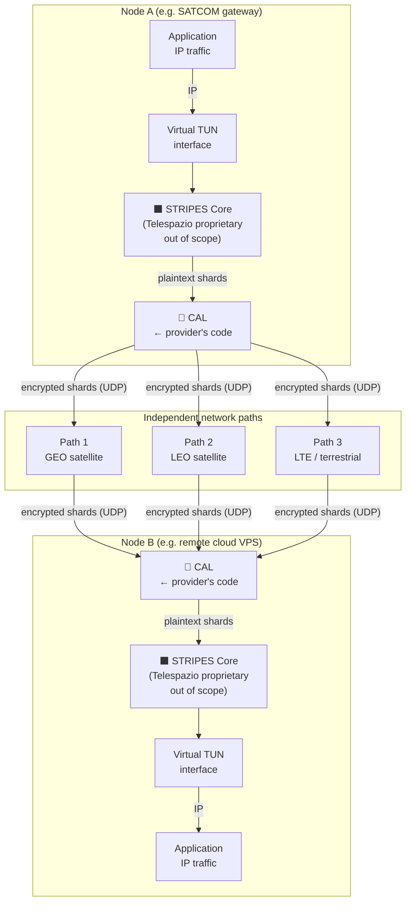
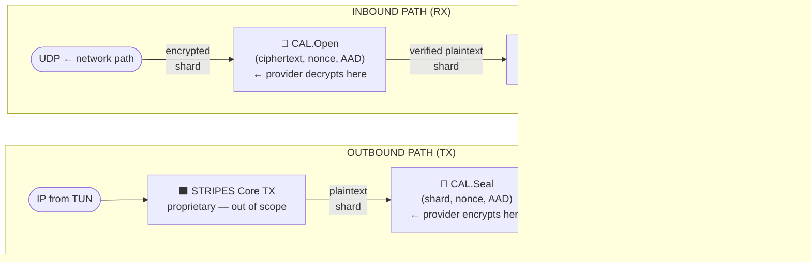
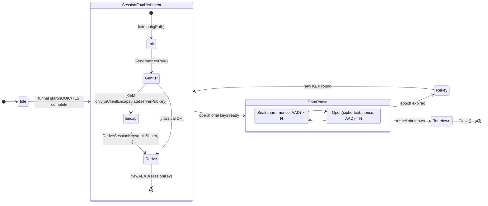
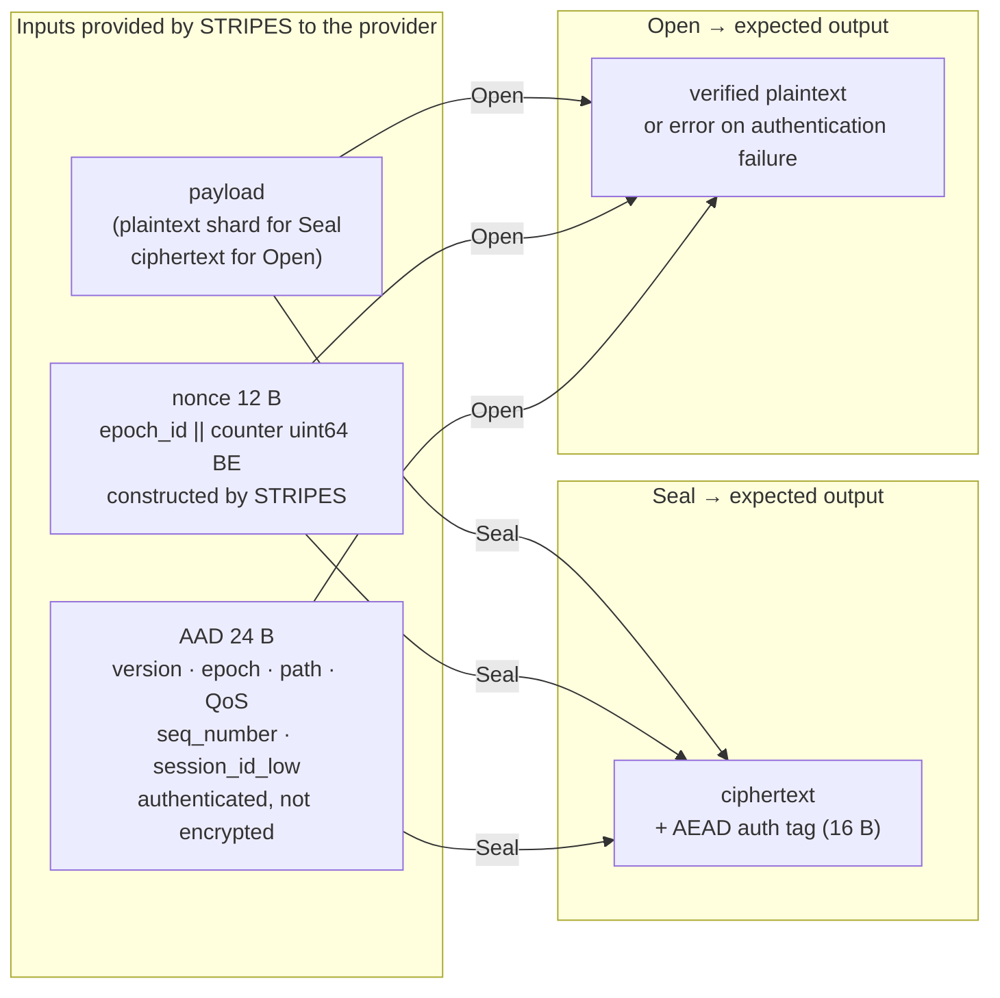
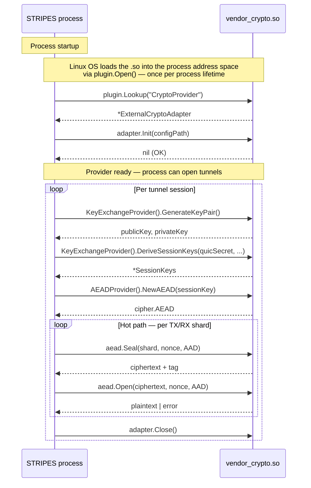
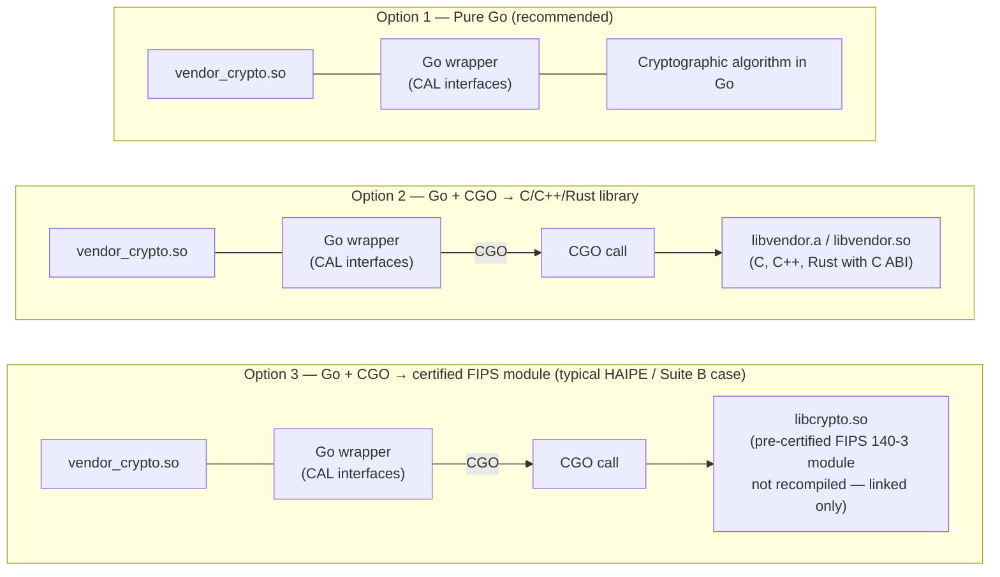
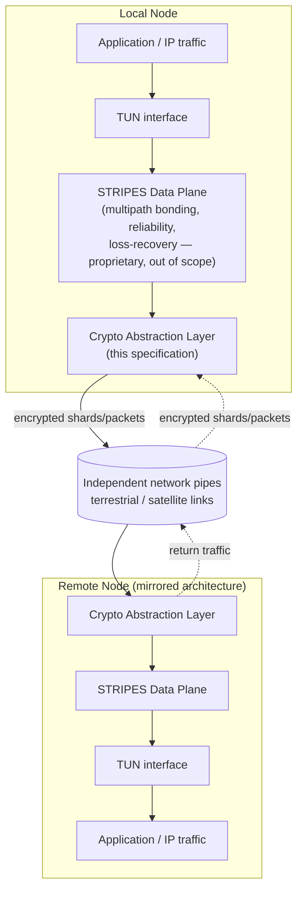
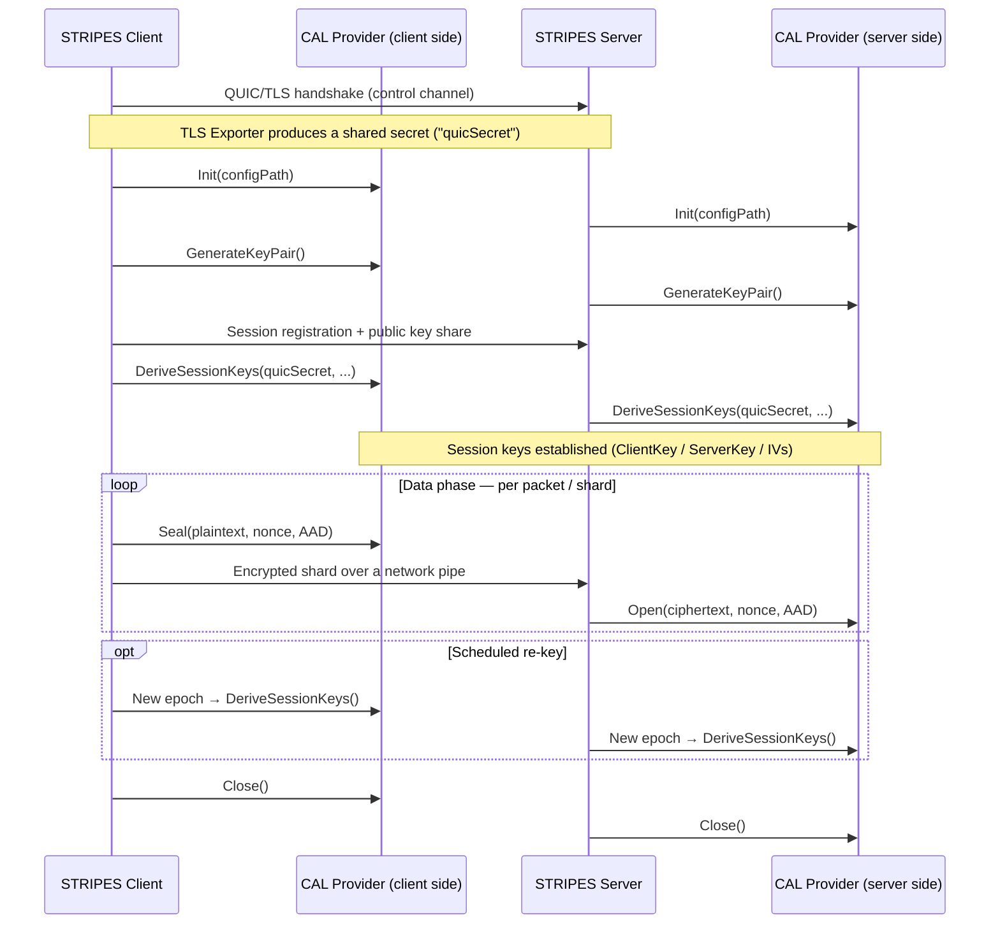
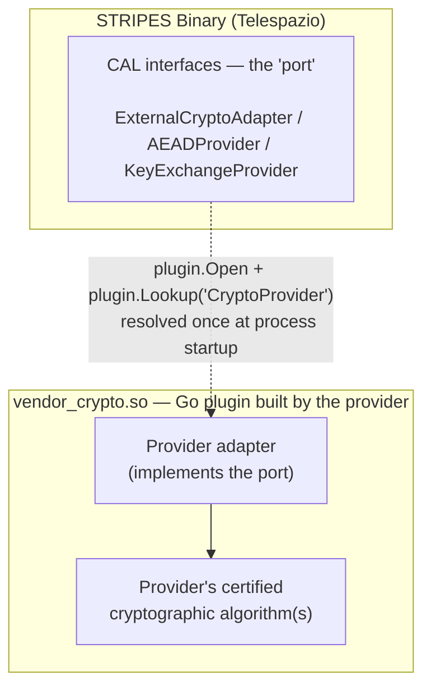

# STRIPES External Crypto Provider — Integration Specification

| | |
|---|---|
| **Document ID** | TPZ-STRIPES-CAL-EXT-001 |
| **Title** | STRIPES External Crypto Provider Integration Specification |
| **Version** | 1.2 |
| **Date** | 2026-06-18 |
| **Classification** | Restricted — Authorised Technical Partners Only |
| **Issuing Entity** | Telespazio S.p.A. — Engineering Division |
| **Contact** | engineering@telespazio.com |

---

## Preface — How STRIPES Works: Technical Guide for the Integration Partner

> **Purpose.** This section gives the provider's engineering team the functional context needed to understand where, when, and how their software will be called. It deliberately does not describe any Telespazio proprietary logic: the STRIPES core (multipath scheduling, loss recovery, path management) is and must remain a black box to the provider.

### P.1 The problem STRIPES solves

Operational SATCOM communications face a fundamental availability problem: any single link — a GEO terminal, a LEO modem, an LTE SIM — can degrade or fail at any time due to weather, congestion, hardware failure, or maintenance. Depending on a single network path exposes the service to unacceptable interruptions.

**STRIPES** (Secure Transport RIsk Protection Enhancement System) solves this by aggregating multiple physically independent paths into a **single encrypted logical tunnel**, transparent to applications. IP traffic enters a virtual TUN interface on one node and is delivered to the remote node's TUN interface across the combination of available paths. Cryptography ensures every byte of traffic is protected end-to-end across all paths.



### P.2 The data unit the CAL processes: the "shard"

Raw IP traffic is never passed directly to the CAL. The STRIPES core (proprietary, undisclosed logic) processes the IP stream and produces atomic transmission units called **shards** — each destined for a single network path.

**The CAL operates exclusively at the shard level**: every outgoing shard is sealed with `Seal()`; every incoming shard is opened and verified with `Open()`. The provider has no visibility into how shards are constructed, sized, sequenced, or reassembled — this is entirely Telespazio proprietary logic.



> ⚡ **Hot path.** On a high-throughput tunnel, `Seal` and `Open` are called hundreds of thousands of times per second. Performance requirements are non-negotiable: **zero heap allocations per shard, zero blocking I/O, microsecond latency.** Full details in §10.

### P.3 Two operational phases: when the provider's code is called

A STRIPES tunnel session has two distinct cryptographic phases. The provider is called in both, with radically different performance requirements.



| Phase | Call frequency | Tolerated latency | CAL methods |
|-------|---------------|------------------|-------------|
| **Session establishment** | Once per session + each scheduled re-key | 10 – 100 ms | `Init`, `GenerateKeyPair`, `ClientEncapsulate`, `DeriveSessionKeys`, `NewAEAD` |
| **Data phase — hot path** | Per shard (> 100 000/s on high-throughput links) | < 10 µs | `Seal`, `Open` |
| **Teardown** | Once on tunnel shutdown | Non-critical | `Close` |

### P.4 Anatomy of a `Seal` / `Open` call

Every `Seal` or `Open` invocation receives three inputs from STRIPES. The provider does not generate any of them — they are constructed entirely by STRIPES and passed as parameters.



**Nonce structure** (constructed by STRIPES — the provider must not generate or modify it):

```
nonce[12 B]:
  byte[0]    → epoch_id   (uint8, incremented at each re-key)
  byte[1:12] → counter    (uint64 big-endian, monotonically increasing per session/epoch)
```

**AAD** authenticates the transmission context (path, QoS class, sequence number, session ID) without encrypting it. The provider **MUST** include the full AAD in AEAD authentication — complete layout in §7.

### P.5 The Go plugin model: loading and call sequence

The provider's plugin is an **ELF `.so` file** compiled with `go build -buildmode=plugin`. STRIPES loads it once at process startup via Go's native plugin mechanism. There is no process separation, no IPC, no network latency: every call into the plugin is an ordinary in-process Go function call.



> The call overhead of an in-process Go function call is in the **nanosecond** range. The actual cost is dominated by the provider's cryptographic implementation — which must therefore be optimised for throughput.

### P.6 Language and toolchain: non-negotiable constraints

| Requirement | Value | Reason |
|------------|-------|--------|
| **Wrapper language** | **Go** — exact version communicated by Telespazio | Go plugins require identical toolchain between `.so` and host binary |
| **Build mode** | `go build -buildmode=plugin` on Linux | Only supported extension mechanism |
| **Target architectures** | `linux/amd64` (primary) + `linux/arm64` (mandatory) | Both STRIPES deployment architectures |
| **Exported symbol** | `var CryptoProvider ExternalCryptoAdapter` | Exact name looked up via `plugin.Lookup("CryptoProvider")` |
| **CGO** | Allowed subject to agreement with Telespazio | Requires alignment of C runtime and linker between the two codebases |
| **External dependencies** | Vendored inside the plugin Go module | Reproducible, self-contained build |

#### P.6.1 Can the cryptographic algorithm be implemented in a language other than Go?

**Yes, the algorithm can be written in any language** — provided the final `.so` file is built as a Go plugin. The `.so` is **always** the product of `go build -buildmode=plugin`; inside it, the Go code may call native libraries via CGO. There are three concrete options:



| Option | Algorithm written in | CGO required | Notes |
|--------|---------------------|--------------|-------|
| **1 — Pure Go** | Go | No | Simplest to build and deliver |
| **2 — Go + C/C++/Rust** | C, C++, Rust (with C ABI) | Yes | Requires toolchain alignment agreement with Telespazio |
| **3 — Go + certified lib** | Any (pre-compiled) | Yes | Typical case for FIPS 140-3 or NATO-certified modules already owned by the provider |

> **In all three options**, the interface to STRIPES is always and exclusively a Go interface. Telespazio does not support alternative integration mechanisms (gRPC, Unix socket, subprocess). For Options 2 and 3, Telespazio will provide a Docker build image at engagement start to ensure C runtime and linker compatibility.

### P.7 What the provider needs — and does not need — to know

| Aspect | Provider knows it | Notes |
|--------|------------------|-------|
| The tunnel aggregates multiple independent network paths | ✅ (functional context) | |
| How traffic is distributed / scheduled across paths | ❌ | Telespazio proprietary |
| The loss-recovery / redundancy mechanism | ❌ | Telespazio proprietary |
| Path-liveness and failover logic | ❌ | Telespazio proprietary |
| The CAL receives individual shards, not full IP packets | ✅ | Interface contract |
| The nonce format (epoch_id + counter) | ✅ | §6.2 |
| The AAD format (24-byte fixed layout) | ✅ | §7 |
| How the QUIC TLS Exporter secret is derived and passed | ✅ | §6.3 — `DeriveSessionKeys` parameter |
| The internal structure of a shard (header, trailer, size) | ❌ | Telespazio proprietary |
| Internal QUIC configuration | ❌ | Out of scope |

### P.8 Quick start: where to begin

1. **Choose integration level** → §5: Level A (AEAD only), B (KEX only), or C (full)
2. **Copy the Go interface definitions** → §6: they are not importable from `internal/`, they must be copied into the plugin package
3. **Implement the interfaces** respecting the constraints in §10
4. **Build**: `go build -buildmode=plugin -o vendor_crypto.so ./vendor_crypto/`
5. **Deliver** according to the checklist in §12

**Minimal structure for Level A** (AEAD only — fastest to implement):

```
vendor_crypto/
├── main.go        ← var CryptoProvider ExternalCryptoAdapter = &MyProvider{}
├── provider.go    ← Init, Name, Version, Close, AEADProvider() → &myAEAD{}
└── aead.go        ← NewAEAD, Seal, Open, KeySize, NonceSize
```

---

*End of preface. The document continues with the contractual interface specification.*

---

## Table of Contents

- [Preface — How STRIPES Works](#preface--how-stripes-works-technical-guide-for-the-integration-partner)
1. [STRIPES Architecture Overview](#1-stripes-architecture-overview)
2. [Introduction](#2-introduction)
3. [Scope](#3-scope)
4. [Prerequisites](#4-prerequisites)
5. [Integration Levels & Paradigm](#5-integration-levels--paradigm)
6. [Interface Definitions](#6-interface-definitions)
7. [AAD Format (v2)](#7-aad-format-v2)
8. [YAML Configuration](#8-yaml-configuration)
9. [Plugin Build Requirements](#9-plugin-build-requirements)
10. [Mandatory Requirements](#10-mandatory-requirements)
11. [Prohibited Behaviors](#11-prohibited-behaviors)
12. [Delivery Checklist](#12-delivery-checklist)

---

## 1. STRIPES Architecture Overview

> This section gives an external integrator enough functional context to understand **where** and **at which phase** the Crypto Abstraction Layer (CAL) is invoked. It deliberately stops at the CAL boundary: the internal path-scheduling, reliability and loss-recovery mechanisms of the STRIPES data plane are Telespazio proprietary technology and are **out of scope** for this document and for this integration.

### 1.1 What STRIPES is

STRIPES (Secure Transport RIsk Protection Enhancement System) is the multipath bonding transport layer of the MPQUIC system. It carries IP traffic from a local TUN interface, distributes it across **multiple independent network paths** (e.g. a satellite link and a terrestrial link, or several SATCOM/cellular modems), and reassembles it at the remote end into the original traffic stream — encrypting every byte that leaves the local node and decrypting every byte that arrives at the remote node.

From an external crypto provider's point of view, STRIPES is a **black box that hands plaintext IP packets to the Crypto Abstraction Layer on the way out, and receives plaintext IP packets back from it on the way in**. The CAL is the only seam the provider needs to understand.

### 1.2 System context



### 1.3 Two operational phases

STRIPES uses cryptography at two distinct phases of a tunnel session's life. The CAL interfaces map directly onto these phases — this mapping is the key thing an integrator needs to internalise before reading the interface contracts in §6.

| Phase | What happens | CAL methods involved |
|-------|---------------|----------------------|
| **1 — Session establishment** (once per session, repeated at each scheduled re-key) | The two STRIPES endpoints agree on a session identity and derive the symmetric operational keys from a shared secret | `Init`, `GenerateKeyPair`, `ClientEncapsulate` (KEM providers only), `DeriveSessionKeys` |
| **2 — Data phase** (continuous, for the entire lifetime of the session) | Every outgoing packet/shard is sealed immediately before being placed on a network pipe; every incoming one is opened immediately after being read from a network pipe | `NewAEAD`, `Seal`, `Open` |



### 1.4 What this document does *not* describe

To protect Telespazio intellectual property, this specification deliberately does **not** disclose:

- How traffic is scheduled or distributed across the network pipes
- The loss-recovery / reliability mechanism used by the data plane
- Path-liveness, failover, or traffic-classification logic
- Any internal algorithm not exposed through the CAL interfaces defined in this document

An external provider does not need any of the above to deliver a conformant CAL implementation. The interfaces, data formats and call lifecycle described from §6 onward are fully self-contained and sufficient to start implementation immediately.

---

## 2. Introduction

STRIPES (Secure Transport RIsk Protection Enhancement System) is the multipath bonding transport layer of the MPQUIC system developed by Telespazio. It provides multi-path UDP bonding with hardware-accelerated encryption over satellite and terrestrial links.

Starting from version 5.0, STRIPES exposes a **Crypto Abstraction Layer** (CAL) that allows an external provider to replace the internal cipher suite (X25519 + ML-KEM-768 + AES-256-GCM) with a certified or customer-specific implementation, **without modifications to the data plane code**.

This document is the authoritative specification for external crypto providers integrating with STRIPES CAL. It covers interface contracts, build requirements, configuration, and delivery requirements.

---

## 3. Scope

This document applies to:

- External organisations providing a certified cryptographic module for integration with STRIPES
- Partners providing post-quantum key exchange or symmetric cipher implementations
- System integrators requiring custom key derivation for national or operational security frameworks

This document does **not** describe:
- STRIPES internal architecture beyond what is shown in §1 (functional context only)
- Telespazio project processes
- The QUIC transport layer (handled by `quic-go`)

---

## 4. Prerequisites

| Requirement | Details |
|-------------|---------|
| Go toolchain | 1.26 or later (exact version provided by Telespazio at delivery) |
| Build mode | `go build -buildmode=plugin` (Linux only) |
| Target architectures | `linux/amd64`, `linux/arm64` |
| ML-KEM / hybrid profile | Requires Go built with `GOEXPERIMENT=mlkem` (build-time constraint, handled by Telespazio) |
| Interface compatibility | Plugin and STRIPES binary must be compiled with identical Go toolchain and shared dependencies |

---

## 5. Integration Levels & Paradigm

The provider selects one of three levels based on what it supplies:

```
┌──────────────────────────────────────────────────────────────────────┐
│                       STRIPES Data Plane                             │
│                                                                      │
│  Encrypt path:  TUN read → [CAL Seal] → UDP sendmmsg                 │
│  Decrypt path:  UDP recvmmsg → [CAL Open] → TUN write                │
│                                                                      │
│  ┌─────────────────────────────────────────────────────────────┐     │
│  │               ExternalCryptoAdapter (plugin)                │     │
│  │                                                             │     │
│  │  Level A: AEADProvider only  ←── provider supplies          │     │
│  │           KEX handled internally by STRIPES                 │     │
│  │                                                             │     │
│  │  Level B: KeyExchangeProvider only  ←── provider supplies   │     │
│  │           AEAD (AES-256-GCM) handled internally             │     │
│  │                                                             │     │
│  │  Level C: Full (KEX + AEAD)  ←── provider supplies both     │     │
│  └─────────────────────────────────────────────────────────────┘     │
└──────────────────────────────────────────────────────────────────────┘
```

### Level Selection Guide

| Provider offers | Recommended level |
|----------------|------------------|
| Certified symmetric cipher (e.g. HAIPE, NSA Suite B AEAD) | **Level A** |
| Certified key agreement algorithm (e.g. PQC lattice KEX) | **Level B** |
| Complete certified cryptographic suite (KEX + cipher) | **Level C** |

For Levels A and B, the plugin must still implement `ExternalCryptoAdapter` (the top-level interface) and return `nil` for the component it does not supply.

### Integration Paradigm

The integration between STRIPES and the provider's software is governed by a small, fixed set of paradigms. An integrator does not need to choose any of these — they are mandatory and are listed here so the partner's engineering team can plan its own internal architecture around them from day one.

| Aspect | Requirement |
|--------|-------------|
| **Language** | Go (matching the exact toolchain version STRIPES is built with — see §4) |
| **Architectural pattern** | Ports & Adapters (Hexagonal Architecture) / Strategy pattern. STRIPES defines the "port" — the three interfaces in §6. The provider supplies the "adapter" — a Go plugin implementing them. STRIPES has no knowledge of, and no dependency on, the concrete algorithm behind the interface |
| **Loading mechanism** | Go's native plugin facility (`buildmode=plugin`), resolved **once** at process startup via `plugin.Open` + `plugin.Lookup("CryptoProvider")`. There is no source-level dependency between the two codebases |
| **Process/IPC boundary** | **None.** The plugin runs in the same OS process and address space as STRIPES. A call into the provider is an ordinary in-process Go function call — not a network call, not RPC, not a subprocess |
| **Call discipline** | Synchronous, call-and-return. STRIPES calls into the provider; the provider never calls back into STRIPES. See §10 for hot-path constraints (no allocation, no blocking I/O, no goroutines left running) |
| **Error handling** | All failures are reported via Go's `error` return value. `panic()` is prohibited (see §10–§11) |



### Call-Site / Phase Reference

This table is the precise answer to "where and when does STRIPES call our code": every CAL method, the phase it belongs to (see §1.3), who calls it and how often.

| Phase | CAL method | Called from | Frequency |
|-------|-----------|--------------|-----------|
| Session establishment | `Init` | STRIPES process startup | Once per process |
| Session establishment | `GenerateKeyPair` | STRIPES client & server | Once per session, repeated at each re-key epoch |
| Session establishment | `ClientEncapsulate` (KEM providers only) | STRIPES client | Once per session, repeated at each re-key epoch |
| Session establishment | `DeriveSessionKeys` | STRIPES client & server | Once per session, repeated at each re-key epoch |
| Data phase (hot path) | `NewAEAD` | STRIPES | Once per session/epoch — **not** per packet |
| Data phase (hot path) | `Seal` | STRIPES TX path | Once per outgoing packet/shard |
| Data phase (hot path) | `Open` | STRIPES RX path | Once per incoming packet/shard |
| Teardown | `Close` | STRIPES | Once, on session/tunnel shutdown |

---

## 6. Interface Definitions

### 6.1 `ExternalCryptoAdapter` — Top-level entry point

This interface is the plugin entry point. STRIPES loads the `.so` file and calls `plugin.Lookup("CryptoProvider")` to obtain a value of this type.

```go
// ExternalCryptoAdapter is the interface that the external crypto plugin must
// implement and export as the symbol "CryptoProvider".
//
// Loading sequence:
//   p, err := plugin.Open("/path/to/vendor_crypto.so")
//   sym, err := p.Lookup("CryptoProvider")
//   adapter := *sym.(*ExternalCryptoAdapter)
type ExternalCryptoAdapter interface {
    // Init initialises the provider with the path to its configuration file.
    // Called once before any other method.
    // configPath is the value of crypto.custom_provider.config_file in the YAML.
    Init(configPath string) error

    // Name returns the provider name (free string, max 64 chars).
    Name() string

    // Version returns the provider version (e.g. "1.2.3").
    Version() string

    // KeyExchangeProvider returns the KEX implementation.
    // Returns nil if the provider supplies AEAD only (Level A).
    // STRIPES will use its internal KeyExchangeProvider when nil is returned.
    KeyExchangeProvider() KeyExchangeProvider

    // AEADProvider returns the AEAD implementation.
    // Returns nil if the provider supplies KEX only (Level B).
    // STRIPES will use its internal AEADProvider (AES-256-GCM) when nil is returned.
    AEADProvider() AEADProvider

    // Close releases all provider resources and zeroizes key material in memory.
    // Called on tunnel shutdown or process restart.
    Close() error
}
```

### 6.2 `AEADProvider` — Level A interface

```go
import "crypto/cipher"

// AEADProvider abstracts a symmetric AEAD cipher.
// Used in the hot path for every UDP packet (TX and RX).
// Implementations MUST be goroutine-safe and allocation-minimal.
type AEADProvider interface {
    // Name returns the algorithm name, e.g. "VendorCipher-256-GCM".
    Name() string

    // NewAEAD creates an AEAD cipher instance for the given key.
    // key length equals KeySize().
    // Called once per session/epoch, not per packet.
    NewAEAD(key []byte) (cipher.AEAD, error)

    // KeySize returns the required key length in bytes (e.g. 32 for AES-256).
    KeySize() int

    // NonceSize returns the required nonce length in bytes.
    // STRIPES uses 12 bytes (GCM-standard). Declare actual size here if different.
    NonceSize() int
}
```

**Nonce format provided by STRIPES to `Seal` / `Open`:**

```
nonce [12 bytes]:
  byte[0]    = epoch_id  (uint8, monotonically increasing per re-key)
  byte[1:12] = uint64 packet counter, big-endian, right-aligned
```

The provider must not modify nonce generation. The nonce is constructed by STRIPES before calling `Seal` or `Open`.

### 6.3 `KeyExchangeProvider` — Level B interface

```go
// KeyExchangeProvider abstracts the key exchange logic (classical or post-quantum).
// Used once per session (handshake) and on each re-key event.
// This operates ABOVE the QUIC TLS handshake — it derives STRIPES-level session
// keys from the QUIC TLS Exporter output.
type KeyExchangeProvider interface {
    // Name returns the provider name, e.g. "VendorKEX-PQC-Level3".
    Name() string

    // GenerateKeyPair generates a public/private key pair.
    // Called on both client and server sides before the handshake.
    GenerateKeyPair() (publicKey, privateKey []byte, err error)

    // DeriveSessionKeys derives operational session keys.
    //
    // Parameters:
    //   quicSecret  — output of QUIC TLS Exporter (64 bytes):
    //                 label "mpquic-stripe-v1", context = sessionID, length = 64
    //   localPrivKey — local private key from GenerateKeyPair()
    //   remotePubKey — peer's public key (exchanged via out-of-band mechanism)
    //   sessionID    — unique session identifier (variable length []byte)
    //
    // Returns SessionKeys with the MANDATORY fixed layout described below.
    DeriveSessionKeys(quicSecret, localPrivKey, remotePubKey []byte, sessionID []byte) (*SessionKeys, error)
}

// SessionKeys holds the operational symmetric keys for a session.
// The layout is MANDATORY regardless of the KEX algorithm used.
// STRIPES slices this struct with fixed offsets.
type SessionKeys struct {
    ClientKey []byte  // client→server symmetric key (MUST be exactly 32 bytes)
    ServerKey []byte  // server→client symmetric key (MUST be exactly 32 bytes)
    ClientIV  []byte  // client→server base IV (MUST be exactly 12 bytes)
    ServerIV  []byte  // server→client base IV (MUST be exactly 12 bytes)
    EpochID   uint8   // current epoch (set by STRIPES, provider propagates unchanged)
}
```

**Mandatory `SessionKeys` field sizes:**

| Field | Size | Notes |
|-------|------|-------|
| `ClientKey` | 32 B | Must be exactly 32 bytes |
| `ServerKey` | 32 B | Must be exactly 32 bytes |
| `ClientIV` | 12 B | Must be exactly 12 bytes |
| `ServerIV` | 12 B | Must be exactly 12 bytes |
| **Total** | 88 B | Fixed — STRIPES slices at fixed offsets |

### 6.4 `KemProvider` — Extension for asymmetric KEM algorithms

Providers implementing a KEM (Key Encapsulation Mechanism) rather than a Diffie-Hellman KEX must also implement `KemProvider`:

```go
// KemProvider extends KeyExchangeProvider for KEM algorithms (e.g. ML-KEM, Kyber).
// Classical DH providers implement KeyExchangeProvider only.
type KemProvider interface {
    KeyExchangeProvider

    // ClientEncapsulate prepares the client-side material for a KEM-based KEX.
    //
    // serverPubKey — the server's public key (from GenerateKeyPair on the server)
    //
    // Returns:
    //   localPrivKey — client's private material (used in DeriveSessionKeys)
    //   peerKeyShare — data to transmit to the server (KEM ciphertext + client pub key)
    ClientEncapsulate(serverPubKey []byte) (localPrivKey, peerKeyShare []byte, err error)
}
```

**STRIPES type assertion for KEM providers:**

```go
if kp, ok := provider.(KemProvider); ok {
    localPrivKey, peerKeyShare, err := kp.ClientEncapsulate(serverPubKey)
    // transmit peerKeyShare to server via out-of-band handshake
    keys, err := kp.DeriveSessionKeys(quicSecret, localPrivKey, serverPubKey, sessionID)
}
```

### 6.5 Exported symbol requirement

The plugin `.so` must export exactly one symbol at the package level:

```go
// In vendor_crypto/main.go

package main

// CryptoProvider is the symbol looked up by STRIPES via plugin.Lookup("CryptoProvider").
// It must be an exported variable of type ExternalCryptoAdapter (or *ExternalCryptoAdapter).
var CryptoProvider ExternalCryptoAdapter = &MyVendorProvider{}

// Compile-time interface compliance check (recommended):
var _ ExternalCryptoAdapter = (*MyVendorProvider)(nil)
```

> **Interface copying note**: The STRIPES `internal/mpquic/crypto/` package is not externally importable. The provider must copy the interface definitions into its own package. Interface compatibility is ensured by Go's structural typing (duck typing): if the method signatures match exactly, the type assertion will succeed at runtime.

---

## 7. AAD Format (v2)

The Additional Authenticated Data (AAD) is a **24-byte packed struct** that Level A and Level C providers must include in AEAD authentication.

### 7.1 Layout

```
Offset  Size  Field             Type         Description
──────  ────  ────────────────  ───────────  ──────────────────────────────────
 0       1B   version           uint8        Always 0x02 for external providers
 1       1B   epoch_id          uint8        Re-key epoch counter (0–255)
 2       2B   path_pipe_id      uint16 BE    High byte=path_id, low byte=pipe_id
 4       1B   traffic_class     uint8        0=best-effort, 1=critical, 2=bulk
 5       1B   flags             uint8        bit0=FEC active
                                             bit1=direction (0=c2s, 1=s2c)
                                             bit2=rekey_in_progress
 6       2B   fec_group_id      uint16 BE    FEC group ID; 0x0000 if no FEC
 8       8B   sequence_number   uint64 BE    Monotonically increasing per session
16       8B   session_id_low    uint64 BE    Low 64 bits of session ID
──────  ────  ────────────────────────────────────────────────────────────────
Total   24B
```

### 7.2 Usage

The full 24-byte AAD is passed as `additionalData` to `cipher.AEAD.Seal` and `cipher.AEAD.Open`. STRIPES validates the `version` field before dispatching to the provider; the provider must not perform version filtering.

### 7.3 Backward compatibility

The legacy AAD format (`version=0x01`, 16+8 bytes) is never sent to an external provider. External providers always receive `version=0x02`.

---

## 8. YAML Configuration

### 8.1 Activating the external provider

```yaml
# /etc/mpquic/instances/<instance>.yaml

stripe_crypto_enabled: true

crypto:
  enabled: true
  profile: custom_provider        # activates the external plugin

  custom_provider:
    path: /opt/mpquic/plugins/crypto/vendor_crypto.so
    config_file: /etc/mpquic/crypto/vendor_config.yaml

  rekey:
    enabled: false                # set to true only when re-key is coordinated
                                  # with the provider's session management
```

### 8.2 Configuration fields relevant to the provider

| YAML Field | Type | Description |
|-----------|------|-------------|
| `custom_provider.path` | string | Absolute path to the plugin `.so` file |
| `custom_provider.config_file` | string | Path passed to `ExternalCryptoAdapter.Init(configPath)` |
| `stripe_crypto_enabled` | bool | Must be `true`; `false` disables CAL entirely |

The `vendor_config.yaml` file is opaque to STRIPES. Its format and schema are defined by the provider and documented in the provider's delivery artefacts.

---

## 9. Plugin Build Requirements

### 9.1 Build command

```bash
# linux/amd64
go build \
  -buildmode=plugin \
  -o vendor_crypto.so \
  ./vendor_crypto/

# linux/arm64
GOOS=linux GOARCH=arm64 go build \
  -buildmode=plugin \
  -o vendor_crypto_arm64.so \
  ./vendor_crypto/
```

### 9.2 Toolchain compatibility constraint

Go plugins require **identical build IDs** between the plugin and the loading binary. This means:

- Same Go toolchain version (Telespazio will provide the exact version)
- Same module graph for any shared Go standard library usage
- No CGO unless explicitly coordinated with Telespazio

Telespazio will provide a **build environment specification** (Docker image or toolchain archive) at engagement start.

### 9.3 Recommended plugin package structure

```
vendor_crypto/
├── main.go           # package main; var CryptoProvider ExternalCryptoAdapter = ...
├── adapter.go        # struct MyProvider; Init, Name, Version, Close
├── aead.go           # AEADProvider implementation (Level A or C)
├── kex.go             # KeyExchangeProvider/KemProvider implementation (Level B or C)
├── config.go         # vendor_config.yaml parsing
├── interfaces.go     # copy of ExternalCryptoAdapter, AEADProvider, KeyExchangeProvider
│                     # (copied from this spec — must match exactly)
└── go.mod             # separate Go module, go 1.26 minimum
```

### 9.4 Allowed dependencies

| Dependency type | Allowed |
|----------------|---------|
| Go standard library | ✅ All packages |
| Certified crypto libraries (FIPS 140-3 validated) | ✅ |
| Provider's own dependencies (vendored) | ✅ |
| Internal STRIPES packages (`internal/...`) | ❌ Not importable |
| Libraries launching uncontrolled background goroutines | ❌ |
| GPL-licensed libraries | ❌ License incompatibility |

---

## 10. Mandatory Requirements

The following requirements are **non-negotiable** for integration approval:

| ID | Requirement |
|----|-------------|
| REQ-EXT-001 | All exported methods must be goroutine-safe |
| REQ-EXT-002 | `Seal` and `Open` must not allocate heap memory per packet |
| REQ-EXT-003 | `Seal` and `Open` must not perform blocking I/O |
| REQ-EXT-004 | No key material, nonces, or derived secrets may be written to any log or file |
| REQ-EXT-005 | `panic()` must not be called in production code paths |
| REQ-EXT-006 | `Init()` must be idempotent after first call (subsequent calls return error) |
| REQ-EXT-007 | `Close()` must zeroize all key material in memory before returning |
| REQ-EXT-008 | `DeriveSessionKeys` output must match the 32+32+12+12 byte layout exactly |
| REQ-EXT-009 | Plugin must compile without errors on `linux/amd64` and `linux/arm64` |
| REQ-EXT-010 | Test vectors must be provided for all cryptographic operations |
| REQ-EXT-011 | Exported symbol must be named exactly `CryptoProvider` |

---

## 11. Prohibited Behaviors

The following behaviors will cause immediate rejection of the integration:

| Behavior | Reason |
|----------|--------|
| Writing key material to stdout, stderr, log files, or syslog | Key logging security violation |
| Allocating memory inside `Seal` or `Open` | Breaks zero-allocation invariant |
| Calling `panic()` instead of returning `error` | Crashes the STRIPES process |
| Using global mutable state without synchronisation | Data races under concurrent access |
| Starting goroutines that are not cleaned up by `Close()` | Resource leak on tunnel restart |
| Implementing `Init()` to accept multiple calls silently | Violates lifecycle contract |
| Returning `nil` session keys from `DeriveSessionKeys` without error | Silent crypto bypass |
| Ignoring the `sessionID` parameter in `DeriveSessionKeys` | Session key isolation failure |

---

## 12. Delivery Checklist

The provider must deliver the following artefacts:

| # | Artefact | Format | Required |
|---|----------|--------|----------|
| 1 | Plugin binary `vendor_crypto.so` (linux/amd64) | ELF shared object | ✅ |
| 2 | Plugin binary `vendor_crypto_arm64.so` (linux/arm64) | ELF shared object | ✅ |
| 3 | Plugin source code | Go package (buildable) | ✅ |
| 4 | `go.mod` and `go.sum` | Go module files | ✅ |
| 5 | `interfaces.go` — copy of interfaces used | Go source | ✅ |
| 6 | Test vectors in JSON format | See §12.1 | ✅ |
| 7 | `vendor_config.yaml` schema documentation | Markdown or PDF | ✅ |
| 8 | Build instructions | Markdown README | ✅ |
| 9 | Cryptographic algorithm documentation | PDF or equivalent | ✅ |
| 10 | Certification/accreditation evidence | PDF (FIPS, NATO CC, etc.) | Recommended |

### 12.1 Test vector JSON format

```json
{
  "provider": "VendorCipher-256-GCM",
  "version": "1.0.0",
  "go_version": "go1.26.0",
  "aead_vectors": [
    {
      "id": "AEAD-001",
      "description": "Nominal seal/open round-trip",
      "key_hex": "<32-byte key, hex>",
      "nonce_hex": "020000000000000000000001",
      "plaintext_hex": "<plaintext, hex>",
      "aad_hex": "<24-byte AAD v2, hex>",
      "ciphertext_hex": "<ciphertext, hex>",
      "tag_hex": "<auth tag, hex>"
    },
    {
      "id": "AEAD-002",
      "description": "Authentication failure on tampered ciphertext",
      "key_hex": "<key, hex>",
      "nonce_hex": "020000000000000000000001",
      "plaintext_hex": "<plaintext, hex>",
      "aad_hex": "<AAD, hex>",
      "tampered_ciphertext_hex": "<ciphertext with 1 byte flipped, hex>",
      "expected_error": "authentication failed"
    }
  ],
  "kex_vectors": [
    {
      "id": "KEX-001",
      "description": "Cross-derivation symmetry: client and server derive identical keys",
      "quic_secret_hex": "<64-byte QUIC TLS Exporter output, hex>",
      "server_pubkey_hex": "<server public key, hex>",
      "client_privkey_hex": "<client private key, hex>",
      "session_id_hex": "aabbccdd",
      "expected_client_key_hex": "<32 bytes, hex>",
      "expected_server_key_hex": "<32 bytes, hex>",
      "expected_client_iv_hex": "<12 bytes, hex>",
      "expected_server_iv_hex": "<12 bytes, hex>"
    }
  ]
}
```

---

*Document end — TPZ-STRIPES-CAL-EXT-001 v1.1 — 2026-06-18*  
*Telespazio S.p.A. — Restricted Distribution — Authorised Technical Partners Only*
