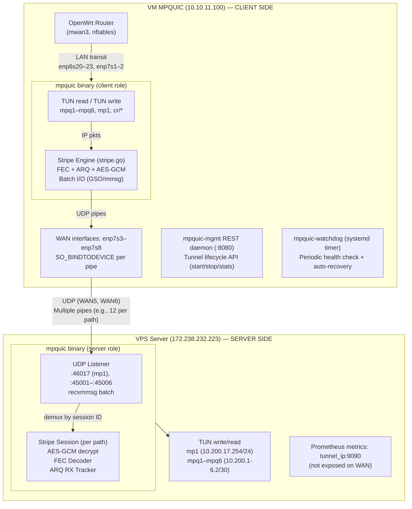
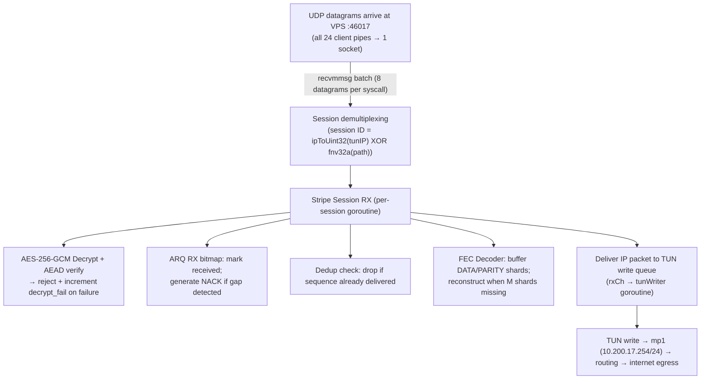
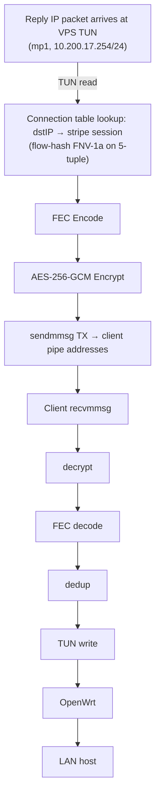
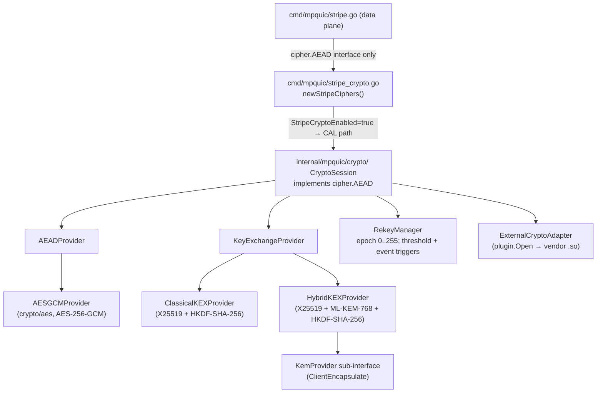
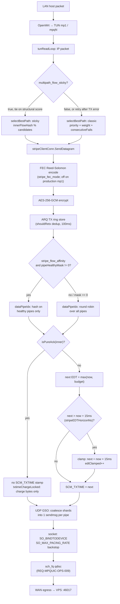
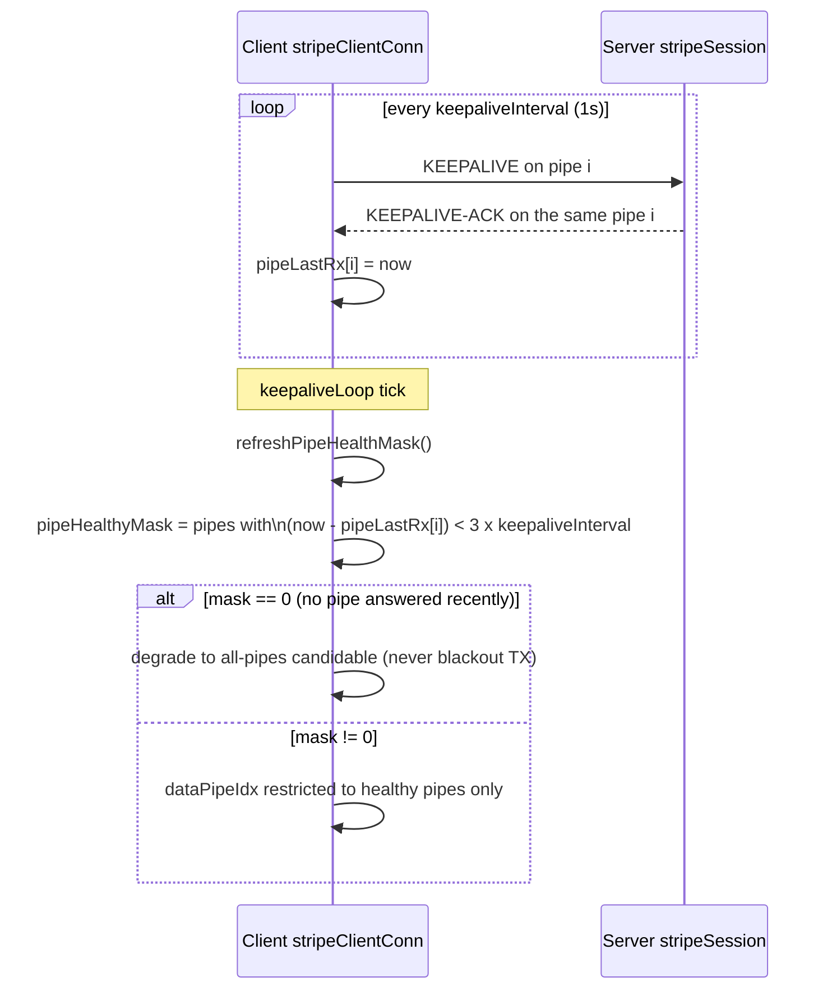
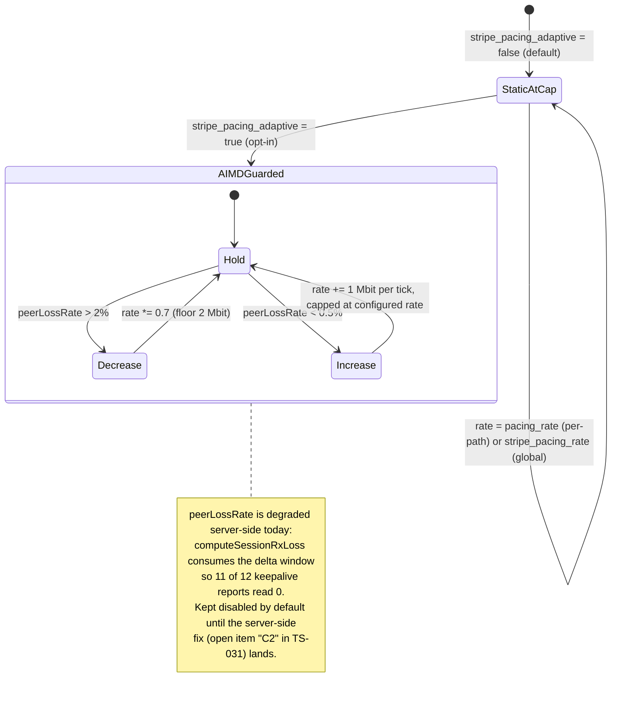

# TPZ-MPQUIC-TDD-001 — Technical Design Document
## MPQUIC/STRIPES Multipath Tunnel System

---

## Document Information

| Campo | Valore |
|-------|--------|
| Document ID | TPZ-MPQUIC-TDD-001 |
| Issue | 1 |
| Revision | 4 |
| Status | Draft |
| Author | Telespazio Engineering Team |
| Reviewed by | Tech Lead |
| Approved by | — |
| Date | 2026-07-29 |
| Classification | Internal |
| Applicable standards | ECSS-E-ST-40C, ECSS-Q-ST-80C |

---

## Table of Contents

1. [Introduction](#1-introduction)
   - 1.1 [Scope](#11-scope)
   - 1.2 [Applicable Documents](#12-applicable-documents)
   - 1.3 [Reference Documents](#13-reference-documents)
   - 1.4 [Acronyms and Abbreviations](#14-acronyms-and-abbreviations)
2. [System Overview](#2-system-overview)
   - 2.1 [Context](#21-context)
   - 2.2 [System Boundaries](#22-system-boundaries)
   - 2.3 [Operational Scenarios](#23-operational-scenarios)
3. [Requirements](#3-requirements)
   - 3.1 [Functional Requirements](#31-functional-requirements)
   - 3.2 [Security Requirements](#32-security-requirements)
   - 3.3 [Networking Requirements](#33-networking-requirements)
   - 3.4 [Performance Requirements](#34-performance-requirements)
   - 3.5 [Configuration Requirements](#35-configuration-requirements)
   - 3.6 [Operational Requirements](#36-operational-requirements)
   - 3.7 [API and Metrics Requirements](#37-api-and-metrics-requirements)
4. [Architecture Design](#4-architecture-design)
   - 4.1 [Component Overview](#41-component-overview)
   - 4.2 [Component Descriptions](#42-component-descriptions)
   - 4.3 [Data Flow](#43-data-flow)
   - 4.4 [Crypto Abstraction Layer (CAL)](#44-crypto-abstraction-layer-cal)
   - 4.5 [Client TX Pacing and Flow-Ordering Pipeline (v5.2)](#45-client-tx-pacing-and-flow-ordering-pipeline-v52)
5. [Interface Design](#5-interface-design)
   - 5.1 [YAML Instance Configuration](#51-yaml-instance-configuration)
   - 5.2 [Systemd Service Interface](#52-systemd-service-interface)
   - 5.3 [REST Metrics API](#53-rest-metrics-api)
   - 5.4 [Control API](#54-control-api)
   - 5.5 [Prometheus Metrics Interface](#55-prometheus-metrics-interface)
   - 5.6 [Crypto Section YAML Configuration](#56-crypto-section-yaml-configuration)
6. [Verification and Validation](#6-verification-and-validation)
   - 6.1 [Test Approach](#61-test-approach)
   - 6.2 [Test Cases](#62-test-cases)
   - 6.3 [Crypto Abstraction Layer Test Cases](#63-crypto-abstraction-layer-test-cases)
7. [Requirements Traceability Matrix (RTM)](#7-requirements-traceability-matrix-rtm)
8. [Change Log](#8-change-log)

---

## 1. Introduction

### 1.1 Scope

This document provides the Technical Design for the **MPQUIC/STRIPES** system developed by Telespazio Engineering.

MPQUIC/STRIPES is a multipath IP-over-QUIC/UDP tunnelling system designed for hybrid satellite connectivity in maritime and vehicular SATCOM platforms. The system creates encrypted IP tunnels over multiple simultaneous WAN links (LEO satellite, GEO satellite, LTE), providing bonding, failover, and quality-of-service capabilities classified as critical infrastructure under EU NIS2 Directive (EU) 2022/2555.

This document covers:
- Software architecture and design of the `mpquic` binary (client and server roles)
- STRIPES transport layer (UDP stripe, FEC Reed-Solomon, Hybrid ARQ)
- Management REST API (`mpquic-mgmt`)
- Systemd-based deployment model on Linux (Debian 12 / Ubuntu 24.04)
- Prometheus/Grafana observability integration

This document does **not** cover: OpenWrt mwan3 configuration, nftables firewall policy design, Grafana dashboard configuration, or Zabbix template details.

### 1.2 Applicable Documents

| ID | Document | Version |
|----|----------|---------|
| AD-01 | ECSS-E-ST-40C — Software Engineering | Rev 1, 6 March 2009 |
| AD-02 | ECSS-Q-ST-80C — Software Product Assurance | Rev 1, 6 March 2009 |
| AD-03 | ECSS-M-ST-40C — Configuration Management | Rev 1, 6 March 2009 |
| AD-04 | EU NIS2 Directive (EU) 2022/2555 | 2022 |

### 1.3 Reference Documents

| ID | Document | Path |
|----|----------|------|
| RD-01 | MPQUIC Architecture & Design (consolidated) | `docs/ARCHITETTURA.md` |
| RD-02 | MPQUIC Security Posture | `docs/SECURITY.md` |
| RD-03 | MPQUIC Requirements for ROMARS | `docs/MPQUIC_REQUIREMENTS_ROMARS.md` |
| RD-04 | MPQUIC Working Instructions | `docs/WORKING_INSTRUCTIONS.md` |
| RD-05 | MPQUIC Nota Tecnica | `docs/NOTA_TECNICA_MPQUIC.md` |
| RD-06 | MPQUIC main.go (entry point) | `cmd/mpquic/main.go` |
| RD-07 | STRIPES transport (stripe.go) | `cmd/mpquic/stripe.go` |
| RD-08 | AES-256-GCM crypto module | `cmd/mpquic/stripe_crypto.go` |
| RD-09 | Hybrid ARQ module | `cmd/mpquic/stripe_arq.go` |
| RD-10 | Systemd service template | `deploy/systemd/mpquic@.service` |
| RD-11 | Crypto Abstraction Layer design document | `docs/CIFRANTE_STRIPES.md` |
| RD-12 | STRIPES External Crypto Provider Specification | `docs/STRIPES_External_Crypto_Provider_Spec.md` |
| RD-13 | Client kernel TX pacing (SO_TXTIME/EDT) | `cmd/mpquic/stripe_txtime_linux.go` |
| RD-14 | Multipath client scheduler and per-flow path stickiness | `cmd/mpquic/client.go`, `cmd/mpquic/stripe_affinity.go` |
| RD-15 | Troubleshooting record for release v5.2 (TS-031) | `docs/TROUBLESHOOTING_HISTORY.md` |

### 1.4 Acronyms and Abbreviations

| Term | Definition |
|------|------------|
| AIMD | Additive Increase / Multiplicative Decrease (adaptive rate control) |
| ARQ | Automatic Repeat reQuest |
| AES-GCM | Advanced Encryption Standard — Galois/Counter Mode |
| BBR | Bottleneck Bandwidth and RTT (congestion control algorithm) |
| CAL | Crypto Abstraction Layer |
| CC | Congestion Control |
| ECSS | European Cooperation for Space Standardization |
| EDT | Early Departure Time (kernel TX pacing timestamp, `SO_TXTIME`/`SCM_TXTIME`) |
| FEC | Forward Error Correction |
| GEO | Geostationary Earth Orbit |
| GSO | Generic Segmentation Offload |
| HKDF | HMAC-based Key Derivation Function (RFC 5869) |
| ICD | Interface Control Document |
| KEM | Key Encapsulation Mechanism |
| KEX | Key Exchange |
| LEO | Low Earth Orbit |
| LTE | Long-Term Evolution (mobile broadband) |
| ML-KEM | Module-Lattice Key Encapsulation Mechanism (NIST FIPS 203) |
| MPQUIC | Multipath QUIC (project name; also refers to the binary) |
| NACK | Negative Acknowledgement |
| NIS2 | Network and Information Security Directive 2 (EU 2022/2555) |
| PFS | Perfect Forward Secrecy |
| PQC | Post-Quantum Cryptography |
| QUIC | QUIC transport protocol (RFC 9000) |
| RTM | Requirements Traceability Matrix |
| SATCOM | Satellite Communications |
| STRIPES | UDP Stripe transport layer within MPQUIC |
| TDD | Technical Design Document |
| TLS | Transport Layer Security |
| TUN | Linux TUN (network tunnel) virtual interface |
| UDP | User Datagram Protocol |
| VPS | Virtual Private Server |
| WAN | Wide Area Network |

---

## 2. System Overview

### 2.1 Context

The MPQUIC/STRIPES system is deployed on maritime vessels and vehicular platforms equipped with multiple satellite terminals and LTE modems. The objective is to aggregate bandwidth across heterogeneous WAN links and provide resilient, encrypted IP connectivity to the onboard LAN.

The system operates in a client–server topology:
- **Client node**: a Debian 12 VM (running on Proxmox) co-located with the vessel's routing infrastructure. Up to 6 WAN interfaces are bound to individual tunnel instances (WAN1–WAN6).
- **Server node**: an Ubuntu 24.04 VPS in a neutral data centre that terminates the tunnels and provides a stable gateway IP to the internet.

The OpenWrt router upstream of the client VM performs multi-WAN policy routing (mwan3) and DSCP-based traffic classification. The MPQUIC system sits transparently above this layer, providing a set of encrypted TUN interfaces which the router treats as additional WAN paths.

### 2.2 System Boundaries

#### In scope

| Component | Host | Description |
|-----------|------|-------------|
| `mpquic` binary (client role) | VM MPQUIC (10.10.11.100) | Reads/writes TUN; opens UDP stripe sockets per WAN |
| `mpquic` binary (server role) | VPS (172.238.232.223) | Terminates UDP stripe; writes/reads TUN |
| `mpquic-mgmt` REST daemon | VM MPQUIC | Management API for tunnel lifecycle |
| `mpquic-watchdog` | VM MPQUIC | Health check and auto-recovery |
| `mpquic-policy-routing.sh` | VM MPQUIC | Per-WAN policy routing tables (host route + tunnel default/blackhole) |
| `mpquic@*.service` | VM MPQUIC + VPS | systemd service units |
| TUN interfaces (`mpq1–6`, `mp1`, etc.) | VM MPQUIC + VPS | Virtual L3 tunnel endpoints |
| STRIPES transport engine | Both | FEC, ARQ, AES-256-GCM, batch I/O |
| Prometheus metrics endpoint | Both | HTTP `:9090` on tunnel IP |

#### Out of scope

| Component | Reason |
|-----------|--------|
| OpenWrt mwan3 | External policy router; not modified by MPQUIC |
| nftables firewall (VPS + OpenWrt) | Managed separately; firewall rules are a deployment concern |
| Grafana / Prometheus server | Third-party monitoring infrastructure |
| LuCI app (`luci-app-mpquic`) | UI layer on OpenWrt; separate deployment unit |
| Proxmox hypervisor | Infrastructure host; not part of the software system |

#### Host inventory

| Host | IP | OS | Role |
|------|----|----|------|
| VM MPQUIC | 10.10.11.100 | Debian 12 | Tunnel client, all service daemons |
| VPS | 172.238.232.223 | Ubuntu 24.04 | Tunnel server |
| OpenWrt | 10.10.11.254 | OpenWrt 24.10 x86_64 | Multi-WAN router (out of scope) |
| Prometheus LXC | 10.10.11.201 | Debian 12 LXC | Metrics scraping |
| Grafana LXC | 10.10.11.202 | Debian 12 LXC | Dashboards |

### 2.3 Operational Scenarios

#### Scenario 1 — Nominal: all WAN links active

All 6 WAN interfaces have valid IPv4 addresses. The multipath instance `mp1` uses WAN5 and WAN6 with 12 UDP pipes per path (24 pipes total). Single-path instances `mpquic@1..6` operate independently on their respective WANs. Aggregate throughput target: ≥ 300 Mbps.

FEC is in adaptive mode: `effective_M = 0` when loss = 0%; parity shards are added only when peer-reported loss exceeds the configured threshold (default: 2%).

#### Scenario 2 — Degraded: one or more WAN links down

One or more WAN paths report no IPv4 (DHCP lost) or no packet received for 30 seconds. The multipath scheduler marks affected paths `down` and applies cooldown with progressive back-off. Remaining active paths continue to carry traffic. FEC adaptive mode may increase M to compensate for elevated loss on surviving links.

Recovery: when the link recovers and the REGISTER + keepalive cycle succeeds, the path re-enters the active pool without service interruption.

#### Scenario 3 — Failover: all multipath paths lost, fallback to single-path

If all multipath paths fail simultaneously, single-path instances `mpquic@1..6` continue operating independently, providing uninterrupted connectivity on each individual WAN.

#### Scenario 4 — Security event: decrypt failure detected

The AES-256-GCM decryption fails for one or more received packets (tampered payload or replay attack). The packet is silently dropped. The counter `mpquic_session_decrypt_fail` is incremented. Prometheus/Zabbix alerting fires for `increase(mpquic_session_decrypt_fail[5m]) > 0`.

#### Scenario 5 — Controlled update

Operator runs `mpquic-update.sh`. The script performs: git pull, binary rebuild, controlled systemd stop/start. Configuration files are preserved. Service downtime is bounded by `RestartSec=2`.

---

## 3. Requirements

### 3.1 Functional Requirements

**[REQ-MPQUIC-SW-001]** The `mpquic` binary shall operate in either `client` or `server` role as specified by the `role` field in the instance YAML configuration file, using the same binary executable for both roles.

**[REQ-MPQUIC-SW-002]** In client role, the system shall read IP packets from the designated TUN interface and forward them to the remote server via the configured transport (QUIC datagram or UDP stripe).

**[REQ-MPQUIC-SW-003]** In server role, the system shall receive IP packets from the transport layer and write them to the designated TUN interface.

**[REQ-MPQUIC-SW-004]** The system shall support up to 6 simultaneously active, independent tunnel instances, each managed by a dedicated `mpquic@<instance>.service` systemd unit.

**[REQ-MPQUIC-SW-005]** The stripe transport engine shall bind each UDP pipe socket to the designated WAN network interface using `SO_BINDTODEVICE`, ensuring that outgoing packets are transmitted exclusively via the specified interface.

**[REQ-MPQUIC-SW-006]** The stripe transport engine shall open N parallel UDP sockets (pipes) per configured WAN path, where N is defined by the `stripe_pipes` YAML parameter.

**[REQ-MPQUIC-SW-007]** The stripe transport engine shall distribute TX packets across active pipes using round-robin scheduling, with a pre-computed `txActivePipes` cache that is rebuilt only on REGISTER or keepalive events to achieve zero per-packet heap allocation.

**[REQ-MPQUIC-SW-008]** The FEC encoder shall apply Reed-Solomon coding with K = 10 data shards and M ≤ 2 parity shards per group; both K and M shall be configurable via YAML parameters `stripe_fec_data_shards` and `stripe_fec_parity_shards`.

**[REQ-MPQUIC-SW-009]** The FEC decoder shall reconstruct up to M missing shards per FEC group without requesting retransmission, provided no more than M shards are absent from the group.

**[REQ-MPQUIC-SW-010]** In adaptive FEC mode (`stripe_fec_mode: adaptive`), the effective parity count `M` shall start at 0 (no parity overhead), shall increase to the configured maximum M when the peer-reported packet loss rate exceeds 2%, and shall not decrease below M for at least 15 seconds after a loss event.

**[REQ-MPQUIC-SW-011]** The Hybrid ARQ TX subsystem shall buffer up to 4096 plaintext shards in a ring buffer for selective retransmission upon receipt of a NACK packet.

**[REQ-MPQUIC-SW-012]** The Hybrid ARQ RX subsystem shall track received sequence numbers using a circular bitmap of 8192 bits and shall detect gaps up to 64 consecutive missing sequences via the NACK bitmap field.

**[REQ-MPQUIC-SW-013]** The Hybrid ARQ subsystem shall transmit NACK packets at intervals of at most 5 ms when gaps are detected, subject to a per-block rate limit of at most one NACK packet per 30 ms and a gap threshold of 96 sequence numbers.

**[REQ-MPQUIC-SW-014]** The server shall maintain a `connectionTable` that maps each client TUN peer IP to the corresponding QUIC connection or stripe session, enabling correct routing of return-path packets including traffic from LAN hosts behind the client.

**[REQ-MPQUIC-SW-015]** The stripe RX subsystem shall deduplicate received packets by checking the sequence number against the RX bitmap before delivering any packet to the TUN write path; duplicate packets shall be silently discarded.

**[REQ-MPQUIC-SW-016]** When `multipath_enabled: true`, the client shall concurrently maintain N path connections (one per entry in `multipath_paths`), each with independent socket binding, reconnection state, and cooldown management.

**[REQ-MPQUIC-SW-017]** The multipath scheduler shall select the TX path based on a composite score derived from the path `priority`, cumulative `consecutiveFails` penalty, and `weight` bonus; lower scores shall be preferred.

**[REQ-MPQUIC-SW-018]** When a path TX or RX error is detected, the system shall mark that path `down`, apply a cooldown period with progressive back-off, and initiate a reconnection loop in the background; if reconnection succeeds, the path shall re-enter the active pool without operator intervention.

**[REQ-MPQUIC-SW-019]** The server shall use FNV-1a hash on the 5-tuple (srcIP, dstIP, protocol, srcPort, dstPort) to assign each TCP/UDP flow to a single stripe session, ensuring that packets belonging to the same flow are consistently dispatched via the same WAN path to prevent TCP reordering.

**[REQ-MPQUIC-SW-020]** The system shall support a token-bucket rate limiter (`stripePacer`) per stripe session to spread TX writes over time and prevent burst-induced retransmissions; the pacer shall be disabled when `stripe_rate_mbps` is not configured.

**[REQ-MPQUIC-SW-021]** When `multipath_flow_sticky: true`, the multipath client shall assign each internal flow, identified by a hash of the 5-tuple of the tunnelled packet, to a single path among the candidates sharing the minimum structural score (path `priority` and `weight`, excluding the transient `consecutiveFails` penalty), keeping that flow pinned to the same path for as long as the candidate set is unchanged.

**[REQ-MPQUIC-SW-022]** When a TX send error occurs on the path selected for a sticky-pinned flow, the multipath client shall retry the send using the standard path-selection scoring (including the `consecutiveFails` penalty) for that attempt, without re-pinning the flow to the failed path.

**[REQ-MPQUIC-SW-023]** The client stripe engine shall maintain a per-pipe health mask, recomputed on every keepalive tick from the timestamp of the last packet received on each pipe; pipe selection for flow-affinity (`stripe_flow_affinity`) shall be restricted to pipes marked healthy in this mask, and an all-unhealthy mask shall cause the engine to select among all pipes rather than suspend transmission.

**[REQ-MPQUIC-SW-024]** The Hybrid ARQ TX subsystem shall not retransmit the same FEC GroupSeq more than once within a 100 ms interval, to prevent duplicate shard delivery caused by repeated NACKs for the same gap arriving faster than the round-trip time.

### 3.2 Security Requirements

**[REQ-MPQUIC-SEC-001]** The QUIC transport shall use TLS 1.3 for all connections; the TLS handshake shall provide mutual peer authentication and session key establishment for all tunnel instances.

**[REQ-MPQUIC-SEC-002]** The client shall verify the server X.509 certificate against the configured CA file (`tls_ca_file`) and shall validate the server common name against `tls_server_name`; certificate validation failures shall terminate the connection with a logged error.

**[REQ-MPQUIC-SEC-003]** The `tls_insecure_skip_verify` parameter shall be set to `false` in all production deployments; deployments with `tls_insecure_skip_verify: true` shall be rejected by the health check script with a WARNING log entry.

**[REQ-MPQUIC-SEC-004]** The stripe transport engine shall encrypt every UDP shard payload using AES-256-GCM before transmission, providing both confidentiality and authenticated integrity for all stripe-transported packets.

**[REQ-MPQUIC-SEC-005]** Stripe session encryption keys shall be derived from TLS 1.3 Exporter Material (RFC 5705) after the QUIC handshake completes, producing independent directional keys; no manual key configuration shall be required.

**[REQ-MPQUIC-SEC-006]** The stripe engine shall maintain a monotonically increasing nonce counter per direction; any received packet whose nonce does not strictly exceed the last accepted nonce for that session shall be rejected and the `mpquic_session_decrypt_fail` counter shall be incremented.

**[REQ-MPQUIC-SEC-007]** The pprof HTTP debug server, when enabled via `--pprof`, shall bind exclusively to `127.0.0.1` and shall never be configured on a network-reachable address.

**[REQ-MPQUIC-SEC-008]** The Control API (`control_api_listen`) shall bind exclusively to `127.0.0.1:<port>` and shall require a valid Bearer token in the `Authorization` header for all state-modifying requests when `control_api_auth_token` is set.

**[REQ-MPQUIC-SEC-009]** The Prometheus metrics HTTP server shall bind to the tunnel IP address (e.g., `10.200.x.y:9090`) and shall not be accessible from WAN interfaces or public IP addresses; the nftables firewall on the VPS server shall not expose port 9090 externally.

**[REQ-MPQUIC-SEC-010]** The systemd service unit shall set `NoNewPrivileges=true` and shall restrict the process capability set to the minimum required: `CAP_NET_ADMIN`, `CAP_NET_RAW`, and `CAP_NET_BIND_SERVICE`.

**[REQ-MPQUIC-SEC-011]** When `stripe_crypto_enabled: true`, the data plane shall access all cryptographic operations exclusively through the `CryptoSession` interface (`internal/mpquic/crypto/`); direct dependencies on `crypto/aes` or `crypto/cipher` in transport code shall not exist on the CAL path. When `stripe_crypto_enabled: false`, the pre-v5.0 legacy cipher path shall remain active for backward compatibility.

**[REQ-MPQUIC-SEC-012]** The `performance` crypto profile shall use X25519 (ECDH, RFC 7748) for key exchange and AES-256-GCM for authenticated encryption; key derivation shall use HKDF-SHA-256 (RFC 5869) with `quicSecret` (64 bytes from QUIC TLS Exporter) as salt and the X25519 shared secret as IKM; the output layout shall be `ClientKey[32] | ServerKey[32] | ClientIV[12] | ServerIV[12]`.

**[REQ-MPQUIC-SEC-013]** The `hybrid_security` crypto profile shall combine X25519 and ML-KEM-768 (NIST FIPS 203, IND-CCA2, security level 3) in a hybrid key exchange; the combined IKM for HKDF-SHA-256 shall be `sharedX(32) ‖ mlkemShared(32)`; this profile shall provide at minimum 178-bit post-quantum security against quantum adversaries, mitigating Store-Now-Decrypt-Later (SNDL) attacks.

**[REQ-MPQUIC-SEC-014]** The `custom_provider` crypto profile shall load the external cipher implementation via Go `plugin.Open`; the loaded symbol `CryptoProvider` shall be type-asserted to `ExternalCryptoAdapter`; failure of `plugin.Open` or the type assertion shall cause a fatal error at session establishment and shall not fall back to any built-in profile.

**[REQ-MPQUIC-SEC-015]** `CryptoSession` shall retain at minimum the two most recent cipher epochs (current epoch N and previous epoch N-1) to allow decryption of in-flight packets during re-key transitions; the `Open` function shall attempt decryption with the current epoch first and fall back to epoch N-1 on AEAD tag failure before returning `ErrAuthFailed`.

**[REQ-MPQUIC-SEC-016]** Registering a cipher epoch with an ID already present in the `CryptoSession` epoch map shall return `ErrRekeyBadEpoch` and shall not overwrite the existing epoch entry; the session shall remain fully operational after this error condition.

**[REQ-MPQUIC-SEC-017]** Cryptographic key material (`quicSecret`, derived session keys, shared secrets) shall not be written to log output at any severity level; when `stripe_crypto_enabled: true`, the system shall return a hard error (not a silent downgrade to the legacy path) if `len(quicSecret) < 64`.

### 3.3 Networking Requirements

**[REQ-MPQUIC-NET-001]** The `ensure_tun.sh` script, executed as `ExecStartPre` by the systemd service, shall create the TUN interface if absent and shall configure the IP address and MTU idempotently, without failing if the interface already exists and is correctly configured.

**[REQ-MPQUIC-NET-002]** Each client UDP pipe socket shall be bound to a source IP address and, when the `bind_ip` value uses the `if:<ifname>` syntax, to the kernel-level interface via `SO_BINDTODEVICE`, ensuring correct egress on multi-homed hosts.

**[REQ-MPQUIC-NET-003]** The system shall support a 1:1 mapping between WAN physical interfaces and single-path tunnel instances, with instances 1–6 mapping to `enp7s3`–`enp7s8` respectively as specified in the deployment configuration.

**[REQ-MPQUIC-NET-004]** The multipath client shall support at least 1 and at most an operator-defined number of simultaneous WAN paths, limited only by available host UDP port and socket resources.

**[REQ-MPQUIC-NET-005]** The server shall accept connections from multiple simultaneous clients on the same UDP listener port and shall demultiplex sessions by session ID (`ipToUint32(tunIP) XOR fnv32a(pathName)`).

**[REQ-MPQUIC-NET-006]** The `mpquic-lan-routing-check.sh` script shall validate and optionally repair policy routing entries for LAN-to-tunnel traffic for instances 1 through 6 or for a single specified instance.

**[REQ-MPQUIC-NET-007]** In a per-WAN policy routing table (`wanN`) shared by more than one tunnel instance, the `mpquic-policy-routing.sh` script shall maintain the host route to the remote tunnel endpoint (VPS) based solely on the physical WAN link state (`wan_usable`: valid IPv4 address and reachable gateway), independently of the up/down state of any single TUN interface routed through that table.

### 3.4 Performance Requirements

**[REQ-MPQUIC-PERF-001]** The stripe transport engine shall sustain an aggregate bidirectional throughput of at least 300 Mbps when operating with 3 active WAN paths and 12 UDP pipes per path, as validated on the production hardware configuration (dual Starlink WAN5+WAN6, 24 total pipes, measured result: 303 Mbps).

**[REQ-MPQUIC-PERF-002]** Each UDP socket (client and server) shall have its receive and transmit kernel buffers set to at least 7 MB (7,340,032 bytes) to absorb bursts of up to 100 ms at 500 Mbps; the host sysctl parameters `net.core.rmem_max` and `net.core.wmem_max` shall be set to at least 7 MB.

**[REQ-MPQUIC-PERF-003]** The RX batch receive loop shall read up to 8 UDP datagrams per `recvmmsg` system call on both client and server, reducing per-packet syscall overhead at high packet rates.

**[REQ-MPQUIC-PERF-004]** The client TX subsystem shall use UDP Generic Segmentation Offload (`UDP_SEGMENT` / `sendmsg` with `UDP_SEGMENT` cmsg) to coalesce multiple shards destined for the same pipe into a single system call; a software fallback shall be activated automatically on kernel `EIO` error.

**[REQ-MPQUIC-PERF-005]** The server TX subsystem shall use `sendmmsg` batch transmission to deliver N datagrams to different client pipe destinations in a single system call, reducing per-packet syscall overhead on the server egress path.

**[REQ-MPQUIC-PERF-006]** All dataplane byte and packet counters shall be implemented using `sync/atomic` operations; no heap allocation shall occur in the TX/RX hot path for counter updates.

**[REQ-MPQUIC-PERF-007]** The stripe session timeout without received traffic shall be 30 seconds; the client-to-server keepalive interval shall be 1 second; the server shall respond to keepalives only for known sessions.

**[REQ-MPQUIC-PERF-008]** The client TX subsystem shall support kernel-level packet pacing via `SO_TXTIME`/`SCM_TXTIME` (Early Departure Time, `CLOCK_MONOTONIC`) on each pipe socket, with `SO_MAX_PACING_RATE` configured on the same socket as a backstop for any packet transmitted without an explicit EDT timestamp.

**[REQ-MPQUIC-PERF-009]** The EDT pacing budget shall be advanced in proportion to the number of bytes transmitted (gap = packet length / 1402-byte shard-equivalent), not per packet, so that small non-data segments are not delayed by the same amount as full-size shards.

**[REQ-MPQUIC-PERF-010]** The EDT pacing budget shall be shared across all pipes belonging to the same path, not allocated independently per pipe, so that the configured pacing rate reflects the aggregate capacity of the path rather than a fraction of it per pipe.

**[REQ-MPQUIC-PERF-011]** The EDT debt, defined as the scheduled transmit time minus the current time, shall never exceed 15 ms; when advancing the budget would exceed this horizon, the pacer shall clamp the EDT to `now + 15 ms` and increment a dedicated counter, rather than allow the local queuing discipline to accumulate an unbounded backlog.

**[REQ-MPQUIC-PERF-012]** The client TX subsystem shall exempt pure TCP acknowledgement segments of the tunnelled inner flow (no payload, no SYN/FIN/RST flags) from carrying an EDT pacing timestamp; the exemption decision shall be based on inspection of the inner (tunnelled) packet, not the wire-level shard size, so that it is unaffected by FEC parity padding.

**[REQ-MPQUIC-PERF-013]** The byte length of an EDT-exempt packet shall nonetheless be charged to the pacing budget, so that the effective transmit rate observed on the wire does not exceed the configured pacing rate.

### 3.5 Configuration Requirements

**[REQ-MPQUIC-CONF-001]** Each tunnel instance shall be configured by a dedicated YAML file, the path to which is passed via the `--config` CLI flag at process start; absence of the `--config` flag shall cause the process to terminate with a fatal error.

**[REQ-MPQUIC-CONF-002]** The YAML instance configuration shall include at minimum the following fields: `role`, `tun_name`, `tun_cidr`, `remote_addr`, `remote_port`; absence of any mandatory field shall cause the process to log a fatal configuration error and exit with a non-zero status code.

**[REQ-MPQUIC-CONF-003]** The `render_config.sh` script shall substitute environment variables (including `VPS_PUBLIC_IP`) in the YAML template file `<instance>.yaml.tpl`, writing the rendered output to `/run/mpquic/<instance>.yaml` before the main process starts.

**[REQ-MPQUIC-CONF-004]** The dataplane QoS policy shall be configurable via either an inline `dataplane:` block within the instance YAML or a separate file referenced by `dataplane_config_file`; when both are present, the `dataplane_config_file` value shall take precedence.

**[REQ-MPQUIC-CONF-005]** The metrics listen address shall be configurable via the `metrics_listen` YAML field; the value `auto` shall resolve to `<tun_local_ip>:9090`; omission of the field shall disable the metrics endpoint.

**[REQ-MPQUIC-CONF-006]** The congestion algorithm shall default to `cubic` when the `congestion_algorithm` field is absent or empty; the accepted values are `cubic` and `bbr`.

**[REQ-MPQUIC-CONF-007]** The transport mode shall default to `datagram` when the `transport_mode` field is absent or empty; the accepted values are `datagram`, `stream`, and `stripe`.

**[REQ-MPQUIC-CONF-008]** The `stripe_pacing_rate` YAML field shall configure a session-level kernel TX pacing rate cap expressed in Mbps; a value of 0 shall disable kernel pacing for that session.

**[REQ-MPQUIC-CONF-009]** The `pacing_rate` field within a `multipath_paths` entry shall, when non-zero, override `stripe_pacing_rate` for that specific path, enabling asymmetric pacing caps across paths with different uplink capacities.

**[REQ-MPQUIC-CONF-010]** The `multipath_flow_sticky` YAML field (boolean, default `false`) shall enable per-flow path stickiness in the multipath client scheduler as described in [REQ-MPQUIC-SW-021].

**[REQ-MPQUIC-CONF-011]** The `stripe_pacing_adaptive` YAML field (boolean, default `false`) shall enable the AIMD pacing-rate controller; when set to `false`, the pacing rate shall remain static at the configured cap (`stripe_pacing_rate` or per-path `pacing_rate`).

**[REQ-MPQUIC-CONF-012]** Kernel TX pacing via `SO_TXTIME` shall require the `fq` (`sch_fq`) queuing discipline configured on the egress WAN interface; the deployment procedure shall document that `fq_codel` and other non-EDT-aware queuing disciplines cause the kernel to silently ignore `SO_TXTIME`/`SCM_TXTIME` and `SO_MAX_PACING_RATE`.

### 3.6 Operational Requirements

**[REQ-MPQUIC-OPS-001]** Each tunnel instance shall be managed by a systemd service unit instantiated from the `mpquic@.service` template, following the naming convention `mpquic@<instance>.service`.

**[REQ-MPQUIC-OPS-002]** The systemd service unit shall set `Restart=always` with `RestartSec=2` so that any abnormal process termination causes an automatic restart within 2 seconds.

**[REQ-MPQUIC-OPS-003]** The TUN interface shall be created and configured idempotently by `ensure_tun.sh` in the `ExecStartPre` phase; the script shall not fail if the interface is already present and correctly configured.

**[REQ-MPQUIC-OPS-004]** The `mpquic-healthcheck.sh` script shall verify for each specified instance: (a) the systemd service is in `active` state, (b) the TUN interface exists and is in `UP` state, and (c) the expected IP address is assigned to the TUN interface; failures shall produce structured log output with the affected instance identifier.

**[REQ-MPQUIC-OPS-005]** The `mpquic-update.sh` script shall perform the following steps in order: pull latest sources from the repository, rebuild the binary, stop the running service instances, install the new binary, and restart the service instances; the script shall re-execute itself if the binary changes during the update.

**[REQ-MPQUIC-OPS-006]** The process shall enforce a hard shutdown deadline of 10 seconds after receiving `SIGTERM`; if the deadline is exceeded, the process shall call `os.Exit(1)` to prevent systemd from waiting indefinitely.

**[REQ-MPQUIC-OPS-007]** The systemd service unit shall set `NoNewPrivileges=true`, `CapabilityBoundingSet=CAP_NET_ADMIN CAP_NET_RAW CAP_NET_BIND_SERVICE`, and `AmbientCapabilities=CAP_NET_ADMIN CAP_NET_RAW CAP_NET_BIND_SERVICE`; no other Linux capabilities shall be granted to the process.

**[REQ-MPQUIC-OPS-008]** The `mpquic-update.sh` auto-update script shall set `LimitNOFILE=1048576` for the service to support up to 1,048,576 open file descriptors, required to sustain a large number of concurrent UDP sockets across all instances.

**[REQ-MPQUIC-OPS-009]** Each WAN interface used for kernel TX pacing shall have the `fq` (`sch_fq`) queuing discipline applied (e.g., `tc qdisc replace dev <wan> root fq`), and the host default queuing discipline shall be persisted as `net.core.default_qdisc=fq` via sysctl so that the prerequisite survives interface re-creation.

**[REQ-MPQUIC-OPS-010]** On stripe paths where the downlink exhibits bursty packet loss (e.g., GEO/LEO satellite links), the operator should configure `stripe_fec_mode: off` and rely on the Hybrid ARQ subsystem for loss recovery, avoiding the positive-feedback interaction between rising adaptive parity overhead and downlink congestion described in §4.2.3.

### 3.7 API and Metrics Requirements

**[REQ-MPQUIC-API-001]** The metrics HTTP server shall expose a Prometheus text-format endpoint at `GET /metrics`, returning all registered `mpquic_*` metrics in the Prometheus text exposition format (version 0.0.4).

**[REQ-MPQUIC-API-002]** The metrics HTTP server shall expose a JSON statistics endpoint at `GET /api/v1/stats`, returning the fields `role`, `version`, `uptime_sec`, `total_tx_bytes`, `total_rx_bytes`, `total_tx_pkts`, `total_rx_pkts`, and either `sessions[]` (server) or `paths[]` (client).

**[REQ-MPQUIC-API-003]** Server-side per-session Prometheus metrics shall use the labels `session` (hex session ID) and `peer` (source IP of the client); the following metrics shall be exposed per session: `mpquic_session_tx_bytes`, `mpquic_session_rx_bytes`, `mpquic_session_tx_packets`, `mpquic_session_rx_packets`, `mpquic_session_pipes`, `mpquic_session_fec_encoded`, `mpquic_session_fec_recovered`, `mpquic_session_arq_nack_sent`, `mpquic_session_arq_retx_recv`, `mpquic_session_arq_dup_filtered`, `mpquic_session_loss_rate_pct`, `mpquic_session_adaptive_m`, `mpquic_session_decrypt_fail`, `mpquic_session_uptime_seconds`.

**[REQ-MPQUIC-API-004]** Client-side per-path Prometheus metrics shall use the labels `path` (path name from YAML) and `bind` (source bind IP); the following metrics shall be exposed per path: `mpquic_path_alive`, `mpquic_path_tx_packets`, `mpquic_path_rx_packets`, `mpquic_path_stripe_tx_bytes`, `mpquic_path_stripe_rx_bytes`, `mpquic_path_stripe_fec_recovered`.

**[REQ-MPQUIC-API-005]** The Control API shall expose the following HTTP endpoints on `127.0.0.1:<control_api_listen_port>`: `GET /healthz`, `GET /dataplane`, `POST /dataplane/validate`, `POST /dataplane/apply`, `POST /dataplane/reload`; all state-modifying endpoints (`POST`) shall require a valid Bearer token when `control_api_auth_token` is configured.

**[REQ-MPQUIC-API-006]** The `POST /dataplane/validate` endpoint shall validate the submitted dataplane policy (JSON or YAML) without applying it, returning HTTP 200 with a validation summary on success, or HTTP 400 with structured error details on validation failure.

---

## 4. Architecture Design

### 4.1 Component Overview

The MPQUIC/STRIPES system is composed of the following components:



### 4.2 Component Descriptions

#### 4.2.1 `mpquic` binary — client role

| Property | Value |
|----------|-------|
| Source | `cmd/mpquic/main.go` |
| Language | Go |
| Entry point | `func main()` → `runClientLoop()` |
| Inputs | TUN interface (IP packets), YAML config, env vars |
| Outputs | UDP datagrams on WAN sockets; TUN write (return path) |
| Responsibilities | TUN read loop, multipath path management, stripe session lifecycle, signal handling, metrics server |

**Key behaviours:**
- Reads the YAML config file from `--config`
- Initialises TUN interface (already created by `ensure_tun.sh`)
- When `transport_mode: stripe`, instantiates `stripeClientConn` per path
- When `multipath_enabled: true`, manages N paths with independent reconnection
- Binds metrics HTTP server to `metrics_listen` address
- Handles `SIGTERM`/`SIGINT` gracefully with 10-second hard deadline

#### 4.2.2 `mpquic` binary — server role

| Property | Value |
|----------|-------|
| Source | `cmd/mpquic/main.go` |
| Language | Go |
| Entry point | `func main()` → `runServer()` |
| Inputs | UDP datagrams from client pipes; TUN interface (return traffic) |
| Outputs | TUN write (received traffic); UDP datagrams to client (return path) |
| Responsibilities | UDP listener, session demultiplexing, stripe session management, connectionTable maintenance |

**Key behaviours:**
- Accepts connections from all client pipes on a single UDP listener port
- Demultiplexes by session ID derived from client TUN IP and path hash
- Maintains `connectionTable` for return routing including LAN hosts
- Exposes Prometheus metrics on tunnel IP

#### 4.2.3 STRIPES transport engine

| Property | Value |
|----------|-------|
| Sources | `cmd/mpquic/stripe.go`, `stripe_crypto.go`, `stripe_arq.go`, `stripe_gso_linux.go`, `stripe_client.go`, `stripe_txtime_linux.go`, `stripe_affinity.go` |
| Language | Go (~3400 LOC total pre-v5.2; v5.2 pacing/ordering subsystem adds ~640 lines across 9 files, see §4.2.7) |
| Implements | `datagramConn` interface (transparent to the multipath system) |

**Sub-components:**

| Sub-component | File | Function |
|---------------|------|----------|
| Wire protocol encoder/decoder | `stripe.go` | 16-byte header: magic, version, type, session, groupSeq, shardIdx, groupDataN, dataLen |
| FEC Reed-Solomon encoder | `stripe.go` | K=10 data + M≤2 parity; adaptive mode; `github.com/klauspost/reedsolomon` |
| FEC Reed-Solomon decoder | `stripe.go` | Reconstruct missing shards; buffer per FEC group |
| AES-256-GCM encrypt | `stripe_crypto.go` | Per-packet encrypt; TLS Exporter key derivation |
| AES-256-GCM decrypt | `stripe_crypto.go` | Per-packet decrypt + AEAD tag verify |
| ARQ TX ring buffer | `stripe_arq.go` | 4096-entry ring; plaintext store for re-encrypt on NACK |
| ARQ RX bitmap tracker | `stripe_arq.go` | 8192-bit circular bitmap; gap detection; NACK encode |
| Deduplication receiver | `stripe.go` | Drop packets with already-seen sequence numbers |
| Token-bucket pacer | `stripe.go` | Per-session TX rate limiter (`stripePacer`) |
| Batch RX (`recvmmsg`) | `stripe.go` | 8 datagrams per syscall |
| UDP GSO TX | `stripe_gso_linux.go` | `UDP_SEGMENT` coalescing; EIO fallback |
| sendmmsg TX (server) | `stripe.go` | `WriteBatch` for multi-destination TX |
| Keepalive loop | `stripe.go` | 1 s interval; session timeout 30 s; periodic REGISTER refresh 30 s |
| Path health check loop | `stripe.go` | 500 ms interval; blackhole detection within 3.5 s |
| Kernel TX pacing (SO_TXTIME/EDT) | `stripe_txtime_linux.go`, `stripe_client.go` | Byte-proportional EDT, 15 ms horizon clamp, pure-ACK exemption (v5.2, see §4.2.7) |
| Per-flow path stickiness | `client.go: selectBestPath`, `stripe_affinity.go: innerFlowHash` | Structural-score tie-break on 5-tuple hash (v5.2, see §4.2.7) |
| Per-pipe health-gated flow affinity | `stripe_client.go: dataPipeIdx`, `refreshPipeHealthMask` | Keepalive-driven healthy-pipe mask (v5.2, see §4.2.7) |
| ARQ retransmission dedup | `stripe_arq.go: shouldRetx` | Minimum 100 ms between retransmissions of the same GroupSeq (v5.2, see §4.2.7) |

**Operational note — adaptive FEC on bursty downlinks (v5.2, incident TS-031):** field measurement on both the TBOX-EVO bench and IBLEA-M production showed that `stripe_fec_mode: adaptive` forms a positive-feedback loop on a bursty satellite downlink: a loss burst raises `effective_M`, the added parity and padding increase load on an already-congested downlink, which raises loss further and keeps `M` elevated; back-to-back runs decayed monotonically (256 → 132 → 79 Mbps on the bench) while the same runs with `stripe_fec_mode: off` stayed stable (235–277 Mbps). This confirms, in the adaptive mode specifically, the general finding of incident TS-013 that added FEC parity can worsen an already-congested link. Loss recovery on both production instances of `mp1` (client and server) is now provided by the Hybrid ARQ subsystem alone, per [REQ-MPQUIC-OPS-010]; [REQ-MPQUIC-SW-010] continues to govern the behaviour of adaptive mode where it is selected.

#### 4.2.4 mpquic-mgmt REST daemon

| Property | Value |
|----------|-------|
| Listen address | `10.10.11.100:8080` (VM MPQUIC, LAN-only) |
| Authentication | Bearer token (`MGMT_TOKEN`) |
| Purpose | Tunnel lifecycle management: start, stop, restart, status, config patch |

Exposed via ubus/rpcd on OpenWrt through `luci-app-mpquic` rpcd plugin. The plugin translates ubus calls to HTTP requests against mpquic-mgmt.

#### 4.2.5 mpquic-watchdog

| Property | Value |
|----------|-------|
| Type | systemd service + timer |
| Script | `/usr/local/lib/mpquic/mpquic-tunnel-watchdog.sh` |
| Health check script | `scripts/mpquic-healthcheck.sh` |
| Role | Periodic health verification; optional auto-restart of failed instances |

#### 4.2.6 `mpquic-policy-routing.sh` — per-WAN policy routing tables

| Property | Value |
|----------|-------|
| Type | Bash script, triggered by `networkd-dispatcher` events (WAN interface up/down/carrier change) and by tunnel service start/stop |
| Script | `scripts/mpquic-policy-routing.sh` |
| Scope | VM MPQUIC client only |
| Role | Builds and refreshes one policy routing table per physical WAN interface (`wan1`–`wan6`, `enp7s3`–`enp7s8`), selected via `ip rule` on source address and/or destination |

**Key behaviours:**
- One routing table per physical WAN interface, not per tunnel instance. A single `wanN` table can carry traffic for more than one tunnel when additional `ip rule` entries route a second instance's source/destination pair through it (e.g. instance `mp1`, bound to `enp7s8`, routed through table `wan6` alongside `mpq6`).
- Each table holds two route classes toward the remote tunnel endpoint (VPS): a **host route** to the VPS public IP, and a **tunnel default/blackhole route** for traffic entering the table's own TUN.

**Design invariant — per-WAN shared resource vs. per-tunnel resource:**

A `wanN` table belongs to the physical WAN interface, not to whichever tunnel instance happens to bind that WAN as its primary path. Every tunnel routed through the table via `ip rule` depends on it, so the two route classes inside it must be conditioned independently:

| Route | Resource type | Condition |
|-------|---------------|-----------|
| Host route to VPS | Per-WAN (shared) | `wan_usable(dev)` — physical link state only |
| Tunnel default / blackhole | Per-tunnel (exclusive) | `wan_usable(dev) && have_tun_up(tun)` |

Conditioning the host route on a single tunnel's `have_tun_up` breaks this separation: stopping that one tunnel removes the VPS host route for every other tunnel sharing the table, even though their own TUN is still up. This was the root cause of incident TS-014 (`docs/TROUBLESHOOTING_HISTORY.md`): stopping `mpquic@6` deleted the `wan6` host route, blackholing the co-located `mp1` tunnel for 18.4 s. Fixed by decoupling the host route condition from `have_tun_up`; the tunnel default/blackhole route keeps the combined condition, which is correct since it is exclusive to that tunnel. Validated on IBLEA-M, 2026-07-22 — see [TC-MPQUIC-NET-001] in §6.2 and [REQ-MPQUIC-NET-007].

#### 4.2.7 Client kernel TX pacing and flow-ordering subsystem (v5.2)

| Property | Value |
|----------|-------|
| Sources | `cmd/mpquic/stripe_txtime_linux.go`, `cmd/mpquic/stripe_client.go`, `cmd/mpquic/stripe_affinity.go`, `cmd/mpquic/client.go`, `cmd/mpquic/stripe.go`, `cmd/mpquic/stripe_arq.go` |
| Scope | Client TX path only (`mpquic@N` single-path and `mp1` multipath instances) |
| Introduced | Release `v5.2`, branch `feat/ts031-upload-pacing`, 9 commits from `3a31bf9`, binary `60965c62` |
| Role | Kernel-level TX pacing, per-flow path/pipe ordering, ARQ retransmission dedup, all on the upload (client → server) direction |

This subsystem closes incident TS-031 (`docs/TROUBLESHOOTING_HISTORY.md`): upload throughput inside `mp1` collapsed under load (measured 22.7 Mbps decaying toward 0 with 2,180 spurious TCP retransmissions against a 342 Mbps physical uplink) even though the STRIPES transport itself dropped nothing (baseline instrumentation: 33,150 packets sent, 33,152 received, ARQ NACKs ≈ 0). The retransmissions were induced entirely by TX-side burstiness and packet reordering, not by loss.

**Key behaviours:**
- Each pipe socket is configured with `SO_TXTIME` (EDT, `CLOCK_MONOTONIC`) and `SO_MAX_PACING_RATE` as a backstop for packets sent without an explicit `SCM_TXTIME` timestamp ([REQ-MPQUIC-PERF-008]).
- The EDT budget advances proportionally to bytes transmitted (`gap = len/1402`), not per packet: an earlier per-packet implementation throttled small inner ACKs as if they were full 1402-byte shards, which measurably capped the return-ACK rate and collapsed download throughput from 271 to 128 Mbps in the same test window ([REQ-MPQUIC-PERF-009]).
- The EDT clock is shared across all pipes of a path rather than divided per pipe, because the pacing budget belongs to the path's uplink capacity; a per-pipe clock had capped every flow with pipe affinity at roughly 1/12th of the path rate ([REQ-MPQUIC-PERF-010]).
- Pure TCP ACK segments of the tunnelled inner flow (`isPureAck`: IPv4/IPv6, TCP, zero payload, no SYN/FIN/RST) are exempted from carrying an EDT timestamp so that TCP feedback is not queued behind data, but their bytes are still charged to the pacing budget (`txtimeChargeLocked`) so the wire rate stays at or below the configured cap; the decision is made on the inner packet so it is unaffected by FEC padding ([REQ-MPQUIC-PERF-012], [REQ-MPQUIC-PERF-013]).
- An adaptive AIMD rate controller exists behind the `stripe_pacing_adaptive` flag, default off: the `peerLossRate` signal it would use is currently degraded on the server side (`computeSessionRxLoss` consumes the delta window such that 11 of every 12 keepalive reports read 0), so the controller is kept disabled and the rate stays static at the configured cap pending a server-side fix (tracked as open item "C2" in the TS-031 record).
- `multipath_flow_sticky` pins each internal flow to one path by 5-tuple hash among the candidates at minimum *structural* score (priority/weight only); the transient `consecutiveFails` penalty is excluded from the tie-break so a single failed send does not migrate the whole flow population to another path ([REQ-MPQUIC-SW-021], [REQ-MPQUIC-SW-022]).
- `stripe_flow_affinity` on the client is gated by a per-pipe health mask (`pipeHealthyMask`), recomputed every keepalive tick from `pipeLastRx`; only pipes that answered a keepalive within the last 3 intervals are eligible for affinity hashing, closing the failure mode of incident TS-024 where a flow pinned to a dead CGNAT-bound pipe lost 100% of its traffic ([REQ-MPQUIC-SW-023]).
- The ARQ TX ring suppresses repeated retransmission of the same GroupSeq within 100 ms (`shouldRetx`), since the receiver re-issues a NACK for an unresolved gap roughly every 30 ms while the RTT is 40–70 ms, producing 2–3 redundant copies per gap in an unmitigated run (measured: 1,411 duplicates filtered in one test) ([REQ-MPQUIC-SW-024]).

**Design invariant — the pacer is a burst smoother, not an admission control [I1]:**

An earlier version of the EDT scheduler allowed the debt (scheduled transmit time minus now) to grow without bound whenever offered load exceeded the configured rate. Under `sch_fq`, whose per-pipe `flow_limit` is 100 packets, this drove the local queue to saturation and caused **silent packet drops inside the qdisc itself** — measured on the bench as 479 dropped packets plus 95 `horizon_drops` on a single WAN in one run, with packets timestamped more than 10 seconds into the future. This self-inflicted loss was then read by any loss-based control loop as congestion, closing a positive-feedback cycle. The fix ([REQ-MPQUIC-PERF-011]) clamps the EDT debt to a 15 ms horizon (`stripeEDTHorizonNs`): once the horizon is reached, the pacer stops limiting rather than let the queue grow, a recoverable failure mode instead of a self-amplifying one. Every clamp event increments a counter (`edtClamped`) for observability.

**Operational prerequisite:** kernel TX pacing has no effect unless the egress WAN queuing discipline is `fq` (`sch_fq`); with `fq_codel` — the interface default on most of the fleet — the kernel accepts and silently ignores `SO_TXTIME`/`SCM_TXTIME` and `SO_MAX_PACING_RATE`. This was itself a root cause of the initial TS-031 symptom: pacing had been configured in YAML but was never actually active on the bench until `sch_fq` was applied and persisted via `net.core.default_qdisc=fq` ([REQ-MPQUIC-OPS-009], [REQ-MPQUIC-CONF-012]).

### 4.3 Data Flow

#### 4.3.1 Client TX path (LAN → WAN)

```mermaid
flowchart TD
    A["LAN host packet"] --> B["OpenWrt (nftables DSCP mark + fwmark → policy routing table)"]
    B --> C["TUN interface mpq{i} or mp1 (10.200.x.y/24 or /30)"]
    C -- "TUN read (syscall)" --> D["mpquic dataplane (main.go: tunReadLoop)"]
    D -- "IP packet buffer (MTU ≤ 1300 bytes)" --> E["[if multipath_enabled]\nmultipathConn.SendDatagram (client.go)"]
    E --> F{"multipath_flow_sticky?"}
    F -- "true, tie on structural score" --> G["selectBestPath: 5-tuple hash tie-break\non minimum STRUCTURAL score (priority/weight only) §4.2.7"]
    F -- "false, or retry after TX error" --> H["selectBestPath: classic score\n(priority + weight + consecutiveFails)"]
    G --> I["[if transport_mode == stripe]\nStripe Engine (stripe_client.go: stripeClientConn.SendDatagram)"]
    H --> I
    I --> J["FEC Encoder (Reed-Solomon K=10, effective_M shards; stripe_fec_mode)\n→ produces 1 DATA shard + M PARITY shards per group\n(production mp1, v5.2: stripe_fec_mode=off, ARQ-only — §4.2.3)"]
    J --> K["AES-256-GCM Encrypt (stripe_crypto.go)\n→ 16B stripe header + ciphertext + 16B GCM tag"]
    K --> L["ARQ TX ring buffer store (plaintext, for future retransmission;\nshouldRetx dedup ≤ 1 retx / 100 ms per GroupSeq) §4.2.7"]
    L --> M{"Pipe selection (dataPipeIdx)"}
    M -- "stripe_flow_affinity=true, pipeHealthyMask≠0" --> N["hash on healthy pipes only"]
    M -- "otherwise" --> O["round-robin over txActivePipes"]
    N --> P{"EDT pacing decision per packet\n(stripe_txtime_linux.go) §4.2.7"}
    O --> P
    P -- "isPureAck(inner)=true" --> Q["no SCM_TXTIME stamp; txtimeChargeLocked\nstill advances the budget by the packet's byte length"]
    P -- "isPureAck=false" --> R["next EDT = max(now, budget); clamp to\nnow + 15 ms (stripeEDTHorizonNs) if exceeded; edtClamped++"]
    Q --> S{"TX dispatch"}
    R --> S
    S -- "Linux" --> T["UDP GSO: coalesce N shards → 1 sendmsg per pipe,\ncarrying SCM_TXTIME where applicable"]
    S --> U["Socket (SO_BINDTODEVICE=enp7s7, buf=7MB,\nSO_MAX_PACING_RATE backstop)"]
    U --> V["sch_fq qdisc (required — REQ-MPQUIC-OPS-009)"]
    V --> W["UDP datagrams → Internet → VPS :46017"]
```



#### 4.3.2 Server RX path (WAN → server TUN)



#### 4.3.3 Return path (VPS TUN → client)



---

### 4.4 Crypto Abstraction Layer (CAL)

The Crypto Abstraction Layer (`internal/mpquic/crypto/`) decouples STRIPES cryptographic operations from the data plane, enabling runtime-configurable cipher profiles without modifying transport code. Introduced in v5.0 (Fasi A–G), it is governed by the `stripe_crypto_enabled` feature flag (default `false` — legacy path remains active when unset).

#### 4.4.1 Package architecture

```mermaid
flowchart TD
    ROOT["internal/mpquic/crypto/"]
    ROOT --> F1["crypto.go\nCryptoSession — implements cipher.AEAD; epoch-aware encrypt/decrypt"]
    ROOT --> F2["aead.go\nAEADProvider interface + AESGCMProvider"]
    ROOT --> F3["kex.go\nKeyExchangeProvider interface + KemProvider sub-interface"]
    ROOT --> F4["kex_classical.go\nClassicalKEXProvider (X25519 + HKDF-SHA-256)"]
    ROOT --> F5["kex_hybrid.go\nHybridKEXProvider (X25519 + ML-KEM-768 + HKDF-SHA-256)"]
    ROOT --> F6["kex_factory.go\nNewKeyExchangeProvider(profile) factory"]
    ROOT --> F7["nonce.go\nNonceManager interface + ContextualNonceManager (per-worker, lock-free)"]
    ROOT --> F8["rekey.go\nRekeyManager (threshold + event triggers, anti-flap 10 s)"]
    ROOT --> F9["external.go\nExternalCryptoAdapter interface + plugin loader (plugin.Open)"]
    ROOT --> F10["config.go\nCryptoConfig (YAML mapping), Validate()"]
    ROOT --> F11["errors.go\nDomain errors (ErrAuthFailed, ErrRekeyBadEpoch, ErrNonceExhausted, …)"]
    ROOT --> F12["types.go\nCryptoProfile, SessionKeys, EpochID, CryptoMetrics"]
    ROOT --> F13["metrics.go\nPrometheus metrics registration"]
```



#### 4.4.2 Component interaction



#### 4.4.3 Cipher profiles

| Profile | KEX | AEAD | Post-quantum | Use case |
|---------|-----|------|-------------|----------|
| `performance` | X25519 | AES-256-GCM | ❌ | High-throughput, classical security |
| `hybrid_security` | X25519 + ML-KEM-768 | AES-256-GCM | ✅ FIPS 203 level 3 | SNDL resistance, NIS2 high-impact |
| `custom_provider` | Vendor plugin | Vendor plugin | Vendor-defined | Certified third-party cipher |

Profile selection is governed by the `crypto.profile` YAML field (see §5.6). When `stripe_crypto_enabled: false`, the pre-v5.0 `stripeEncrypt*` path is used unchanged (full backward compatibility).

#### 4.4.4 Epoch management

`CryptoSession` maintains a map of active cipher epochs keyed by `EpochID` (`uint8`). At most two epochs are typically active (current N and previous N-1) to handle in-flight packets during re-key transitions. Epoch 0 is the initial epoch derived via QUIC TLS Exporter.

| Event | Action |
|-------|--------|
| `UpdateKeys(N)` | Adds epoch N; calls `PruneOldKeys` to remove epochs older than N-1 |
| Duplicate `UpdateKeys(N)` | Returns `ErrRekeyBadEpoch` — no silent overwrite (§REQ-MPQUIC-SEC-016) |
| `Seal(dst, nonce, plaintext, aad)` | Copies nonce to local buffer; sets `nonce[0] = epochID` (no caller mutation) |
| `Open(dst, nonce, ciphertext, aad)` | Tries current epoch; falls back to prev-epoch on AEAD tag failure |
| Tag verify failure | Increments `TotalAuthFailures`; returns `dst` unmodified |

#### 4.4.5 Key derivation summary

**Classical (`performance` profile):**
```
quicSecret = QUIC TLS Exporter("mpquic-stripe-v1", sessionID, 64)
sharedX    = X25519(localPrivKey, remotePubKey)   [32 bytes]

HKDF-SHA-256(
  salt = quicSecret[64B],
  IKM  = sharedX[32B],
  info = "X25519-HKDF-SHA256|<sessionID>"
) → 88B → ClientKey[32] | ServerKey[32] | ClientIV[12] | ServerIV[12]
```

**Hybrid (`hybrid_security` profile):**
```
quicSecret  = QUIC TLS Exporter("mpquic-stripe-v1", sessionID, 64)
sharedX     = X25519(localPrivKey, remotePubKey)     [32 bytes]
mlkemShared = ML-KEM-768 decapsulate/encapsulate     [32 bytes]

HKDF-SHA-256(
  salt = quicSecret[64B],
  IKM  = sharedX[32B] ‖ mlkemShared[32B],
  info = "X25519+ML-KEM-768-HKDF-SHA256|<sessionID>"
) → 88B → ClientKey[32] | ServerKey[32] | ClientIV[12] | ServerIV[12]
```

The `quicSecret` derivation is unchanged from pre-CAL (QUIC TLS Exporter per REQ-MPQUIC-SEC-005).

#### 4.4.6 Implementation status (v5.0)

| Phase | Name | Status | Commit | Test results |
|-------|------|--------|--------|-------------|
| A | Foundation — interfaces and types | ✅ Complete | `c08d5c3` | 18/18 PASS |
| B | AES-GCM provider | ✅ Complete | `4ff1d3a` | 18/18 PASS |
| C | NonceManager + extended AAD | ✅ Complete | `35e6f13` | 18/18 PASS |
| D | Classical + Hybrid KEX providers | ✅ Complete | `1459ed8` | 36/36 PASS |
| E | External provider plugin loader | ✅ Complete | combined E+F | — |
| F | Rekey engine | ✅ Complete | combined E+F | — |
| G | Full wire integration + hardening | ✅ Complete | `418d7b6` | **58/58 PASS + 3 SKIP** |

**Release tag**: `v5.0` — deployed on both production nodes (2026-06-04).
**Go version**: 1.26 (upgraded from 1.22 in Phase D — required by `crypto/mlkem`).
**Race detector**: 0 data races across all 58 passing tests.

#### 4.4.7 Security audit summary (Fasi A–G)

| Finding | Description | Severity | Status |
|---------|-------------|----------|--------|
| SEC-D01 | HKDF domain separation missing | Medium (CVSSv3 4.8) | ✅ Fixed in Phase D |
| SEC-D02 | X25519‖ML-KEM IKM ordering vs TLS convention | Low | 📝 Accepted debt (proprietary protocol) |
| SEC-D03 | Key size validated with `<` instead of `==` | Low | ✅ Fixed in Phase D |
| SEC-D04 | `zeroize` best-effort (Go stdlib GC limitation) | Informational | 📝 Documented |
| SEC-G01 | Re-key in-place server bypasses CAL factory | Low | 📝 Phase H debt |
| SEC-G02 | Duplicate epoch registration — silent overwrite | Medium | ✅ Fixed in Phase G |
| SEC-G03 | `stripeKeyMaterial` not zeroed after consumption | Low | 📝 Phase H debt |
| SEC-G04 | Short `quicSecret` caused silent legacy downgrade | Medium | ✅ Fixed in Phase G |

---

### 4.5 Client TX Pacing and Flow-Ordering Pipeline (v5.2)

This section details, as three diagrams, the client TX subsystem introduced in §4.2.7 to close incident TS-031.

#### 4.5.1 TX pipeline — decision points from TUN read to WAN egress



#### 4.5.2 Keepalive-driven per-pipe health gating



#### 4.5.3 Pacing rate control states



---

## 5. Interface Design

### 5.1 YAML Instance Configuration

Each instance is configured by a YAML file rendered from a `.yaml.tpl` template by `render_config.sh`. The table below lists all supported fields.

#### Mandatory fields

| Field | Type | Description |
|-------|------|-------------|
| `role` | string | `client` or `server` |
| `tun_name` | string | TUN interface name (e.g., `mpq1`, `mp1`) |
| `tun_cidr` | string | TUN IP/prefix (e.g., `10.200.1.1/30`) |
| `remote_addr` | string | Server IP or hostname |
| `remote_port` | int | Server UDP listen port |

#### TLS fields (client)

| Field | Type | Description |
|-------|------|-------------|
| `tls_ca_file` | string | Path to CA certificate PEM |
| `tls_server_name` | string | Expected server CN (e.g., `mpquic-server`) |
| `tls_insecure_skip_verify` | bool | Must be `false` in production |

#### Transport fields

| Field | Type | Default | Description |
|-------|------|---------|-------------|
| `transport_mode` | string | `datagram` | `datagram`, `stream`, or `stripe` |
| `congestion_algorithm` | string | `cubic` | `cubic` or `bbr` |
| `bind_ip` | string | — | Bind IP or `if:<ifname>` |

#### Stripe fields

| Field | Type | Default | Description |
|-------|------|---------|-------------|
| `stripe_pipes` | int | 4 | UDP pipes per path |
| `stripe_fec_data_shards` | int | 10 | FEC K parameter |
| `stripe_fec_parity_shards` | int | 2 | FEC M parameter |
| `stripe_fec_mode` | string | `adaptive` | `none`, `static`, `adaptive`, `off` (`off` recommended on bursty downlinks — see [REQ-MPQUIC-OPS-010]) |
| `stripe_rate_mbps` | int | 0 | TX rate limiter (0 = disabled) |
| `stripe_pacing_rate` | int | 0 | Kernel TX pacing (SO_TXTIME/EDT) rate cap in Mbps, session-global; 0 = disabled (v5.2, [REQ-MPQUIC-CONF-008]); requires `fq` qdisc on the WAN interface ([REQ-MPQUIC-CONF-012]) |
| `stripe_pacing_adaptive` | bool | `false` | Enable the AIMD pacing-rate controller; `false` keeps the rate static at the configured cap (v5.2, [REQ-MPQUIC-CONF-011]) |

#### Multipath fields

| Field | Type | Description |
|-------|------|-------------|
| `multipath_enabled` | bool | Enable multipath mode |
| `multipath_policy` | string | `priority`, `failover`, `balanced` |
| `multipath_flow_sticky` | bool | Default `false`. Per-flow path stickiness at parity of structural score (v5.2, [REQ-MPQUIC-CONF-010]) |
| `multipath_paths` | list | Per-path: `name`, `bind_ip`, `remote_addr`, `remote_port`, `priority`, `weight`, `pacing_rate` (Mbps, overrides `stripe_pacing_rate` for this path when non-zero — v5.2, [REQ-MPQUIC-CONF-009]) |

#### Management fields

| Field | Type | Description |
|-------|------|-------------|
| `metrics_listen` | string | `auto` or `ip:port`; omit to disable |
| `control_api_listen` | string | `127.0.0.1:19090` |
| `control_api_auth_token` | string | Bearer token for Control API |
| `log_level` | string | `debug`, `info`, `error` |

### 5.2 Systemd Service Interface

Template: `deploy/systemd/mpquic@.service`

```ini
[Unit]
Description=MPQUIC tunnel instance %i
After=network-online.target
Wants=network-online.target

[Service]
Type=simple
EnvironmentFile=-/etc/mpquic/global.env
EnvironmentFile=/etc/mpquic/instances/%i.env
ExecStartPre=/bin/sh -c '/usr/local/lib/mpquic/ensure_tun.sh "$TUN_NAME" "$TUN_CIDR" "${TUN_MTU:-1300}"'
ExecStartPre=/bin/sh -c '/usr/local/lib/mpquic/render_config.sh "%i"'
ExecStart=/usr/local/bin/mpquic --config /run/mpquic/%i.yaml
ExecStopPost=-/bin/sh -c 'ip link set dev "$TUN_NAME" down 2>/dev/null || true'
Restart=always
RestartSec=2
TimeoutStopSec=15
KillMode=mixed
KillSignal=SIGTERM
User=root
CapabilityBoundingSet=CAP_NET_ADMIN CAP_NET_RAW CAP_NET_BIND_SERVICE
AmbientCapabilities=CAP_NET_ADMIN CAP_NET_RAW CAP_NET_BIND_SERVICE
NoNewPrivileges=true
LimitNOFILE=1048576
```

**Environment file format** (`/etc/mpquic/instances/<i>.env`):
```
TUN_NAME=mpq1
TUN_CIDR=10.200.1.1/30
TUN_MTU=1300
```

**Global env file** (`/etc/mpquic/global.env`):
```
VPS_PUBLIC_IP=172.238.232.223
```

### 5.3 REST Metrics API

**Base URL:** `http://<tunnel_ip>:9090`

| Endpoint | Method | Content-Type | Description |
|----------|--------|--------------|-------------|
| `/api/v1/stats` | GET | `application/json` | JSON statistics snapshot |
| `/metrics` | GET | `text/plain` | Prometheus text exposition |

**Example: `GET /api/v1/stats` (server)**

```json
{
  "role": "server",
  "version": "4.2",
  "uptime_sec": 14523.45,
  "sessions": [
    {
      "session_id": "a1b2c3d4",
      "peer_ip": "100.64.86.226",
      "pipes": 12,
      "tx_bytes": 892345678,
      "tx_pkts": 612345,
      "rx_bytes": 1234567890,
      "rx_pkts": 845678,
      "fec_mode": "adaptive",
      "adaptive_m": 0,
      "fec_encoded": 12345,
      "fec_recovered": 234,
      "arq_nack_sent": 567,
      "arq_retx_recv": 523,
      "arq_dup_filtered": 89,
      "loss_rate_pct": 0,
      "uptime_sec": 14500.12,
      "decrypt_fail": 0
    }
  ],
  "total_tx_bytes": 892345678,
  "total_rx_bytes": 1234567890,
  "total_tx_pkts": 612345,
  "total_rx_pkts": 845678
}
```

### 5.4 Control API

**Base URL:** `http://127.0.0.1:<control_api_port>`  
**Authentication:** `Authorization: Bearer <token>` (required for POST endpoints when token is configured)

| Endpoint | Method | Description |
|----------|--------|-------------|
| `/healthz` | GET | Process and API health status (HTTP 200 / 503) |
| `/dataplane` | GET | Current dataplane policy snapshot (JSON) |
| `/dataplane/validate` | POST | Validate policy body (JSON or YAML); no side effects |
| `/dataplane/apply` | POST | Validate and apply policy body at runtime |
| `/dataplane/reload` | POST | Reload and apply `dataplane_config_file` from disk |

**Dataplane policy schema excerpt:**
```yaml
default_class: default
classes:
  critical:
    scheduler_policy: failover
    preferred_paths: [wan5, wan6]
    duplicate: true
    duplicate_copies: 2
  default:
    scheduler_policy: balanced
    preferred_paths: [wan4, wan5, wan6]
classifiers:
  - name: voip
    class: critical
    protocol: udp
    dst_ports: ["5060", "10000-20000"]
    dscp: [46]
```

### 5.5 Prometheus Metrics Interface

All metrics carry the prefix `mpquic_`. Metrics are scraped by Prometheus from `http://<tunnel_ip>:9090/metrics`.

**Global metrics (no labels):**

| Metric | Type | Unit |
|--------|------|------|
| `mpquic_uptime_seconds` | gauge | seconds |
| `mpquic_tx_bytes_total` | counter | bytes |
| `mpquic_rx_bytes_total` | counter | bytes |
| `mpquic_tx_packets_total` | counter | packets |
| `mpquic_rx_packets_total` | counter | packets |

**Server per-session metrics (labels: `session`, `peer`):**

| Metric | Type |
|--------|------|
| `mpquic_session_tx_bytes` | counter |
| `mpquic_session_rx_bytes` | counter |
| `mpquic_session_tx_packets` | counter |
| `mpquic_session_rx_packets` | counter |
| `mpquic_session_pipes` | gauge |
| `mpquic_session_fec_encoded` | counter |
| `mpquic_session_fec_recovered` | counter |
| `mpquic_session_arq_nack_sent` | counter |
| `mpquic_session_arq_retx_recv` | counter |
| `mpquic_session_arq_dup_filtered` | counter |
| `mpquic_session_loss_rate_pct` | gauge |
| `mpquic_session_adaptive_m` | gauge |
| `mpquic_session_decrypt_fail` | counter |
| `mpquic_session_uptime_seconds` | gauge |

**Client per-path metrics (labels: `path`, `bind`):**

| Metric | Type |
|--------|------|
| `mpquic_path_alive` | gauge |
| `mpquic_path_tx_packets` | counter |
| `mpquic_path_rx_packets` | counter |
| `mpquic_path_stripe_tx_bytes` | counter |
| `mpquic_path_stripe_rx_bytes` | counter |
| `mpquic_path_stripe_fec_recovered` | counter |

---

### 5.6 Crypto Section YAML Configuration

The `crypto:` block is added to an instance YAML file when the Crypto Abstraction Layer is activated via `stripe_crypto_enabled: true`. When this flag is `false` (default), the legacy `stripe_crypto.go` path is used and this section is ignored.

#### Activation field

| Field | Type | Default | Description |
|-------|------|---------|-------------|
| `stripe_crypto_enabled` | bool | `false` | `true` activates the CAL; `false` uses the pre-v5.0 legacy cipher path |

#### Full `crypto:` schema

```yaml
stripe_crypto_enabled: true          # false = pre-v5.0 legacy path (default)

crypto:
  enabled: true
  profile: performance               # performance | hybrid_security | custom_provider

  rekey:
    enabled: false                   # Phase H — disabled in v5.0
    interval_seconds: 3600           # periodic re-key interval
    max_packets: 1000000000          # re-key after N packets
    max_bytes: 1073741824            # re-key after N bytes
    on_path_recovery: false          # re-key on WAN path recovery
    anti_flapping_seconds: 10        # minimum interval between re-keys

  # Required only when profile: custom_provider
  custom_provider:
    path: /opt/mpquic/plugins/crypto/vendor_crypto.so
    config_file: /etc/mpquic/crypto/vendor_config.yaml
```

#### Profile-specific notes

| Profile | Additional requirement | Build flag |
|---------|----------------------|------------|
| `performance` | None | Standard |
| `hybrid_security` | `quicSecret` must be ≥ 64 bytes; ML-KEM available | `goexperiment.mlkem` (Go 1.24+) |
| `custom_provider` | `custom_provider.path` must be set; `.so` must export `CryptoProvider` symbol | Standard |

#### Validation rules

| Rule | Enforcement |
|------|-------------|
| `stripe_crypto_enabled: true` + `len(quicSecret) < 64` | Hard error — no silent downgrade (REQ-MPQUIC-SEC-017) |
| `profile: custom_provider` without `custom_provider.path` | Fatal config error at startup |
| `profile: hybrid_security` without `goexperiment.mlkem` build | Compile-time error |
| `rekey.anti_flapping_seconds < 0` | Config validation error |

---

## 6. Verification and Validation

### 6.1 Test Approach

Testing is performed at three levels:

| Level | Method | Files |
|-------|--------|-------|
| Unit | Go test (`go test ./cmd/mpquic/... ./internal/mpquic/crypto/...`) | `stripe_test.go` (14 functions), `crypto_test.go`, `kex_*_test.go`, `external_loader_test.go`, `flow_path_affinity_test.go`, `pipe_health_test.go`, `edt_pacing_test.go` (v5.2) |
| Integration | Manual end-to-end on lab environment (VM MPQUIC + VPS) | `scripts/mpquic-multipath-smoke.sh` |
| System | Performance benchmark on production hardware | Lab infrastructure (dual Starlink); bench collaudo TBOX-EVO and production IBLEA-M (v5.2) |

**Unit test scope (stripe_test.go):**
- FEC encode/decode round-trip with and without loss
- AES-256-GCM encrypt/decrypt correctness
- ARQ NACK encode/decode
- Deduplication bitmap behaviour
- Wire protocol header encode/decode

**Unit test scope (v5.2 pacing and flow-ordering, `go test -race` verified clean):**
- `flow_path_affinity_test.go`: deterministic per-flow stickiness, distribution across candidates, rehash on path degradation, structural priority overriding the hash tie-break
- `pipe_health_test.go`: pipe selection respects the healthy-pipe mask, selection is deterministic per flow, TX is never blacked out even with an all-unhealthy mask
- `edt_pacing_test.go`: EDT debt stays within the configured horizon under a 10x offered-load test, byte-based charging of exempt packets, `isPureAck` classification table (ACK / payload / SYN / FIN / RST / non-TCP)

**Integration test scope:**
- Tunnel establishment (TUN creation, QUIC handshake, REGISTER flow)
- IP packet forwarding through single-path tunnel
- Multipath path failover and recovery
- Metrics endpoint availability

**System test scope:**
- Aggregate throughput ≥ 300 Mbps on 3-path stripe (validated: 303 Mbps)
- ARQ improvement: ≥ 30% throughput gain on dual Starlink with ARQ enabled (validated: +48%, 239→354 Mbps)
- v5.2 upload/download pacing and ordering, validated with the client's collaudo method (OpenWrt → public IP, back-to-back plus 30 s soak): see [TC-MPQUIC-PERF-004] (bench) and [TC-MPQUIC-PERF-005] (production)

### 6.2 Test Cases

---

**[TC-MPQUIC-SW-001]** — TUN Interface Creation

| Field | Value |
|-------|-------|
| Objective | Verify that `ensure_tun.sh` creates the TUN interface and assigns the correct IP address |
| Preconditions | TUN interface does not exist |
| Procedure | 1. Execute `ensure_tun.sh mpq1 10.200.1.1/30 1300`; 2. Run `ip link show mpq1`; 3. Run `ip -4 addr show mpq1` |
| Expected result | Interface `mpq1` exists, is in UP state, IP `10.200.1.1/30` is assigned, MTU = 1300 |
| Verifies | [REQ-MPQUIC-NET-001] |

---

**[TC-MPQUIC-SW-002]** — Single-path IP packet forwarding

| Field | Value |
|-------|-------|
| Objective | Verify that IP packets injected into the client TUN interface reach the server TUN interface |
| Preconditions | `mpquic@1` running on client; `mpquic@1` running on server |
| Procedure | 1. `ping -I mpq1 -c 10 10.200.1.2`; 2. Capture on server TUN `mp{q1}` with `tcpdump` |
| Expected result | 10/10 ICMP echo requests appear on server TUN within 500 ms; ICMP replies return |
| Verifies | [REQ-MPQUIC-SW-002], [REQ-MPQUIC-SW-003] |

---

**[TC-MPQUIC-SW-003]** — FEC Reed-Solomon recovery

| Field | Value |
|-------|-------|
| Objective | Verify that the FEC decoder reconstructs missing shards when M shards are absent per group |
| Preconditions | Unit test environment; FEC K=10, M=2 |
| Procedure | Execute `stripe_test.go` test `TestFECRoundTrip` with simulated 2-shard drop per group of 12 |
| Expected result | All IP packets are delivered without retransmission; `fec_recovered` counter increments |
| Verifies | [REQ-MPQUIC-SW-008], [REQ-MPQUIC-SW-009] |

---

**[TC-MPQUIC-SW-004]** — Adaptive FEC threshold activation

| Field | Value |
|-------|-------|
| Objective | Verify that adaptive FEC enables parity shards when peer-reported loss exceeds 2% |
| Preconditions | `stripe_fec_mode: adaptive`; baseline `effective_M = 0` |
| Procedure | Simulate peer-reported loss > 2% via keepalive feedback; observe `mpquic_session_adaptive_m` metric |
| Expected result | `mpquic_session_adaptive_m` transitions from 0 to configured M within 2 keepalive intervals (≤ 2 s) |
| Verifies | [REQ-MPQUIC-SW-010] |

---

**[TC-MPQUIC-SW-005]** — ARQ NACK generation and retransmission

| Field | Value |
|-------|-------|
| Objective | Verify that the ARQ subsystem sends NACKs and triggers retransmission for missing packets |
| Preconditions | Unit test `TestARQNACK` in `stripe_test.go`; simulated packet drop at RX |
| Procedure | Drop shard sequence N; wait ≤ 5 ms; observe NACK packet on wire; verify packet N is retransmitted |
| Expected result | NACK packet encodes missing sequence N; retransmission of shard N arrives within 30 ms |
| Verifies | [REQ-MPQUIC-SW-011], [REQ-MPQUIC-SW-012], [REQ-MPQUIC-SW-013] |

---

**[TC-MPQUIC-SW-006]** — Stripe deduplication

| Field | Value |
|-------|-------|
| Objective | Verify that duplicate packets (replay of an already-received sequence) are silently discarded |
| Preconditions | Unit test environment |
| Procedure | Inject sequence N once, then inject it again; observe `arq_dup_filtered` counter |
| Expected result | Second packet is dropped; `arq_dup_filtered` increments by 1; no duplicate delivery to TUN |
| Verifies | [REQ-MPQUIC-SW-015] |

---

**[TC-MPQUIC-SW-007]** — Per-flow path stickiness (`multipath_flow_sticky`)

| Field | Value |
|-------|-------|
| Objective | Verify that packets of the same internal flow are consistently assigned to the same path at parity of structural score, and that priority overrides the hash tie-break |
| Preconditions | Unit test `flow_path_affinity_test.go`; two or more paths at equal `priority`/`weight` |
| Procedure | Run `go test -race ./cmd/mpquic/... -run FlowPathAffinity`; assert stickiness across repeated calls with the same 5-tuple, distribution across a population of distinct flows, rehash when a candidate path becomes degraded, and correct override when one path has strictly lower structural score |
| Expected result | Same-flow calls return the same path index; distribution spreads across candidates for a varied flow population; rehash occurs only when the candidate set changes; a lower-priority path is never selected over a strictly better one |
| Verifies | [REQ-MPQUIC-SW-021], [REQ-MPQUIC-SW-022] |

---

**[TC-MPQUIC-SW-008]** — Per-pipe health-gated flow affinity

| Field | Value |
|-------|-------|
| Objective | Verify that pipe selection under `stripe_flow_affinity` is restricted to pipes marked healthy, and that an all-unhealthy mask degrades to selection among all pipes rather than blocking TX |
| Preconditions | Unit test `pipe_health_test.go`; `pipeHealthyMask` set to a partial and a full pattern |
| Procedure | Run `go test -race ./cmd/mpquic/... -run PipeHealth`; assert `dataPipeIdx` only returns indices set in the mask, that selection is deterministic for a fixed flow, and that a zero mask still returns a valid pipe index |
| Expected result | Selected pipe index is always a bit set in `pipeHealthyMask` when the mask is non-zero; identical flow always selects the same pipe; a zero mask never results in a blocked or dropped send |
| Verifies | [REQ-MPQUIC-SW-023] |

---

**[TC-MPQUIC-SW-009]** — ARQ retransmission dedup (`shouldRetx`)

| Field | Value |
|-------|-------|
| Objective | Verify that the ARQ TX subsystem does not retransmit the same GroupSeq more than once within 100 ms |
| Preconditions | Unit test in `stripe_arq_test.go`; a stored GroupSeq with a simulated repeated NACK arrival every 30 ms over an RTT range of 40–70 ms |
| Procedure | Call `shouldRetx(seq, 100ms)` repeatedly at 30 ms intervals for the same seq; count how many calls return `true` |
| Expected result | Only one retransmission is triggered per 100 ms window per GroupSeq, regardless of NACK repetition rate; field measurement on the bench with this fix active: 1,411 duplicate retransmissions filtered in one run |
| Verifies | [REQ-MPQUIC-SW-024] |

---

**[TC-MPQUIC-SEC-001]** — TLS 1.3 handshake and certificate validation

| Field | Value |
|-------|-------|
| Objective | Verify that the client rejects a server presenting an untrusted certificate |
| Preconditions | Server started with a certificate signed by a different CA |
| Procedure | Start client with `tls_insecure_skip_verify: false`; observe connection attempt |
| Expected result | Client logs TLS handshake error and connection is refused; tunnel is not established |
| Verifies | [REQ-MPQUIC-SEC-001], [REQ-MPQUIC-SEC-002] |

---

**[TC-MPQUIC-SEC-002]** — AES-256-GCM encrypt/decrypt round-trip

| Field | Value |
|-------|-------|
| Objective | Verify that `stripe_crypto.go` encrypt/decrypt functions are inverses for arbitrary payloads |
| Preconditions | Unit test `TestCryptoRoundTrip` in `stripe_test.go` |
| Procedure | Encrypt a 1400-byte payload; decrypt the ciphertext; compare with original |
| Expected result | Decrypted output is byte-for-byte identical to original; no error returned |
| Verifies | [REQ-MPQUIC-SEC-004] |

---

**[TC-MPQUIC-SEC-003]** — Anti-replay: monotonic nonce enforcement

| Field | Value |
|-------|-------|
| Objective | Verify that a replayed packet (same nonce as a previously accepted packet) is rejected |
| Preconditions | Unit test; established stripe session with advancing nonce |
| Procedure | Record ciphertext of packet with nonce N; replay it after packet N+k has been accepted |
| Expected result | Decryption of replayed packet fails; `mpquic_session_decrypt_fail` counter increments by 1 |
| Verifies | [REQ-MPQUIC-SEC-006] |

---

**[TC-MPQUIC-PERF-001]** — Aggregate throughput ≥ 300 Mbps (3-path stripe)

| Field | Value |
|-------|-------|
| Objective | Verify the stripe engine meets the minimum throughput requirement under production conditions |
| Preconditions | mp1 configured with WAN5+WAN6, 12 pipes per path (24 total); `iperf3` server at VPS |
| Procedure | Run `iperf3 -c 10.200.17.254 -P 4 -t 60 -B 10.200.17.1` from VM MPQUIC; record TCP throughput |
| Expected result | Measured aggregate throughput ≥ 300 Mbps sustained over 60 seconds |
| Verifies | [REQ-MPQUIC-PERF-001] |

---

**[TC-MPQUIC-PERF-002]** — EDT pacing debt bounded to the configured horizon

| Field | Value |
|-------|-------|
| Objective | Verify that the EDT debt never exceeds the 15 ms horizon under sustained offered load above the pacing rate |
| Preconditions | Unit test `edt_pacing_test.go`; a `stripeClientConn` configured with a fixed pacing rate and offered load at 10x that rate |
| Procedure | Run `go test -race ./cmd/mpquic/... -run EDTPacing`; feed packets at 10x the configured rate; sample the EDT debt (`next EDT - now`) after each send; assert `edtClamped` increments once the horizon is reached |
| Expected result | EDT debt never exceeds `stripeEDTHorizonNs` (15 ms); `edtClamped` counter increments monotonically once the horizon is reached and stops growing the debt further |
| Verifies | [REQ-MPQUIC-PERF-011] |

---

**[TC-MPQUIC-PERF-003]** — EDT byte-based charge and pure-ACK exemption

| Field | Value |
|-------|-------|
| Objective | Verify that EDT-exempt packets (pure ACKs) still charge their byte length to the pacing budget, and that `isPureAck` correctly classifies inner packets |
| Preconditions | Unit test `edt_pacing_test.go`; table of IPv4/IPv6 TCP packets covering pure ACK, ACK+payload, SYN, FIN, RST, and non-TCP cases |
| Procedure | Run `go test -race ./cmd/mpquic/... -run EDTPacing`; call `isPureAck` against each table entry; call `txtimeChargeLocked` with a known byte count and verify the budget advances by that amount |
| Expected result | `isPureAck` returns `true` only for zero-payload TCP segments with no SYN/FIN/RST; `txtimeChargeLocked` advances the pacing budget by exactly the charged byte count regardless of the exemption decision |
| Verifies | [REQ-MPQUIC-PERF-012], [REQ-MPQUIC-PERF-013] |

---

**[TC-MPQUIC-PERF-004]** — Bench collaudo (TBOX-EVO), client method, back-to-back plus soak

| Field | Value |
|-------|-------|
| Objective | Verify upload and download throughput of the v5.2 pacing/ordering release using the client's own collaudo method rather than a developer-convenient shortcut, per the corrective methodology adopted after the TS-031 false-success episode |
| Preconditions | Bench TBOX-EVO, binary `60965c62` on client (VM 200 lab) and VPS lab; production config: `stripe_fec_mode: off`, `stripe_pacing_rate` static caps, `sch_fq` applied; test executed from OpenWrt via `mwan3 use BOND1`, `iperf3` to the VPS **public** IP, back-to-back runs plus a 30 s soak |
| Procedure | Run repeated back-to-back `iperf3` upload and download sessions from OpenWrt to the VPS public IP; record every interval, not only the average; run a 30 s soak in addition to the short back-to-back runs |
| Expected result | No session collapsing to 0 Mbps; throughput sustained across back-to-back runs without monotonic decay |
| Actual result (bench, 2026-07-29) | Download 232 Mbps average over the 30 s soak (minimum interval 163 Mbps, with full recovery); upload 65 Mbps average over the soak (minimum interval 48.2 Mbps); zero sessions at 0 Mbps; against targets of 200 Mbps download / 50 Mbps upload |
| Verifies | [REQ-MPQUIC-PERF-008] .. [REQ-MPQUIC-PERF-013], [REQ-MPQUIC-SW-021] .. [REQ-MPQUIC-SW-024], [REQ-MPQUIC-OPS-009], [REQ-MPQUIC-OPS-010] |

---

**[TC-MPQUIC-PERF-005]** — Production validation (IBLEA-M), client method, post-deploy

| Field | Value |
|-------|-------|
| Objective | Verify upload and download throughput of the v5.2 release in production, against the physical uplink ceiling measured in the same time window |
| Preconditions | IBLEA-M production, `mp1` on binary `60965c62`, config: `stripe_fec_mode: off` on both sides, `stripe_pacing_rate: 80` on the client, `sch_fq` on `enp7s8` with `net.core.default_qdisc=fq` persisted; deployed 2026-07-29 under a dead-man switch, single instance restarted |
| Procedure | From TBOX-IBLEAM, `mwan3 use BOND1`, run back-to-back `iperf3` upload and download against the VPS public IP; measure the physical ceiling via `STARLINK_PHY` in the same minute |
| Expected result | Upload and download throughput improved relative to the pre-fix baseline (22.7 Mbps upload decaying toward ~1 Mbps with 2,180 retransmissions), with no session collapsing to 0 |
| Actual result (production, 2026-07-29) | Upload 42.9 and 43.5 Mbps back-to-back (every interval 40–58 Mbps, no stalls) against a physical ceiling of 65.4 Mbps (66%); download climbing 145 → 163 Mbps back-to-back against a physical ceiling of 277 Mbps (59%), with no decay across the run |
| Verifies | [REQ-MPQUIC-PERF-008] .. [REQ-MPQUIC-PERF-013], [REQ-MPQUIC-OPS-009], [REQ-MPQUIC-OPS-010] |
| Known limitation | Download efficiency (59% of physical ceiling) and single-flow (P1) throughput remain open tuning items; AIMD pacing reactivation is pending the server-side `computeSessionRxLoss` fix (open item "C2") — not blocking, tracked in `docs/TROUBLESHOOTING_HISTORY.md` |

---

**[TC-MPQUIC-API-001]** — JSON stats endpoint correctness

| Field | Value |
|-------|-------|
| Objective | Verify that `GET /api/v1/stats` returns a valid JSON document with all required top-level fields |
| Preconditions | `mpquic@mp1` running with `metrics_listen: auto`; tunnel established |
| Procedure | `curl -s http://10.200.17.1:9090/api/v1/stats \| jq .` |
| Expected result | JSON contains `role`, `version`, `uptime_sec`, `paths[]` (client) with `name`, `alive`, `stripe_tx_bytes`; HTTP 200 |
| Verifies | [REQ-MPQUIC-API-002] |

---

**[TC-MPQUIC-API-002]** — Prometheus metrics endpoint correctness

| Field | Value |
|-------|-------|
| Objective | Verify that `GET /metrics` returns Prometheus text format with all required metric names |
| Preconditions | `mpquic@mp1` running; tunnel established |
| Procedure | `curl -s http://10.200.17.254:9090/metrics \| grep -E "^mpquic_"` |
| Expected result | Output contains `mpquic_uptime_seconds`, `mpquic_session_tx_bytes`, `mpquic_session_decrypt_fail`, `mpquic_path_alive`; content-type is `text/plain` |
| Verifies | [REQ-MPQUIC-API-001], [REQ-MPQUIC-API-003], [REQ-MPQUIC-API-004] |

---

**[TC-MPQUIC-OPS-001]** — Systemd auto-restart on abnormal termination

| Field | Value |
|-------|-------|
| Objective | Verify that the systemd service restarts the process within 2 seconds of abnormal termination |
| Preconditions | `mpquic@1.service` active and running |
| Procedure | `kill -KILL $(systemctl show -p MainPID --value mpquic@1.service)`; wait 5 s; check service state |
| Expected result | `systemctl is-active mpquic@1.service` returns `active`; service restarts within ≤ 4 s (RestartSec=2 + process start time) |
| Verifies | [REQ-MPQUIC-OPS-001], [REQ-MPQUIC-OPS-002] |

---

**[TC-MPQUIC-OPS-002]** — Health check script: TUN interface validation

| Field | Value |
|-------|-------|
| Objective | Verify that `mpquic-healthcheck.sh` correctly detects a missing TUN interface and reports failure |
| Preconditions | `mpquic@1` stopped; TUN interface `mpq1` manually removed (`ip link del mpq1`) |
| Procedure | Run `mpquic-healthcheck.sh client 1`; check exit code and stdout |
| Expected result | Exit code non-zero; log line contains `FAIL` and `mpq1` |
| Verifies | [REQ-MPQUIC-OPS-004] |

---

**[TC-MPQUIC-NET-001]** — Per-WAN host route survives stop of a co-located tunnel

| Field | Value |
|-------|-------|
| Objective | Verify that stopping one tunnel instance sharing a per-WAN policy routing table does not remove the VPS host route relied upon by other tunnel instances routed through the same table |
| Preconditions | Client VM MPQUIC (IBLEA-M, VM 200); `mpq6` (WAN6, `enp7s8`, table `wan6`) and `mp1` (multipath, routed through table `wan6` via `ip rule` priority 1206) both active; fixed `mpquic-policy-routing.sh` deployed |
| Procedure | 1. Start continuous liveness sampling on `mp1` pipes (500 ms interval); 2. `systemctl stop mpquic@6`; 3. Sample presence of the VPS host route in table `wan6` and `mp1` pipe liveness for 38 consecutive samples (~19 s); 4. `systemctl start mpquic@6` |
| Expected result | VPS host route present in table `wan6` for all 38 sampled intervals; `mp1` shows no more than 1 consecutive FAIL sample |
| Actual result (field validation, IBLEA-M, 2026-07-22) | Host route present 38/38 samples; `mp1` max 1 consecutive FAIL sample (down from 14 consecutive FAIL / 18.4 s blackout measured pre-fix) |
| Verifies | [REQ-MPQUIC-NET-007] |
| Known limitation | Validation performed manually on the field; an automated bats regression test for this scenario, and a `flock` guard on concurrent script executions, are open technical debt from the fix review (not blocking, tracked outside this document) |

---

### 6.3 Crypto Abstraction Layer Test Cases

---

**[TC-MPQUIC-CAL-001]** — CryptoSession Seal/Open round-trip

| Field | Value |
|-------|-------|
| Objective | Verify that `CryptoSession.Seal` followed by `CryptoSession.Open` recovers the original plaintext without mutating the caller's nonce buffer |
| Preconditions | `CryptoSession` initialised with `performance` profile, single epoch |
| Procedure | Execute Go unit tests in `internal/mpquic/crypto/crypto_test.go` with `-race` flag |
| Expected result | `Open(Seal(plaintext)) == plaintext`; no error; nonce slice passed to `Seal` is unmodified after return |
| Verifies | [REQ-MPQUIC-SEC-011], [REQ-MPQUIC-SEC-012] |

---

**[TC-MPQUIC-CAL-002]** — Epoch fallback during re-key transition

| Field | Value |
|-------|-------|
| Objective | Verify that a packet encrypted under epoch N-1 is correctly decrypted after epoch N is installed on the receiver |
| Preconditions | Two `CryptoSession` instances representing server and client; server advances to epoch 1, client remains at epoch 0 |
| Procedure | Execute `TestCryptoSession_EpochFallback_RealScenario` in `crypto_test.go` |
| Expected result | Server successfully decrypts epoch-0 packet using prev-epoch fallback; no `ErrAuthFailed`; `TotalDecryptions` increments |
| Verifies | [REQ-MPQUIC-SEC-015] |

---

**[TC-MPQUIC-CAL-003]** — Duplicate epoch rejection

| Field | Value |
|-------|-------|
| Objective | Verify that registering the same epoch ID twice returns `ErrRekeyBadEpoch` and leaves the session operational |
| Preconditions | `CryptoSession` with epoch 1 already installed |
| Procedure | Execute `TestCryptoSession_DuplicateEpoch` in `crypto_test.go` |
| Expected result | Second `UpdateKeys(epoch=1)` returns `ErrRekeyBadEpoch`; session continues functioning; `UpdateKeys(epoch=2)` succeeds |
| Verifies | [REQ-MPQUIC-SEC-016] |

---

**[TC-MPQUIC-CAL-004]** — Short `quicSecret` hard error with `StripeCryptoEnabled=true`

| Field | Value |
|-------|-------|
| Objective | Verify that `newStripeCiphers` returns a hard error (no silent downgrade to legacy) when `quicSecret` < 64 bytes and `StripeCryptoEnabled=true` |
| Preconditions | `StripeCryptoEnabled=true`; `quicSecret` of length 32 bytes |
| Procedure | Execute `TestNewStripeCiphers_ShortQuicSecret_StripeCryptoEnabled` in `cmd/mpquic/stripe_crypto_test.go` |
| Expected result | Error returned containing `"StripeCryptoEnabled=true but quicSecret len=32 (need ≥64)"`; no cipher instance created; no fallback to legacy |
| Verifies | [REQ-MPQUIC-SEC-011], [REQ-MPQUIC-SEC-017] |

---

**[TC-MPQUIC-CAL-005]** — External plugin loader (`custom_provider`)

| Field | Value |
|-------|-------|
| Objective | Verify that `LoadExternalProvider` correctly loads a compliant Go plugin and type-asserts `ExternalCryptoAdapter` |
| Preconditions | Fake provider `.so` compiled from `internal/mpquic/crypto/testdata/fake_provider/` using compatible Go build mode |
| Procedure | Execute `TestLoadExternalProvider_*` tests in `external_loader_test.go`; tests SKIP automatically when plugin ABI is incompatible (e.g., `-race` build mode) |
| Expected result | With compatible build: provider loads; `Name()`, `Version()`, `AEADProvider()` return expected values; `Close()` returns nil; with incompatible ABI: test SKIPs gracefully |
| Verifies | [REQ-MPQUIC-SEC-014] |

---

**[TC-MPQUIC-CAL-006]** — Hybrid KEX cross-derivation symmetry

| Field | Value |
|-------|-------|
| Objective | Verify that `HybridKEXProvider.DeriveSessionKeys` produces identical `SessionKeys` on client and server sides from their respective key material |
| Preconditions | `hybrid_security` profile; Go 1.24+ with `goexperiment.mlkem` |
| Procedure | Execute `TestHybridKEX_CrossDerivation` in `internal/mpquic/crypto/kex_hybrid_test.go` |
| Expected result | `clientKeys.ClientKey == serverKeys.ClientKey`; `clientKeys.ServerKey == serverKeys.ServerKey`; each key is exactly 32 bytes; no errors |
| Verifies | [REQ-MPQUIC-SEC-013] |

---

## 7. Requirements Traceability Matrix (RTM)

| REQ-ID | Short Description | Design §ref | Implementation File | TC-ID | Status |
|--------|------------------|-------------|---------------------|-------|--------|
| REQ-MPQUIC-SW-001 | Single binary client/server role | §4.2.1, §4.2.2 | `cmd/mpquic/main.go` | TC-MPQUIC-SW-002 | Draft |
| REQ-MPQUIC-SW-002 | Client TUN→transport forward | §4.3.1 | `cmd/mpquic/main.go: tunReadLoop` | TC-MPQUIC-SW-002 | Draft |
| REQ-MPQUIC-SW-003 | Server transport→TUN forward | §4.3.2 | `cmd/mpquic/main.go: runServer` | TC-MPQUIC-SW-002 | Draft |
| REQ-MPQUIC-SW-004 | Up to 6 simultaneous instances | §4.1, §5.2 | `deploy/systemd/mpquic@.service` | TC-MPQUIC-OPS-001 | Draft |
| REQ-MPQUIC-SW-005 | SO_BINDTODEVICE per pipe | §4.2.3 | `cmd/mpquic/stripe.go: bindPipeToDevice` | — | Draft |
| REQ-MPQUIC-SW-006 | N pipes per path | §4.2.3 | `cmd/mpquic/stripe.go: stripeClientConn` | TC-MPQUIC-PERF-001 | Draft |
| REQ-MPQUIC-SW-007 | Round-robin TX + zero-alloc cache | §4.2.3 | `cmd/mpquic/stripe.go: txActivePipes` | TC-MPQUIC-PERF-001 | Draft |
| REQ-MPQUIC-SW-008 | FEC Reed-Solomon K=10, M≤2 | §4.2.3 | `cmd/mpquic/stripe.go: fecEncode` | TC-MPQUIC-SW-003 | Draft |
| REQ-MPQUIC-SW-009 | FEC decoder reconstruction | §4.2.3 | `cmd/mpquic/stripe.go: fecDecode` | TC-MPQUIC-SW-003 | Draft |
| REQ-MPQUIC-SW-010 | Adaptive FEC threshold 2% | §4.2.3 | `cmd/mpquic/stripe.go: adaptiveFEC` | TC-MPQUIC-SW-004 | Draft |
| REQ-MPQUIC-SW-011 | ARQ TX ring buffer 4096 | §4.2.3 | `cmd/mpquic/stripe_arq.go: txRing` | TC-MPQUIC-SW-005 | Draft |
| REQ-MPQUIC-SW-012 | ARQ RX bitmap 8192 bits | §4.2.3 | `cmd/mpquic/stripe_arq.go: rxBitmap` | TC-MPQUIC-SW-005 | Draft |
| REQ-MPQUIC-SW-013 | NACK interval 5 ms, rate 30 ms | §4.2.3 | `cmd/mpquic/stripe_arq.go: nackLoop` | TC-MPQUIC-SW-005 | Draft |
| REQ-MPQUIC-SW-014 | connectionTable per peer TUN IP | §4.2.2 | `cmd/mpquic/main.go: connectionTable` | TC-MPQUIC-SW-002 | Draft |
| REQ-MPQUIC-SW-015 | Stripe RX deduplication | §4.2.3 | `cmd/mpquic/stripe.go: markReceived` | TC-MPQUIC-SW-006 | Draft |
| REQ-MPQUIC-SW-016 | N-path multipath management | §4.2.1 | `cmd/mpquic/main.go: runClientLoop` | — | Draft |
| REQ-MPQUIC-SW-017 | Scheduler composite score | §4.2.1 | `cmd/mpquic/main.go: selectPath` | — | Draft |
| REQ-MPQUIC-SW-018 | Path down/cooldown/recovery | §4.2.1 | `cmd/mpquic/main.go: reconnectPath` | — | Draft |
| REQ-MPQUIC-SW-019 | Flow-hash FNV-1a 5-tuple | §4.3.3 | `cmd/mpquic/stripe.go: flowHash` | TC-MPQUIC-SW-002 | Draft |
| REQ-MPQUIC-SW-020 | Token-bucket pacer | §4.2.3 | `cmd/mpquic/stripe.go: stripePacer` | — | Draft |
| REQ-MPQUIC-SW-021 | Per-flow path stickiness (structural score) | §4.2.7, §4.5.1 | `cmd/mpquic/client.go: selectBestPath, pathStructuralScore` | TC-MPQUIC-SW-007 | Draft |
| REQ-MPQUIC-SW-022 | Sticky flow fallback to classic on TX error | §4.2.7 | `cmd/mpquic/client.go: SendDatagram` | TC-MPQUIC-SW-007 | Draft |
| REQ-MPQUIC-SW-023 | Per-pipe health-gated flow affinity | §4.2.7, §4.5.2 | `cmd/mpquic/stripe_client.go: dataPipeIdx, refreshPipeHealthMask` | TC-MPQUIC-SW-008 | Draft |
| REQ-MPQUIC-SW-024 | ARQ retransmission dedup (100 ms) | §4.2.7 | `cmd/mpquic/stripe_arq.go: shouldRetx` | TC-MPQUIC-SW-009 | Draft |
| REQ-MPQUIC-SEC-001 | TLS 1.3 mutual auth | §4.2.1, §4.2.2 | `cmd/mpquic/main.go: tlsConfig` | TC-MPQUIC-SEC-001 | Draft |
| REQ-MPQUIC-SEC-002 | CA + CN certificate verify | §4.2.1 | `cmd/mpquic/main.go: tlsConfig.RootCAs` | TC-MPQUIC-SEC-001 | Draft |
| REQ-MPQUIC-SEC-003 | tls_insecure_skip_verify=false | §5.1 | `cmd/mpquic/main.go: loadConfig` | TC-MPQUIC-SEC-001 | Draft |
| REQ-MPQUIC-SEC-004 | AES-256-GCM per shard | §4.2.3 | `cmd/mpquic/stripe_crypto.go: encrypt` | TC-MPQUIC-SEC-002 | Draft |
| REQ-MPQUIC-SEC-005 | TLS Exporter key derivation | §4.2.3 | `cmd/mpquic/stripe_crypto.go: deriveKeys` | TC-MPQUIC-SEC-002 | Draft |
| REQ-MPQUIC-SEC-006 | Monotonic nonce anti-replay | §4.2.3 | `cmd/mpquic/stripe_crypto.go: decrypt` | TC-MPQUIC-SEC-003 | Draft |
| REQ-MPQUIC-SEC-007 | pprof localhost only | §4.2.1 | `cmd/mpquic/main.go: pprofAddr` | — | Draft |
| REQ-MPQUIC-SEC-008 | Control API localhost + Bearer | §5.4 | `cmd/mpquic/main.go: controlAPIHandler` | — | Draft |
| REQ-MPQUIC-SEC-009 | Metrics bind tunnel IP only | §5.3 | `cmd/mpquic/main.go: startMetricsServer` | TC-MPQUIC-API-001 | Draft |
| REQ-MPQUIC-SEC-010 | systemd NoNewPrivileges + caps | §5.2 | `deploy/systemd/mpquic@.service` | TC-MPQUIC-OPS-001 | Draft |
| REQ-MPQUIC-NET-001 | TUN creation idempotent | §4.2.5 | `scripts/ensure_tun.sh` | TC-MPQUIC-SW-001 | Draft |
| REQ-MPQUIC-NET-002 | SO_BINDTODEVICE + bind IP | §4.2.3 | `cmd/mpquic/stripe.go: resolveBindIP` | — | Draft |
| REQ-MPQUIC-NET-003 | 1:1 WAN–instance mapping | §2.2, §5.2 | `deploy/config/client/{1..6}.yaml` | TC-MPQUIC-SW-002 | Draft |
| REQ-MPQUIC-NET-004 | N-path multipath | §4.2.1 | `cmd/mpquic/main.go` | TC-MPQUIC-PERF-001 | Draft |
| REQ-MPQUIC-NET-005 | Server multi-client demux | §4.2.2 | `cmd/mpquic/main.go: runServer` | TC-MPQUIC-SW-002 | Draft |
| REQ-MPQUIC-NET-006 | LAN routing validation script | §4.2.5 | `scripts/mpquic-lan-routing-check.sh` | TC-MPQUIC-OPS-002 | Draft |
| REQ-MPQUIC-NET-007 | Per-WAN host route decoupled from single-TUN state | §4.2.6 | `scripts/mpquic-policy-routing.sh` | TC-MPQUIC-NET-001 | Draft |
| REQ-MPQUIC-PERF-001 | Throughput ≥ 300 Mbps | §4.3.1 | `cmd/mpquic/stripe.go` | TC-MPQUIC-PERF-001 | Draft |
| REQ-MPQUIC-PERF-002 | Socket buffers ≥ 7 MB | §4.2.3 | `cmd/mpquic/stripe.go: stripeSocketBufSize` | TC-MPQUIC-PERF-001 | Draft |
| REQ-MPQUIC-PERF-003 | recvmmsg batch 8 | §4.2.3 | `cmd/mpquic/stripe.go: stripeBatchSize=8` | TC-MPQUIC-PERF-001 | Draft |
| REQ-MPQUIC-PERF-004 | UDP GSO client TX | §4.2.3 | `cmd/mpquic/stripe_gso_linux.go` | TC-MPQUIC-PERF-001 | Draft |
| REQ-MPQUIC-PERF-005 | sendmmsg server TX | §4.2.3 | `cmd/mpquic/stripe.go: WriteBatch` | TC-MPQUIC-PERF-001 | Draft |
| REQ-MPQUIC-PERF-006 | sync/atomic counters, no alloc | §4.2.3 | `cmd/mpquic/stripe.go: atomic.AddUint64` | TC-MPQUIC-PERF-001 | Draft |
| REQ-MPQUIC-PERF-007 | Timeout 30s / keepalive 1s | §4.2.3 | `cmd/mpquic/stripe.go: stripeSessionTimeout` | — | Draft |
| REQ-MPQUIC-PERF-008 | Kernel TX pacing via SO_TXTIME/EDT + SO_MAX_PACING_RATE backstop | §4.2.7, §4.5.1 | `cmd/mpquic/stripe_txtime_linux.go` | TC-MPQUIC-PERF-004, TC-MPQUIC-PERF-005 | Draft |
| REQ-MPQUIC-PERF-009 | EDT budget advances proportional to bytes | §4.2.7 | `cmd/mpquic/stripe_client.go: txtimeChargeLocked` | TC-MPQUIC-PERF-003 | Draft |
| REQ-MPQUIC-PERF-010 | EDT clock shared per path, not per pipe | §4.2.7 | `cmd/mpquic/stripe_client.go` | TC-MPQUIC-PERF-004 | Draft |
| REQ-MPQUIC-PERF-011 | EDT debt clamped to 15 ms horizon | §4.2.7 | `cmd/mpquic/stripe_client.go: stripeEDTHorizonNs, edtClamped` | TC-MPQUIC-PERF-002 | Draft |
| REQ-MPQUIC-PERF-012 | Pure-ACK exemption decided on inner packet | §4.2.7 | `cmd/mpquic/stripe.go: isPureAck` | TC-MPQUIC-PERF-003 | Draft |
| REQ-MPQUIC-PERF-013 | Exempt packet bytes still charged to budget | §4.2.7 | `cmd/mpquic/stripe_client.go: txtimeChargeLocked` | TC-MPQUIC-PERF-003 | Draft |
| REQ-MPQUIC-CONF-001 | YAML per-instance config | §5.1 | `cmd/mpquic/main.go: loadConfig` | TC-MPQUIC-SW-002 | Draft |
| REQ-MPQUIC-CONF-002 | Mandatory YAML fields | §5.1 | `cmd/mpquic/main.go: validateConfig` | TC-MPQUIC-SW-002 | Draft |
| REQ-MPQUIC-CONF-003 | render_config.sh env substitution | §5.2 | `scripts/render_config.sh` | TC-MPQUIC-OPS-001 | Draft |
| REQ-MPQUIC-CONF-004 | Dataplane file precedence | §5.1, §4.2.4 | `cmd/mpquic/main.go: loadDataplane` | — | Draft |
| REQ-MPQUIC-CONF-005 | metrics_listen auto resolution | §5.3 | `cmd/mpquic/main.go: startMetricsServer` | TC-MPQUIC-API-001 | Draft |
| REQ-MPQUIC-CONF-006 | Congestion default cubic | §5.1 | `cmd/mpquic/main.go: main()` | — | Draft |
| REQ-MPQUIC-CONF-007 | Transport default datagram | §5.1 | `cmd/mpquic/main.go: main()` | — | Draft |
| REQ-MPQUIC-CONF-008 | `stripe_pacing_rate` session pacing cap | §5.1 | `cmd/mpquic/config.go: StripePacingRate` | TC-MPQUIC-PERF-004, TC-MPQUIC-PERF-005 | Draft |
| REQ-MPQUIC-CONF-009 | Per-path `pacing_rate` override | §5.1 | `cmd/mpquic/config.go: MultipathPathConfig.PacingRate` | TC-MPQUIC-PERF-005 | Draft |
| REQ-MPQUIC-CONF-010 | `multipath_flow_sticky` YAML field | §5.1 | `cmd/mpquic/config.go: MultipathFlowSticky` | TC-MPQUIC-SW-007 | Draft |
| REQ-MPQUIC-CONF-011 | `stripe_pacing_adaptive` YAML field | §5.1 | `cmd/mpquic/config.go: StripePacingAdaptive` | — | Draft |
| REQ-MPQUIC-CONF-012 | `sch_fq` prerequisite for SO_TXTIME | §5.1, §4.2.7 | `cmd/mpquic/stripe_txtime_linux.go` | TC-MPQUIC-PERF-004 | Draft |
| REQ-MPQUIC-OPS-001 | systemd template service | §5.2 | `deploy/systemd/mpquic@.service` | TC-MPQUIC-OPS-001 | Draft |
| REQ-MPQUIC-OPS-002 | Restart=always RestartSec=2 | §5.2 | `deploy/systemd/mpquic@.service` | TC-MPQUIC-OPS-001 | Draft |
| REQ-MPQUIC-OPS-003 | TUN idempotent ExecStartPre | §5.2 | `scripts/ensure_tun.sh` | TC-MPQUIC-SW-001 | Draft |
| REQ-MPQUIC-OPS-004 | Health check script | §4.2.5 | `scripts/mpquic-healthcheck.sh` | TC-MPQUIC-OPS-002 | Draft |
| REQ-MPQUIC-OPS-005 | Update script git+rebuild+restart | §4.2.5 | `scripts/mpquic-update.sh` | — | Draft |
| REQ-MPQUIC-OPS-006 | 10s hard shutdown deadline | §4.2.1 | `cmd/mpquic/main.go: main()` | — | Draft |
| REQ-MPQUIC-OPS-007 | NoNewPrivileges + min caps | §5.2 | `deploy/systemd/mpquic@.service` | TC-MPQUIC-OPS-001 | Draft |
| REQ-MPQUIC-OPS-008 | LimitNOFILE=1048576 | §5.2 | `deploy/systemd/mpquic@.service` | — | Draft |
| REQ-MPQUIC-OPS-009 | `sch_fq` qdisc + persisted `default_qdisc` sysctl | §4.2.7 | Deployment procedure (WAN `tc qdisc`, `net.core.default_qdisc`) | TC-MPQUIC-PERF-004 | Draft |
| REQ-MPQUIC-OPS-010 | `stripe_fec_mode: off` on bursty downlinks (should) | §4.2.3 | `deploy/config/client/mp1.yaml`, `deploy/config/server/mp1.yaml` | TC-MPQUIC-PERF-004, TC-MPQUIC-PERF-005 | Draft |
| REQ-MPQUIC-API-001 | Prometheus /metrics endpoint | §5.5 | `cmd/mpquic/main.go: startMetricsServer` | TC-MPQUIC-API-002 | Draft |
| REQ-MPQUIC-API-002 | JSON /api/v1/stats endpoint | §5.3 | `cmd/mpquic/main.go: statsHandler` | TC-MPQUIC-API-001 | Draft |
| REQ-MPQUIC-API-003 | Server session metrics labels | §5.5 | `cmd/mpquic/main.go: registerMetrics` | TC-MPQUIC-API-002 | Draft |
| REQ-MPQUIC-API-004 | Client path metrics labels | §5.5 | `cmd/mpquic/main.go: registerMetrics` | TC-MPQUIC-API-002 | Draft |
| REQ-MPQUIC-API-005 | Control API 5 endpoints | §5.4 | `cmd/mpquic/main.go: controlAPIServer` | — | Draft |
| REQ-MPQUIC-API-006 | /dataplane/validate no side-effects | §5.4 | `cmd/mpquic/main.go: validateHandler` | — | Draft |
| REQ-MPQUIC-SEC-011 | CAL exclusive crypto dependency (when enabled) | §4.4.2, §5.6 | `cmd/mpquic/stripe_crypto.go: newStripeCiphers` | TC-MPQUIC-CAL-001, TC-MPQUIC-CAL-004 | Draft |
| REQ-MPQUIC-SEC-012 | Performance profile: X25519 + AES-256-GCM + HKDF-SHA-256 | §4.4.3, §4.4.5 | `internal/mpquic/crypto/kex_classical.go` | TC-MPQUIC-CAL-001 | Draft |
| REQ-MPQUIC-SEC-013 | Hybrid profile: X25519 + ML-KEM-768 + HKDF-SHA-256 | §4.4.3, §4.4.5 | `internal/mpquic/crypto/kex_hybrid.go` | TC-MPQUIC-CAL-006 | Draft |
| REQ-MPQUIC-SEC-014 | custom_provider: plugin.Open + ExternalCryptoAdapter | §4.4.2, §5.6 | `internal/mpquic/crypto/external.go` | TC-MPQUIC-CAL-005 | Draft |
| REQ-MPQUIC-SEC-015 | Epoch fallback: retain current N and previous N-1 | §4.4.4 | `internal/mpquic/crypto/crypto.go: Open` | TC-MPQUIC-CAL-002 | Draft |
| REQ-MPQUIC-SEC-016 | Duplicate epoch → ErrRekeyBadEpoch, no overwrite | §4.4.4 | `internal/mpquic/crypto/crypto.go: addEpochLocked` | TC-MPQUIC-CAL-003 | Draft |
| REQ-MPQUIC-SEC-017 | No key logging; hard error on short quicSecret | §4.4.5, §5.6 | `cmd/mpquic/stripe_crypto.go: newStripeCiphers` | TC-MPQUIC-CAL-004 | Draft |

---

## 8. Change Log

| Issue | Rev | Date | Description of Change | Author |
|-------|-----|------|-----------------------|--------|
| 1 | 0 | 2026-05-14 | Initial draft — ECSS-compliant TDD for MPQUIC/STRIPES system. Covers: system overview, 60 requirements (SW/SEC/NET/PERF/CONF/OPS/API), architecture design, interface design, 13 test cases, full RTM. | Telespazio Engineering Team |
| 1 | 1 | 2026-06-04 | Crypto Abstraction Layer (CAL) — v5.0. Added: §4.4 CAL architecture (phases A–G, tag v5.0, 58/58 PASS); §5.6 crypto YAML schema; §6.3 six CAL test cases (TC-MPQUIC-CAL-001..006); §3.2 security requirements REQ-MPQUIC-SEC-011..017 (crypto profiles, epoch management, key zeroization); §7 RTM rows for SEC-011..017; §1.3 RD-11 (CIFRANTE_STRIPES.md) and RD-12 (External Provider Spec); acronyms CAL/KEX/KEM/ML-KEM/PQC/HKDF. Security audit (Fasi A–G): SEC-G02 and SEC-G04 fixed; SEC-D01 and SEC-D03 fixed in Phase D; SEC-G01/G03 and SEC-D02/D04 accepted as Phase H deferred items. | Telespazio Engineering Team |
| 1 | 2 | 2026-07-23 | Incident TS-014 closure — per-WAN policy routing shared-resource fix. Added: §2.2 in-scope component `mpquic-policy-routing.sh`; §4.2.6 new component description with design invariant (per-WAN host route vs. per-tunnel default/blackhole route); §3.3 REQ-MPQUIC-NET-007 (host route decoupled from single-TUN state); §6.2 TC-MPQUIC-NET-001 with field validation numbers (IBLEA-M, 2026-07-22: host route present 38/38 samples post-fix, max 1 consecutive FAIL vs 14/18.4 s pre-fix); §7 RTM row for NET-007. Root cause: `mpquic-policy-routing.sh` conditioned the shared VPS host route in table `wan6` on `have_tun_up(mpq6)`, so stopping the WAN-owning tunnel blackholed the co-located `mp1` tunnel. Open technical debt (non-blocking, tracked outside this document): bats regression test for the TS-014 scenario, `flock` guard on the script. | Telespazio Engineering Team |
| 1 | 3 | 2026-07-29 | Release `v5.2` (incident TS-031) — client upload pacing and per-flow ordering, in production on IBLEA-M since 2026-07-29. Added: §4.2.7 new component description for the client kernel TX pacing/flow-ordering subsystem (SO_TXTIME/EDT with 15 ms horizon clamp, byte-proportional and per-path-shared pacing budget, pure-ACK exemption with byte charge, per-flow path stickiness, per-pipe health-gated flow affinity, ARQ retransmission dedup); §4.5 three Mermaid diagrams (TX pipeline flowchart, keepalive/health-gating sequence, pacing-rate state diagram); §4.3.1 data flow updated for path/pipe selection and EDT/exempt/clamp/`sch_fq` steps; §3.1 REQ-MPQUIC-SW-021..024 (flow stickiness, sticky fallback, health-gated affinity, ARQ dedup); §3.4 REQ-MPQUIC-PERF-008..013 (SO_TXTIME pacing, byte-proportional and per-path-shared EDT budget, horizon clamp, pure-ACK exemption and byte charge); §3.5 REQ-MPQUIC-CONF-008..012 (`stripe_pacing_rate`, per-path `pacing_rate`, `multipath_flow_sticky`, `stripe_pacing_adaptive`, `sch_fq` prerequisite); §3.6 REQ-MPQUIC-OPS-009/010 (`sch_fq` + `net.core.default_qdisc=fq` persistence, `stripe_fec_mode: off` recommendation on bursty downlinks); §5.1 four new YAML fields; §6.2 TC-MPQUIC-SW-007..009, TC-MPQUIC-PERF-002..005 with bench (TBOX-EVO) and production (IBLEA-M) validation numbers; §7 RTM rows for all of the above; §1.3 RD-13..RD-15; acronyms EDT, AIMD. Root cause (TS-031): the client TX path had neither pacing nor per-flow ordering, so per-packet round-robin across 12–24 pipes and unpaced GSO bursts on a narrow uplink (~50 Mbps) were read by the tunnelled TCP as loss (measured 2,180–5,975 spurious retransmissions against near-zero transport-level loss). Root cause of the initial fix regression (same-day addendum): an unbounded EDT debt saturated the `sch_fq` per-pipe `flow_limit`, causing silent local qdisc drops (479 dropped + 95 `horizon_drops` measured on one WAN) that any loss-based control loop read as congestion; fixed by the 15 ms horizon clamp. A pre-existing but previously latent defect — `stripe_fec_mode: adaptive` forming a positive-feedback loop with downlink congestion (256→132→79 Mbps decay across back-to-back runs) — was uncovered during validation and closed operationally via [REQ-MPQUIC-OPS-010] (`stripe_fec_mode: off` on `mp1`, both sides). Validated on the TBOX-EVO bench with the client's own collaudo method (download 232 Mbps / upload 65 Mbps average over a 30 s soak, zero sessions at 0) and in IBLEA-M production post-deploy (upload 42.9/43.5 Mbps against a 65.4 Mbps physical ceiling — 66%; download 145→163 Mbps against 277 Mbps — 59%). Open, non-blocking: server-side `computeSessionRxLoss` fix ("C2") required before the AIMD pacing controller (`stripe_pacing_adaptive`) can be enabled; download efficiency and single-flow (P1) throughput remain tuning items. | Telespazio Engineering Team |
| 1 | 4 | 2026-07-29 | Editorial: legacy ASCII architecture diagrams converted to Mermaid, no technical content change. The six remaining box-drawing diagrams predating the v5.2 Mermaid adoption are now Mermaid too: §4.1 component overview (client VM / VPS server, two subgraphs), §4.3.1 client TX data flow, §4.3.2 server RX data flow, §4.3.3 return path data flow, §4.4.1 CAL package file tree, §4.4.2 CAL component interaction. Same components, same arrows, same labels as the ASCII originals — this is a rendering change only, verified by compiling every Mermaid block in the document with mermaid-cli. Left untouched: the key-derivation pseudocode in §4.4.5 (formulas, not diagrams) and all YAML/JSON/ini examples and CLI output elsewhere in the document. | Telespazio Engineering Team |

---

*End of Document — TPZ-MPQUIC-TDD-001 Issue 1, Rev 4*
